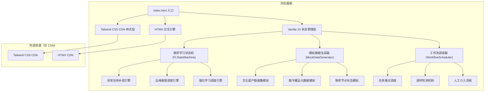
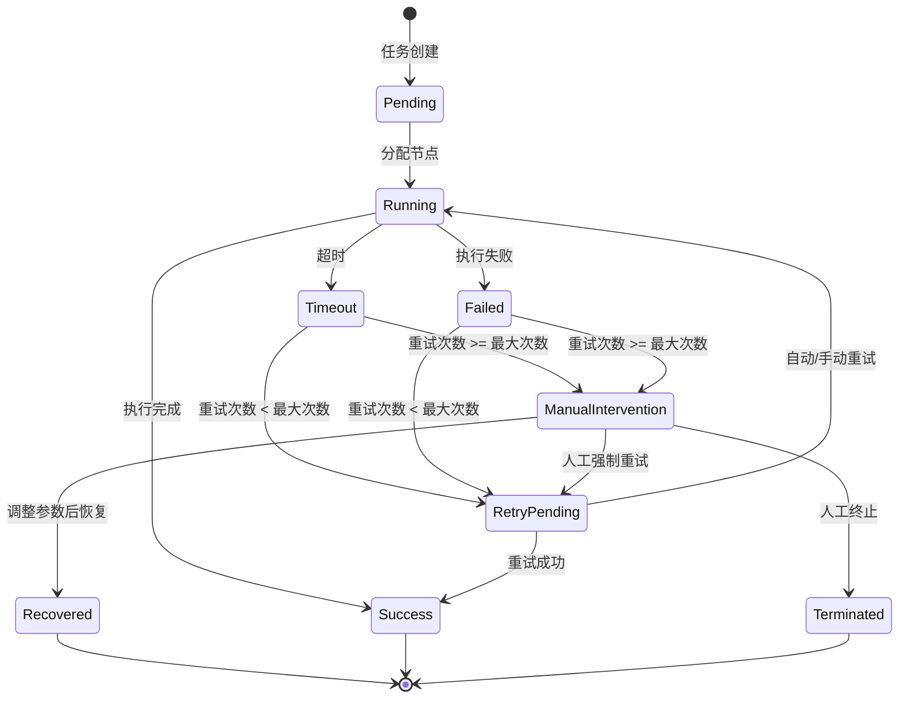
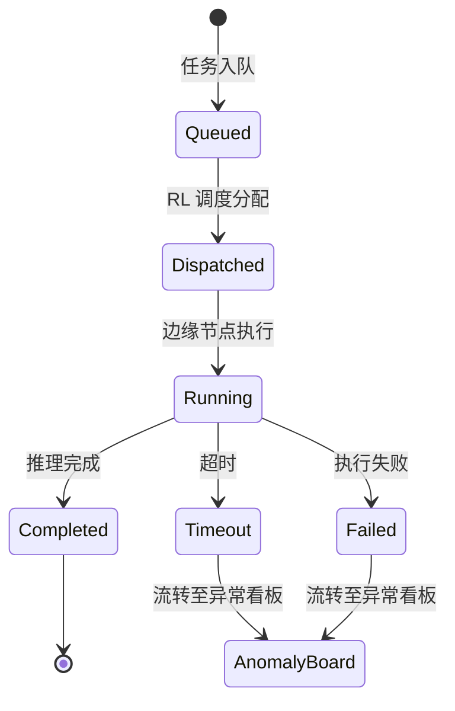

## 1. 架构设计

本项目为纯前端单页应用，采用 HTMX + Tailwind CSS 实现，所有业务逻辑与状态模拟均在浏览器端完成，无后端依赖。



## 2. 技术栈说明

- **前端框架**：无框架，原生 HTML + Vanilla JavaScript
- **样式方案**：Tailwind CSS v3（CDN 引入）
- **交互引擎**：HTMX v1.9（CDN 引入）
- **图标方案**：Lucide Icons（CDN 引入 SVG sprites）
- **数据可视化**：Chart.js（CDN 引入）
- **状态管理**：自定义 Store 模式，基于 Proxy 实现响应式
- **构建工具**：无构建过程，纯静态文件
- **本地服务**：Python http.server

## 3. 目录结构

```
/
├── index.html              # 主入口，包含六区块布局与 HTMX 路由
├── css/
│   └── custom.css          # 自定义样式、动画、Tailwind 扩展
├── js/
│   ├── state/
│   │   ├── store.js        # 全局状态管理
│   │   ├── fl-state.js     # 联邦学习状态机
│   │   └── mock-data.js    # 模拟数据生成器
│   ├── modules/
│   │   ├── anomaly-board.js    # 异常任务补偿看板逻辑
│   │   ├── edge-inference.js   # 边缘推理决策板逻辑
│   │   └── rl-brain.js         # RL 资源分配脑核心逻辑
│   ├── components/
│   │   ├── task-card.js    # 任务卡片组件
│   │   ├── status-badge.js # 状态徽章组件
│   │   └── timeline.js     # 时间轴组件
│   ├── utils/
│   │   ├── workflow.js     # 工作流调度器
│   │   ├── animation.js    # 动画工具函数
│   │   └── format.js       # 格式化工具函数
│   └── app.js              # 应用初始化
└── partials/               # HTMX 局部渲染片段
    ├── dashboard.html      # 总控驾驶舱
    ├── anomaly-board.html  # 异常任务补偿看板
    ├── edge-inference.html # 边缘推理决策板
    ├── rl-brain.html       # RL 资源分配脑核心
    ├── security-monitor.html # 安全边界监控
    └── data-domain.html    # 数字藏品数据域
```

## 4. 六区块信息组织设计规范

遵循面向领域对象的六区块信息组织设计，页面主体固定为 2×3 网格布局：

| 区块位置 | 区块名称 | 领域对象 | 状态维度 |
|----------|----------|----------|----------|
| 左上 (B1) | 数字藏品数据域 | 数据资产对象 | 数据完整性、隐私等级、授权状态 |
| 中上 (B2) | 低延迟边缘侧推理决策板 | 推理任务对象 | 推理队列、执行状态、延迟指标 |
| 右上 (B3) | 安全边界监控 | 安全策略对象 | 越权检测、加密状态、审计日志 |
| 左下 (B4) | 异常任务补偿看板 | 异常任务对象 | 失败原因、重试次数、补偿状态 |
| 中下 (B5) | 强化学习资源动态分配脑核心链路 | 资源调度对象 | 算力分配、带宽调度、存储规划 |
| 右下 (B6) | 联邦节点拓扑 | 计算节点对象 | 节点健康、连接状态、负载均衡 |

每个区块包含：
- 区块标题栏（含状态指示灯）
- 核心指标区（3-5 个关键数据）
- 可视化图表区
- 操作入口区
- 状态流转展示区

## 5. 前端状态模拟设计

### 5.1 全局状态结构

```javascript
const initialState = {
  // 系统概览
  overview: {
    totalNodes: 128,
    activeNodes: 115,
    totalTasks: 1024,
    successRate: 94.7,
    avgLatency: 23,
    securityAlerts: 3
  },
  
  // 异常任务补偿看板状态
  anomalyTasks: [
    {
      id: 'AT-2024-0847',
      type: 'federated_training',
      name: '甲骨文特征提取训练',
      status: 'retry_pending',
      retryCount: 2,
      maxRetries: 3,
      failedReason: '边缘节点网络超时',
      timeoutAt: '2024-06-09T14:32:00',
      priority: 'high',
      dataSensitivity: '绝密',
      executionTrace: [
        { time: '14:25:00', action: '任务启动', node: '节点-BJ-03', status: 'success' },
        { time: '14:28:15', action: '数据加密传输', node: '节点-BJ-03', status: 'success' },
        { time: '14:30:00', action: '联邦聚合计算', node: '节点-SH-07', status: 'timeout' },
        { time: '14:31:00', action: '自动重试第1次', node: '节点-SH-07', status: 'timeout' },
        { time: '14:32:00', action: '自动重试第2次', node: '节点-GZ-02', status: 'pending' }
      ]
    }
  ],
  
  // 边缘推理决策板状态
  inferenceTasks: {
    queued: [
      { id: 'INF-001', name: '敦煌壁画风格迁移', priority: 'normal', eta: '12s', sensitivity: '机密' }
    ],
    running: [
      { id: 'INF-002', name: '青铜器3D纹理重建', progress: 67, node: '边缘-XA-12', latency: '18ms' }
    ],
    completed: [
      { id: 'INF-003', name: '书法作品真伪鉴别', result: '99.7% 真迹', duration: '2.3s' }
    ]
  },
  
  // 边缘节点状态
  edgeNodes: [
    { id: 'edge-01', name: '北京-故宫边缘节点', load: 78, latency: 12, throughput: 1250, status: 'healthy' },
    { id: 'edge-02', name: '西安-兵马俑边缘节点', load: 45, latency: 18, throughput: 980, status: 'healthy' },
    { id: 'edge-03', name: '敦煌-莫高窟边缘节点', load: 92, latency: 35, throughput: 760, status: 'warning' }
  ],
  
  // RL 资源分配状态
  rlBrain: {
    currentPolicy: 'optimize_latency',
    explorationRate: 0.12,
    totalReward: 847.2,
    rewardHistory: [820, 825, 830, 835, 842, 847],
    resourceAllocation: {
      compute: { '节点-BJ': 25, '节点-SH': 20, '节点-GZ': 18, '节点-XA': 22, '节点-DH': 15 },
      bandwidth: { '节点-BJ': 30, '节点-SH': 25, '节点-GZ': 20, '节点-XA': 15, '节点-DH': 10 },
      storage: { '节点-BJ': 20, '节点-SH': 22, '节点-GZ': 28, '节点-XA': 18, '节点-DH': 12 }
    },
    recentDecisions: [
      { time: '14:30', action: '将 5% 算力从 DH 节点转移至 XA 节点', reason: 'DH 节点负载过高', reward: '+3.2' },
      { time: '14:25', action: '提升 SH 节点带宽配额 10%', reason: '推理任务队列积压', reward: '+2.8' }
    ]
  },
  
  // 安全边界状态
  security: {
    accessAttempts: 1542,
    blockedAttempts: 7,
    encryptionStatus: 'active',
    hsmStatus: 'healthy',
    recentAlerts: [
      { time: '14:28', type: 'suspicious_access', source: '192.168.1.105', target: '甲骨文数据集', risk: 'high', status: 'investigating' },
      { time: '14:15', type: 'boundary_violation', source: '内部运维', target: '跨节点数据访问', risk: 'medium', status: 'resolved' }
    ]
  },
  
  // 数字藏品数据域
  dataDomain: {
    datasets: [
      { id: 'DS-001', name: '甲骨文拓片数据集', items: 15234, sensitivity: '绝密', authorized: true, encryption: 'AES-256' },
      { id: 'DS-002', name: '敦煌壁画高清影像', items: 8756, sensitivity: '机密', authorized: true, encryption: 'AES-256' },
      { id: 'DS-003', name: '青铜器3D扫描模型', items: 3421, sensitivity: '机密', authorized: true, encryption: '国密SM4' }
    ],
    trainingTasks: [
      { id: 'TR-007', name: '文物自动分类模型', progress: 82, status: 'training', participants: 12 },
      { id: 'TR-008', name: '风格迁移生成模型', progress: 45, status: 'paused', participants: 8 }
    ]
  },
  
  // 工作流引擎状态
  workflow: {
    autoRetryEnabled: true,
    maxAutoRetries: 3,
    defaultTimeout: 300,
    pendingManualIntervention: 5
  }
}
```

### 5.2 状态模拟机制

#### 异常任务补偿模拟
```javascript
// 自动重试逻辑：每 5 秒检查待重试任务
function scheduleAutoRetry(taskId) {
  setTimeout(() => {
    const task = getState().anomalyTasks.find(t => t.id === taskId);
    if (!task || task.status !== 'retry_pending') return;
    
    const success = Math.random() > 0.4; // 60% 成功率
    if (success) {
      updateTaskStatus(taskId, 'recovered');
      addExecutionTrace(taskId, {
        time: new Date().toLocaleTimeString(),
        action: `自动重试第${task.retryCount}次`,
        node: selectOptimalNode(),
        status: 'success'
      });
    } else if (task.retryCount < task.maxRetries) {
      incrementRetryCount(taskId);
      addExecutionTrace(taskId, {
        time: new Date().toLocaleTimeString(),
        action: `自动重试第${task.retryCount}次`,
        node: selectOptimalNode(),
        status: 'timeout'
      });
      scheduleAutoRetry(taskId);
    } else {
      updateTaskStatus(taskId, 'manual_intervention_required');
    }
  }, 3000 + Math.random() * 2000);
}
```

#### 超时检测模拟
```javascript
// 超时检测：每秒检查运行中任务
function startTimeoutMonitor() {
  setInterval(() => {
    const now = Date.now();
    getState().anomalyTasks.forEach(task => {
      if (task.status === 'running' && task.timeoutAt && new Date(task.timeoutAt).getTime() < now) {
        handleTaskTimeout(task.id);
      }
    });
  }, 1000);
}
```

#### 人工介入模拟
```javascript
function handleManualIntervention(taskId, action, params = {}) {
  const task = getState().anomalyTasks.find(t => t.id === taskId);
  if (!task) return;
  
  switch(action) {
    case 'force_retry':
      task.retryCount = 0;
      task.status = 'retry_pending';
      addExecutionTrace(taskId, {
        time: new Date().toLocaleTimeString(),
        action: '人工强制重试',
        operator: '运维工程师-张工',
        status: 'pending'
      });
      scheduleAutoRetry(taskId);
      break;
      
    case 'terminate':
      task.status = 'terminated';
      addExecutionTrace(taskId, {
        time: new Date().toLocaleTimeString(),
        action: '人工终止任务',
        operator: '安全审计员-李工',
        reason: params.reason,
        status: 'completed'
      });
      break;
      
    case 'adjust_and_retry':
      task.retryCount = 0;
      task.status = 'retry_pending';
      task.assignedNode = params.newNode;
      task.timeout = params.newTimeout;
      addExecutionTrace(taskId, {
        time: new Date().toLocaleTimeString(),
        action: '调整参数后重试',
        operator: '运维工程师-张工',
        newNode: params.newNode,
        newTimeout: `${params.newTimeout}s`,
        status: 'pending'
      });
      scheduleAutoRetry(taskId);
      break;
  }
  
  notifyStateChange();
}
```

## 6. HTMX 路由定义

| HTMX 触发源 | 目标容器 | 局部页面 | 说明 |
|------------|----------|----------|------|
| `#nav-dashboard` | `#main-content` | `partials/dashboard.html` | 总控驾驶舱 |
| `#nav-anomaly` | `#main-content` | `partials/anomaly-board.html` | 异常任务补偿看板 |
| `#nav-inference` | `#main-content` | `partials/edge-inference.html` | 边缘推理决策板 |
| `#nav-rl-brain` | `#main-content` | `partials/rl-brain.html` | RL 资源分配脑核心 |
| `#nav-security` | `#main-content` | `partials/security-monitor.html` | 安全边界监控 |
| `#nav-data` | `#main-content` | `partials/data-domain.html` | 数字藏品数据域 |
| `.task-row` | `#detail-drawer` | `partials/task-detail.html` | 任务详情抽屉 |
| `#retry-btn` | `#toast-container` | `partials/toast.html` | 操作结果提示 |

## 7. 核心工作流状态转移定义

### 7.1 异常任务状态机



### 7.2 边缘推理状态机



## 8. 响应式状态更新机制

使用 Proxy 实现状态变更的自动响应：

```javascript
// 状态变更自动触发 UI 更新
const stateProxy = new Proxy(state, {
  set(target, prop, value) {
    target[prop] = value;
    // 触发相关 UI 组件更新
    triggerUIRefresh(prop);
    return true;
  }
});

// UI 刷新策略：局部更新而非全量重渲染
function triggerUIRefresh(changedProp) {
  const updateMap = {
    'anomalyTasks': () => refreshAnomalyBoard(),
    'inferenceTasks': () => refreshInferenceBoard(),
    'rlBrain': () => refreshRLBrain(),
    'security': () => refreshSecurityMonitor(),
    'dataDomain': () => refreshDataDomain(),
    'overview': () => refreshOverview()
  };
  
  if (updateMap[changedProp]) {
    updateMap[changedProp]();
  }
}
```

## 9. 性能与用户体验保障

1. **虚拟滚动**：任务列表超过 50 条时启用虚拟滚动，避免 DOM 节点过多
2. **防抖节流**：搜索输入防抖 300ms，滚动事件节流 100ms
3. **增量更新**：数据刷新时仅更新变更的 DOM 节点，而非全量替换
4. **加载状态**：所有异步操作（模拟）显示骨架屏或 loading 动画
5. **离线支持**：Service Worker 缓存静态资源，状态变更本地持久化
