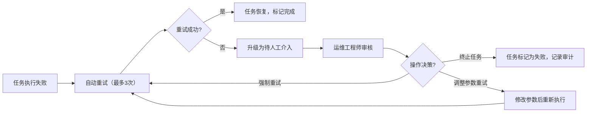
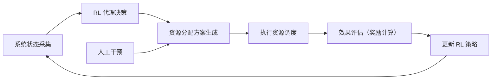

## 1. 产品概述

文化遗产数字化与数字藏品领域的联邦学习隐私计算联邦控制台，聚焦解决安全边界模糊造成的越权访问隐患，为高敏感文化遗产数据提供硬件级加密计算与隔离的可视化管控平台。

- 核心价值：通过联邦学习技术实现文化遗产数据"可用不可见"的隐私计算，保护数字藏品版权与文化遗产数据安全
- 目标用户：文化遗产数字化机构、数字藏品运营方、隐私计算运维工程师、安全审计人员

## 2. 核心功能

### 2.1 用户角色

| 角色 | 接入方式 | 核心权限 |
|------|----------|----------|
| 运维工程师 | 控制台登录 | 任务调度、异常处理、资源配置、人工介入决策 |
| 安全审计员 | 控制台登录 | 安全边界监控、访问日志审计、越权风险评估 |
| 数据节点管理员 | 控制台登录 | 边缘节点管理、推理任务监控、本地数据查看 |

### 2.2 功能模块

1. **总控驾驶舱**：六区块信息总览、联邦节点状态、安全边界监控、核心指标看板
2. **异常任务补偿看板**：失败任务列表、重试机制、超时处理、恢复流程、人工介入审批
3. **低延迟边缘侧推理决策板**：边缘推理任务、推理状态流转、延迟监控、节点调度
4. **强化学习资源动态分配脑核心链路**：RL 调度器状态、资源分配策略、算力分配可视化、调度决策日志
5. **安全边界监控**：越权访问检测、加密计算状态、硬件隔离状态、安全审计日志
6. **数字藏品数据域**：文化遗产数据集、数字藏品元数据、训练任务管理、隐私计算合约

### 2.3 页面详情

| 页面名称 | 模块名称 | 功能描述 |
|----------|----------|----------|
| 总控驾驶舱 | 六区块信息矩阵 | 按领域对象六区块规范展示全系统状态，支持点击跳转 |
| 总控驾驶舱 | 联邦节点拓扑图 | 可视化展示各节点连接状态与健康度 |
| 总控驾驶舱 | 核心指标卡片 | 任务成功率、推理延迟、资源利用率、安全告警数 |
| 异常任务补偿看板 | 异常任务列表 | 展示失败/超时任务，支持筛选、搜索、状态分类 |
| 异常任务补偿看板 | 任务详情抽屉 | 展示任务执行轨迹、失败原因、重试次数、建议操作 |
| 异常任务补偿看板 | 补偿操作面板 | 一键重试、超时终止、恢复确认、人工介入审批流 |
| 低延迟边缘侧推理决策板 | 推理任务队列 | 实时展示推理任务排队、执行、完成状态流转 |
| 低延迟边缘侧推理决策板 | 边缘节点监控 | 各边缘节点负载、延迟、吞吐量实时数据 |
| 低延迟边缘侧推理决策板 | 推理决策操作 | 任务优先级调整、节点重新分配、紧急插队处理 |
| 强化学习资源动态分配脑核心链路 | RL 调度器状态 | 展示强化学习代理当前策略、探索率、奖励曲线 |
| 强化学习资源动态分配脑核心链路 | 资源分配热力图 | 算力、带宽、存储资源在各节点间的分配情况 |
| 强化学习资源动态分配脑核心链路 | 调度决策干预 | 手动覆盖 RL 决策、调整奖励权重、重置调度策略 |
| 安全边界监控 | 越权访问检测 | 实时告警、访问轨迹回溯、风险等级评估 |
| 安全边界监控 | 加密计算状态 | 硬件加密模块状态、数据脱敏进度、密钥轮换状态 |
| 数字藏品数据域 | 数据集管理 | 文化遗产数据集列表、隐私等级、授权状态 |
| 数字藏品数据域 | 训练任务管理 | 联邦训练任务创建、进度监控、模型评估 |

## 3. 核心流程

### 3.1 异常任务补偿流程
运维工程师在异常任务补偿看板中发现失败任务，查看失败原因与重试历史，系统根据预设规则自动重试3次，若仍失败则触发人工介入审批，安全审计员复核后决定终止或强制执行。

### 3.2 边缘推理调度流程
数字藏品推理请求进入边缘侧队列，RL 调度器根据实时节点负载、延迟要求、数据敏感度分配最优节点，执行过程中监控超时，异常任务自动流转至补偿看板。

### 3.3 资源动态分配流程
强化学习代理持续监控各节点资源状态与任务需求，基于奖励函数（吞吐量、延迟、公平性）动态调整资源分配，支持人工干预覆盖决策并记录审计日志。

## 4. 用户界面设计

### 4.1 设计风格
- **主色调**：文物青铜色 `#8B7355` 作为主色，代表文化遗产的厚重感
- **辅助色**：科技蓝 `#0EA5E9` 代表联邦学习的科技属性，安全红 `#DC2626` 用于告警
- **中性色**：深空灰 `#0F172A` 背景、石板灰 `#334155` 边框、浅灰 `#F8FAFC` 文本
- **按钮风格**：扁平化设计，2px 圆角，hover 状态有轻微上移与阴影加深
- **字体**：标题使用宋体类衬线字体体现文化感，正文使用无衬线字体保证可读性
- **布局风格**：网格化六区块布局，卡片式容器，数据可视化采用深色科技风
- **图标风格**：线性图标为主，关键状态使用实心图标，文化遗产相关使用印章、卷轴等元素

### 4.2 页面设计概述

| 页面名称 | 模块名称 | UI 元素 |
|----------|----------|----------|
| 总控驾驶舱 | 六区块信息矩阵 | 2x3 网格布局，每块有独立主题色、状态指示灯、核心数据、点击动效 |
| 总控驾驶舱 | 联邦节点拓扑图 | 力导向图布局，节点状态颜色区分，连线粗细代表数据流量 |
| 异常任务补偿看板 | 任务列表 | 斑马纹表格，状态标签彩色区分，操作按钮组靠右对齐 |
| 异常任务补偿看板 | 任务详情抽屉 | 右侧滑入，时间轴展示执行轨迹，底部操作区 |
| 低延迟边缘侧推理决策板 | 任务看板 | 看板式三列布局（排队/执行/完成），拖拽调整优先级 |
| 低延迟边缘侧推理决策板 | 节点监控面板 | 仪表盘式布局，实时刷新数据流，延迟告警阈值线 |
| 强化学习资源动态分配脑核心链路 | 状态面板 | 脑图式布局，中枢为 RL 核心，辐射各资源维度 |
| 强化学习资源动态分配脑核心链路 | 分配热力图 | 色块深浅表示资源占用率，hover 显示详情，可点击调整 |
| 安全边界监控 | 告警面板 | 时间流式布局，严重告警闪烁，支持一键处置 |
| 数字藏品数据域 | 数据集卡片 | 卡片网格布局，封面缩略图，隐私等级徽章 |

### 4.3 响应性
- 采用桌面端优先设计，最小支持 1280px 宽度
- 侧边导航在 1024px 以下转为顶部汉堡菜单
- 数据表格在窄屏自动转为卡片列表展示
- 图表组件自适应容器宽度，触摸设备支持手势缩放

### 4.4 交互动效
- 页面加载：六区块依次淡入，延迟 100ms 间隔，总时长 800ms
- 状态变化：任务状态变更时背景色闪烁提示后回归正常
- 抽屉滑入：从右侧 300ms ease-out 滑入，背景蒙层渐变
- 按钮交互：hover 时 translateY(-1px)，阴影加深，active 时轻微下压
- 数据刷新：实时数据采用增量更新，数字变化有滚动动效
