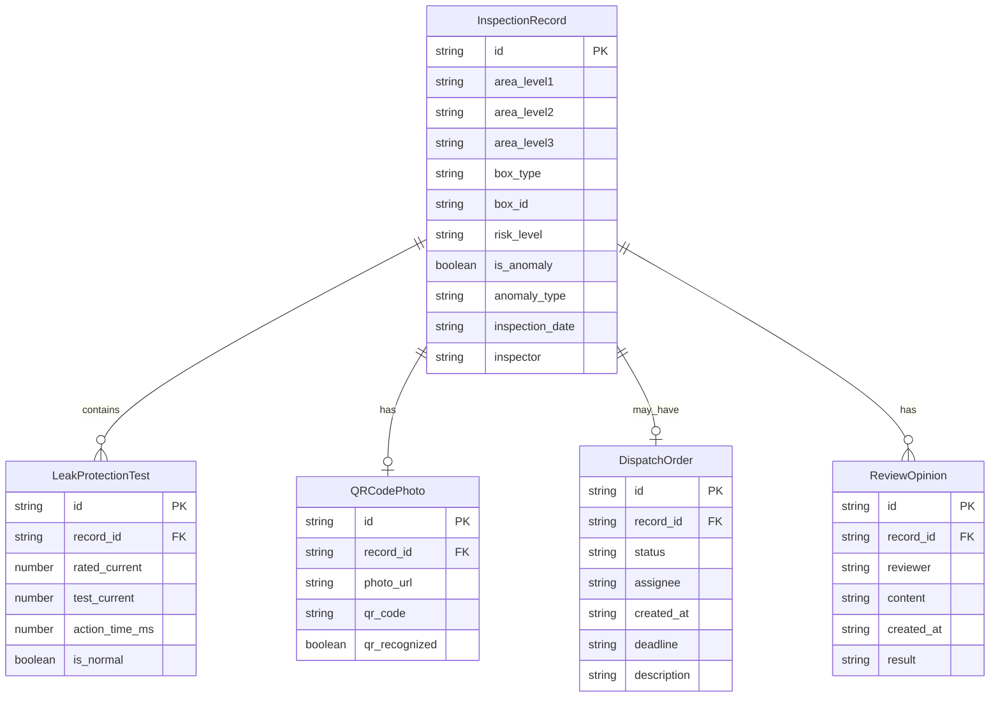

## 1. 架构设计

```mermaid
flowchart TB
    subgraph "前端层"
        "UI组件层" --> "Zustand状态管理层"
        "Zustand状态管理层" --> "数据处理层"
        "数据处理层" --> "localStorage持久化"
    end
    subgraph "数据处理层"
        "JSON导入解析" --> "风险分级算法"
        "风险分级算法" --> "异常检测引擎"
        "异常检测引擎" --> "数据一致性校验"
    end
    subgraph "数据层"
        "Mock JSON数据文件" --> "导入解析器"
        "localStorage" --> "状态恢复"
    end
```

## 2. 技术说明

- 前端：React@18 + TypeScript + TailwindCSS@3 + Vite
- 状态管理：Zustand（含 zustand/middleware persist）
- 初始化工具：vite-init（react-ts 模板）
- 后端：无（纯前端项目）
- 数据库：无（使用 localStorage + 静态JSON文件）
- 图表：自定义CSS条形图（不引入重型图表库）
- 图标：lucide-react

## 3. 路由定义

| 路由 | 用途 |
|------|------|
| / | 主页面，包含数据总览、筛选、列表 |
| 无额外路由 | 详情模态框、异常处理面板均为浮层组件 |

## 4. API定义

不适用（纯前端项目，无后端API）

## 5. 服务端架构图

不适用（纯前端项目）

## 6. 数据模型

### 6.1 数据模型定义



### 6.2 数据定义

使用TypeScript接口定义，存储于 `src/types/index.ts`。Mock数据以JSON文件形式存储于 `public/mock-data/` 目录。
