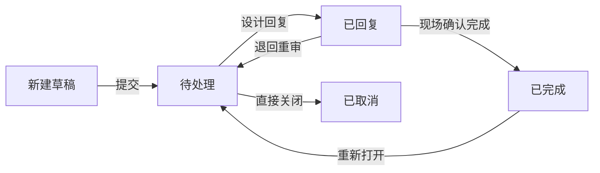

## 1. 产品概述

消防喷淋碰撞问题管理看板是面向机电协调员的专业工具，用于追踪和管理消防喷淋管线与梁、风管、灯槽等构件的碰撞问题。通过整合 BIM 截图、现场照片、设计回复和处理状态，实现从问题发现到闭环确认的全流程管理。

- **目标用户**：机电协调员、消防工程师、现场施工管理人员
- **核心价值**：避免碰撞问题遗漏、确保设计回复可追溯、实现现场闭环管理
- **使用场景**：机电协调会、吊顶封板前检查、设计变更追踪

## 2. 核心功能

### 2.1 用户角色

| 角色 | 操作方式 | 核心权限 |
|------|---------|----------|
| 机电协调员 | 本地登录 | 提交问题、上传附件、跟进状态、导出纪要、修改责任人 |
| 设计方（虚拟） | 通过回复功能 | 提供设计回复意见 |

### 2.2 功能模块

1. **统计概览区**：按状态、楼层、系统、责任专业多维度统计图表
2. **问题列表区**：碰撞问题明细列表，支持多条件筛选
3. **问题详情区**：单条问题的完整信息，包含附件和历史记录
4. **状态流转区**：提交、退回、确认完成等状态操作
5. **导出功能**：导出协调纪要文档

### 2.3 页面详情

| 页面名称 | 模块名称 | 功能描述 |
|---------|---------|----------|
| 主看板 | 统计图表区 | 状态分布饼图、楼层柱状图、专业趋势图，与筛选联动 |
| 主看板 | 筛选工具栏 | 楼层、系统、责任专业、状态多维度筛选 |
| 主看板 | 问题列表 | 分页列表，显示关键信息和状态标签 |
| 问题详情 | 基本信息 | 碰撞位置、分类、标高、责任人等 |
| 问题详情 | 附件管理 | BIM 截图、现场照片上传与预览，保留历史版本 |
| 问题详情 | 设计回复 | 设计回复内容记录，不覆盖原始信息 |
| 问题详情 | 状态历史 | 完整的状态变更轨迹和操作人记录 |
| 问题详情 | 操作区 | 提交、退回、确认完成、修改责任人 |

## 3. 核心流程

### 3.1 问题提交流程

机电协调员发现碰撞问题 → 填写基本信息（位置、分类、标高） → 上传 BIM 截图和现场照片 → 提交问题 → 问题进入"待处理"状态

### 3.2 设计回复流程

问题待处理 → 设计方提供回复意见 → 更新问题状态为"已回复" → 保留原始问题信息不覆盖

### 3.3 闭环确认流程

问题已回复 → 现场核实整改 → 上传整改后照片 → 确认完成 → 问题进入"已完成"状态

### 3.4 状态流转图

## 4. 用户界面设计

### 4.1 设计风格

- **主色调**：消防红（#D32F2F）作为品牌色，搭配工业蓝（#1565C0）作为功能色
- **辅助色**：橙黄色（#F57C00）表示警告状态，绿色（#2E7D32）表示完成状态
- **中性色**：深灰（#263238）背景，浅灰（#ECEFF1）分隔，白色（#FFFFFF）卡片
- **按钮风格**：圆角 4px，扁平化设计，悬停时有轻微阴影
- **字体**：Noto Sans SC 中文显示字体，搭配 JetBrains Mono 等宽数字字体
- **布局风格**：左侧导航 + 右侧内容区，卡片式布局，清晰的信息层级
- **图标风格**：线性图标，统一 24px 尺寸

### 4.2 页面设计概览

| 页面名称 | 模块名称 | UI 元素 |
|---------|---------|---------|
| 主看板 | 统计图表区 | 三列卡片布局，ECharts 图表，渐变色彩，悬停交互 |
| 主看板 | 筛选工具栏 | 下拉选择器、标签式筛选、搜索框、重置按钮 |
| 主看板 | 问题列表 | 表格布局，斑马纹，状态标签颜色区分，行悬停高亮 |
| 问题详情 | 基本信息 | 两列表单布局，标签左对齐，只读状态灰色背景 |
| 问题详情 | 附件管理 | 缩略图网格布局，鼠标悬停放大预览，版本标记 |
| 问题详情 | 设计回复 | 时间线布局，不同版本区分，原始信息保留 |
| 问题详情 | 操作区 | 主按钮突出，次按钮弱化，危险操作红色 |

### 4.3 响应式设计

- 桌面端（1440px+）：三列统计图表 + 完整表格
- 平板端（1024px）：两列统计图表 + 简化表格
- 移动端（768px-）：单列统计图表 + 卡片式列表

### 4.4 交互细节

- 统计图表与筛选条件实时联动，带动画过渡
- 列表行点击展开详情，或侧边滑出详情面板
- 附件图片支持点击放大查看
- 状态变更有确认弹窗，防止误操作
- 导出功能生成可下载的文本格式协调纪要
