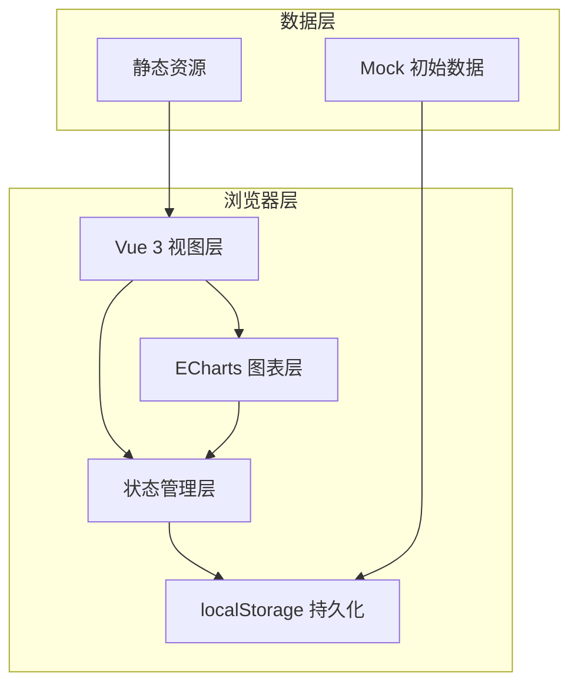
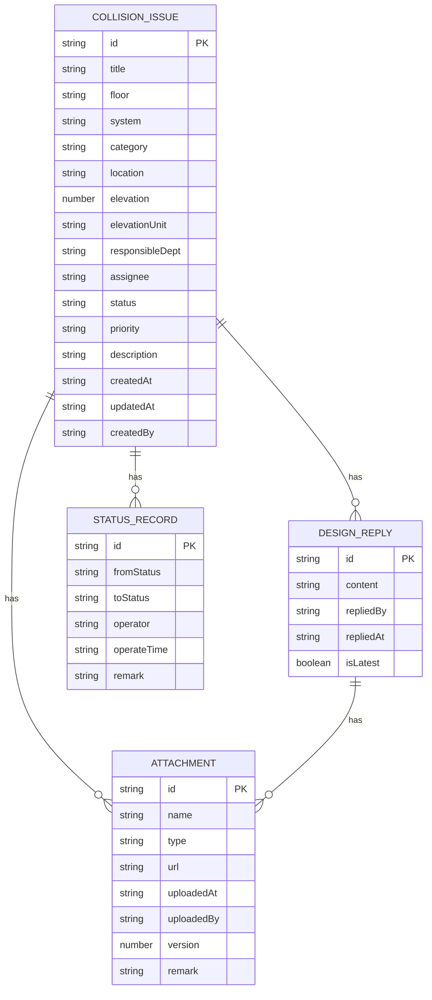

## 1. 架构设计

本项目为纯前端应用，采用 Vue 3 + TypeScript + Vite 技术栈，数据存储基于浏览器 localStorage，不依赖任何后端服务。



## 2. 技术描述

- **前端框架**：Vue 3.4 + TypeScript 5.0 + Composition API
- **构建工具**：Vite 5.0
- **样式方案**：Tailwind CSS 3.4
- **图表库**：ECharts 5.4
- **状态管理**：Pinia（本地状态）+ localStorage 持久化
- **路由**：Vue Router 4
- **图标**：Lucide Vue Next
- **数据存储**：浏览器 localStorage
- **Mock 数据**：内置静态样例数据

## 3. 路由定义

| 路由路径 | 页面名称 | 功能描述 |
|---------|---------|----------|
| `/` | 问题看板 | 统计图表 + 筛选 + 问题列表 |
| `/detail/:id` | 问题详情 | 问题详细信息、附件、设计回复、状态历史 |
| `/new` | 新建问题 | 创建新的碰撞问题记录 |

## 4. 数据模型

### 4.1 碰撞问题 (CollisionIssue)

| 字段名 | 类型 | 说明 |
|-------|------|------|
| id | string | 唯一标识 |
| title | string | 问题标题 |
| floor | string | 楼层 |
| system | string | 系统分类（喷淋系统/消火栓系统等） |
| category | string | 碰撞类型（梁碰撞/风管碰撞/灯槽碰撞等） |
| location | string | 具体位置描述 |
| elevation | number | 标高值 |
| elevationUnit | string | 标高单位（mm/m） |
| responsibleDept | string | 责任专业 |
| assignee | string | 责任人 |
| status | string | 状态（draft/pending/replied/completed/cancelled） |
| priority | string | 优先级（high/medium/low） |
| description | string | 问题描述 |
| attachments | Attachment[] | 附件列表 |
| designReplies | DesignReply[] | 设计回复列表 |
| statusHistory | StatusRecord[] | 状态历史 |
| createdAt | string | 创建时间 |
| updatedAt | string | 更新时间 |
| createdBy | string | 创建人 |

### 4.2 附件 (Attachment)

| 字段名 | 类型 | 说明 |
|-------|------|------|
| id | string | 唯一标识 |
| name | string | 文件名 |
| type | string | 类型（bim_screenshot/photo/other） |
| url | string | 图片 URL（base64 或示例图） |
| uploadedAt | string | 上传时间 |
| uploadedBy | string | 上传人 |
| version | number | 版本号 |
| remark | string | 备注 |

### 4.3 设计回复 (DesignReply)

| 字段名 | 类型 | 说明 |
|-------|------|------|
| id | string | 唯一标识 |
| content | string | 回复内容 |
| repliedBy | string | 回复人 |
| repliedAt | string | 回复时间 |
| attachments | Attachment[] | 回复附件 |
| isLatest | boolean | 是否最新回复 |

### 4.4 状态记录 (StatusRecord)

| 字段名 | 类型 | 说明 |
|-------|------|------|
| id | string | 唯一标识 |
| fromStatus | string | 原状态 |
| toStatus | string | 目标状态 |
| operator | string | 操作人 |
| operateTime | string | 操作时间 |
| remark | string | 备注 |

### 4.5 ER 图



## 5. 项目结构

```
src/
├── components/           # 组件目录
│   ├── charts/          # 图表组件
│   │   ├── StatusPieChart.vue
│   │   ├── FloorBarChart.vue
│   │   └── DeptTrendChart.vue
│   ├── layout/          # 布局组件
│   │   ├── AppHeader.vue
│   │   └── AppSidebar.vue
│   ├── issue/           # 问题相关组件
│   │   ├── IssueFilter.vue
│   │   ├── IssueList.vue
│   │   ├── IssueCard.vue
│   │   ├── IssueDetail.vue
│   │   ├── IssueForm.vue
│   │   └── StatusBadge.vue
│   ├── attachment/      # 附件组件
│   │   ├── AttachmentList.vue
│   │   └── AttachmentUploader.vue
│   └── common/          # 通用组件
│       ├── Modal.vue
│       ├── Button.vue
│       └── Timeline.vue
├── composables/         # 组合式函数
│   ├── useIssues.ts
│   ├── useFilter.ts
│   └── useStorage.ts
├── stores/              # Pinia 状态管理
│   └── issueStore.ts
├── pages/               # 页面组件
│   ├── Dashboard.vue
│   ├── IssueDetail.vue
│   └── NewIssue.vue
├── types/               # 类型定义
│   └── index.ts
├── utils/               # 工具函数
│   ├── storage.ts
│   ├── export.ts
│   └── mockData.ts
├── router/              # 路由配置
│   └── index.ts
├── App.vue
└── main.ts
```

## 6. 状态管理方案

使用 Pinia 管理全局状态，结合 localStorage 实现数据持久化：

- **issueStore**: 管理所有碰撞问题数据
  - `issues`: 问题列表
  - `filters`: 当前筛选条件
  - `selectedIssue`: 当前选中问题
  - `addIssue()`: 新增问题
  - `updateIssue()`: 更新问题
  - `changeStatus()`: 状态流转
  - `addAttachment()`: 添加附件
  - `addDesignReply()`: 添加设计回复
  - `exportMinutes()`: 导出协调纪要

## 7. 关键技术点

1. **数据持久化**：使用 localStorage 存储，初始化时从本地加载，修改后自动保存
2. **图表联动**：筛选条件变化时，ECharts 图表数据同步更新，带动画过渡
3. **附件管理**：支持多附件上传，保留版本历史，不覆盖旧文件
4. **设计回复**：时间线展示，保留全部历史版本，原始信息不被覆盖
5. **状态流转**：严格的状态机管理，记录每一次状态变更的操作人和时间
6. **标高单位**：支持 mm/m 两种单位显示和切换，存储时统一单位
7. **导出功能**：生成格式化的协调纪要文本，支持下载
