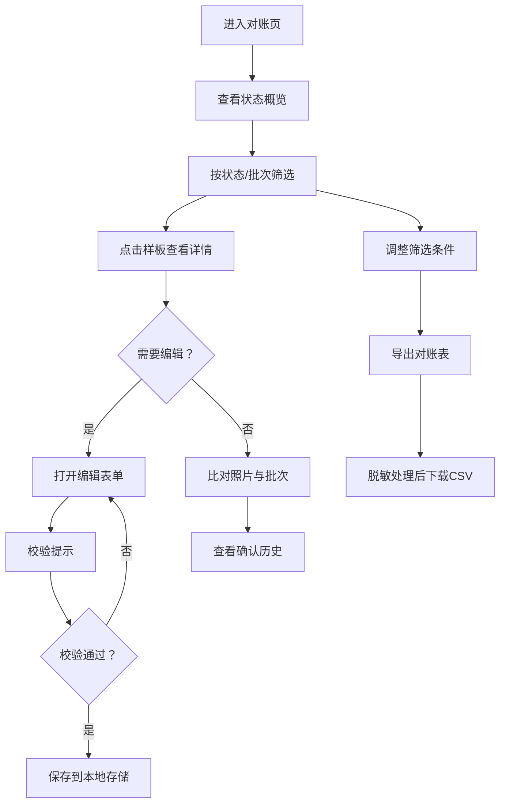

## 1. 产品概述
幕墙样板封样对账系统，服务于幕墙工程师在材料进场前的核对工作。解决项目部在微信群翻历史记录、人工比对样板与进场批次不一致的痛点。

- 目标用户：幕墙工程师、项目部、采购人员、业主代表
- 核心价值：将样板编号、厂家批次、色板照片、确认人和进场批次关联，实现可追溯的封样对账机制

## 2. 核心功能

### 2.1 用户角色
| 角色 | 权限说明 |
|------|----------|
| 幕墙工程师 | 新增/编辑样板记录、上传照片、录入确认记录、导出对账表 |
| 采购 | 查看对账表、按条件筛选批次 |
| 业主代表 | 查看封样记录、确认材料 |

### 2.2 功能模块
1. **对账主页面**：样板列表、状态筛选（可用/待确认/退回、批次搜索、快捷操作
2. **样板详情面板**：色板照片比对、厂家批次对照、确认历史时间线
3. **新增/编辑表单**：样板信息录入、照片上传、校验提示
4. **脱敏导出模块**：按筛选条件导出对账表，敏感信息脱敏

### 2.3 页面详情
| 页面名称 | 模块名称 | 功能描述 |
|---------|---------|---------|
| 对账主页面 | 顶部筛选栏 | 状态筛选、批次搜索、导出按钮、新增按钮 |
| 对账主页面 | 样板卡片列表 | 样板编号、厂家批次、色板缩略图、状态标签、确认人 |
| 对账主页面 | 统计概览 | 三种状态数量统计卡片 |
| 样板详情面板 | 基本信息区 | 样板编号、版本号、规格、厂家信息 |
| 样板详情面板 | 照片比对区 | 封样照片与进场照片左右并排对比 |
| 样板详情面板 | 批次对照表 | 厂家批次与进场批次对照列表 |
| 样板详情面板 | 确认历史 | 时间线展示历次确认/退回记录 |
| 新增/编辑表单 | 信息录入 | 样板基本信息、照片上传、批次信息 |
| 新增/编辑表单 | 校验提示 | 重复批次、日期异常、照片缺失的红色提示 |
| 导出功能 | 脱敏导出 | CSV导出、手机号脱敏、按当前筛选条件导出 |

## 3. 核心流程

幕墙工程师的日常对账流程：

## 4. 用户界面设计

### 4.1 设计风格
- **主色**：深邃工业蓝 `#1e3a5f`（专业、稳重，契合幕墙工程行业）
- **辅色**：琥珀金 `#c9a227`（强调、可用状态标识）、警示橙 `#e07b39`（待确认）、警戒红 `#c0392b`（退回）
- **中性色**：冷灰系列 `#f5f6f8` / `#e4e7eb` / `#6b7280` / `#374151`
- **按钮风格**：直角微圆角（2px）、扁平设计、2px边框强调交互
- **字体**：正文使用「思源黑体 / PingFang SC」工业感无衬线；标题使用「思源宋体 Heavy」增加专业厚重感
- **布局风格**：卡片式栅格布局、左侧筛选工具栏、详情侧边抽屉
- **图标风格**：Lucide 线性图标，统一1.5px线宽

### 4.2 页面设计概述
| 页面名称 | 模块名称 | UI元素 |
|---------|---------|---------|
| 对账主页面 | 顶部筛选栏 | 深蓝色背景、白色文字、琥珀金高亮选中状态、工业风分隔线 |
| 对账主页面 | 统计概览 | 三列等宽卡片、大号数字配状态色、左边缘色带装饰 |
| 对账主页面 | 样板卡片列表 | 网格布局、每张卡左色条标识状态、右上角状态胶囊标签、悬停上浮2px阴影 |
| 样板详情面板 | 照片比对区 | 左右分栏对比、中间分隔线配刻度标识、鼠标悬停放大效果 |
| 样板详情面板 | 确认历史 | 垂直时间线、圆点节点、左侧色线、交替深浅背景 |
| 新增/编辑表单 | 校验提示 | 红色边框+图标+文案三段式、顶部聚合错误汇总条 |
| 全局 | 动效 | 卡片悬停微上浮、抽屉侧滑进入、表单校验抖动反馈 |

### 4.3 响应式
桌面端优先设计（1280px起），适配1440px大屏优化；
中等屏幕（≥1024px自适应栅格列数调整；
移动端（≥768px单列纵向布局，抽屉变全屏模态。
