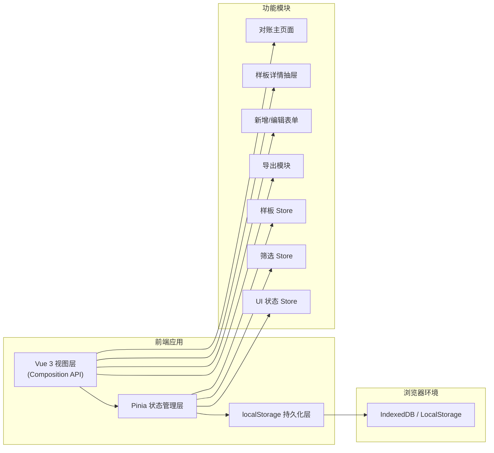
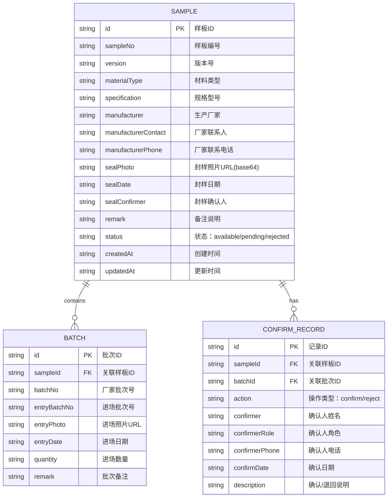

## 1. 架构设计



## 2. 技术说明
- **前端框架**：Vue@3.4 + Vite@5 + TypeScript@5
- **状态管理**：Pinia@2（含持久化插件 pinia-plugin-persistedstate）
- **样式方案**：Tailwind CSS@3
- **路由**：Vue Router@4（单页应用，Hash模式）
- **图标库**：lucide-vue-next
- **导出工具**：原生 Blob + CSV 格式
- **数据持久化**：localStorage（Pinia 持久化插件自动同步）

## 3. 路由定义
| 路由路径 | 页面用途 |
|---------|---------|
| `/` | 对账主页面（默认首页，包含列表+详情） |

## 4. 数据模型

### 4.1 实体关系图



### 4.2 筛选条件数据结构

```typescript
interface FilterState {
  status: 'all' | 'available' | 'pending' | 'rejected'
  keyword: string
  dateRange: [string, string] | null
}
```

### 4.3 状态枚举

```typescript
enum SampleStatus {
  AVAILABLE = 'available',    // 可用
  PENDING = 'pending',      // 待确认
  REJECTED = 'rejected'     // 退回
}
```

## 5. 目录结构

```
src/
├── assets/              # 静态资源
├── components/        # 通用组件
│   ├── StatusBadge.vue
│   ├── SampleCard.vue
│   ├── PhotoCompare.vue
│   ├── ConfirmTimeline.vue
│   ├── BatchTable.vue
│   ├── SampleForm.vue
│   ├── FilterBar.vue
│   ├── StatsCards.vue
│   └── ExportDialog.vue
├── composables/     # 组合式函数
│   ├── useExport.ts
│   ├── useValidation.ts
│   └── useMockData.ts
├── pages/              # 页面
│   └── ReconPage.vue
├── router/             # 路由
│   └── index.ts
├── stores/             # Pinia 状态管理
│   ├── sample.ts       # 样板数据
│   ├── filter.ts       # 筛选条件
│   └── ui.ts           # UI状态
├── types/              # TypeScript 类型定义
│   └── index.ts
├── utils/              # 工具函数
│   ├── date.ts
│   ├── mask.ts         # 脱敏工具
│   └── storage.ts
├── App.vue
└── main.ts
```

## 6. 校验规则
- **重复批次校验：同一样板下厂家批次号唯一
- **日期校验：确认日期 >= 封样日期
- **照片完整性校验：新增时封样照片必填
- **进场批次校验：进场批次号格式校验
