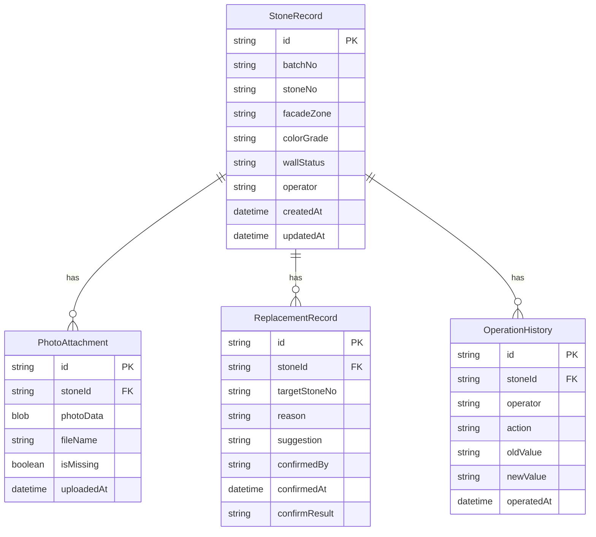

## 1. 架构设计

```mermaid
graph TB
    subgraph "前端层"
        "React 页面组件" --> "Zustand Store"
        "Zustand Store" --> "业务 Hook"
        "业务 Hook" --> "IndexedDB 数据层(Dexie)"
    end
    subgraph "浏览器存储"
        "IndexedDB" --> "石材记录表"
        "IndexedDB" --> "替换记录表"
        "IndexedDB" --> "操作历史表"
        "IndexedDB" --> "照片附件表"
    end
    "导出模块" --> "CSV/PDF 生成"
    "照片处理" --> "Blob 存储"
```

纯前端架构，所有数据存储在浏览器 IndexedDB 中，无后端依赖。

## 2. 技术说明

- 前端：React@18 + TypeScript + Tailwind CSS + Vite
- 初始化工具：vite-init
- 后端：无
- 数据库：IndexedDB（通过 Dexie.js 操作）
- 状态管理：Zustand
- 表格：TanStack Table
- 导出：csv-stringify + 自定义格式化

## 3. 路由定义

| 路由 | 用途 |
|------|------|
| / | 石材复核列表主页，含筛选、统计、表格、批量操作 |
| /stone/:id | 石材详情页，含照片、替换建议、确认、操作历史 |

## 4. API 定义

无后端 API，所有数据操作通过 Dexie.js 直接读写 IndexedDB。

## 5. 服务端架构

不适用

## 6. 数据模型

### 6.1 数据模型定义



### 6.2 数据定义语言

```typescript
interface StoneRecord {
  id: string;
  batchNo: string;
  stoneNo: string;
  facadeZone: string;
  colorGrade: 'A' | 'B' | 'C' | 'D';
  wallStatus: 'normal' | 'replaced' | 'pending' | 'conflict';
  operator: string;
  createdAt: string;
  updatedAt: string;
}

interface PhotoAttachment {
  id: string;
  stoneId: string;
  photoData: Blob | null;
  fileName: string;
  isMissing: boolean;
  uploadedAt: string;
}

interface ReplacementRecord {
  id: string;
  stoneId: string;
  targetStoneNo: string;
  reason: string;
  suggestion: string;
  confirmedBy: string;
  confirmedAt: string;
  confirmResult: 'approved' | 'rejected' | 'pending';
}

interface OperationHistory {
  id: string;
  stoneId: string;
  operator: string;
  action: string;
  oldValue: string;
  newValue: string;
  operatedAt: string;
}
```
