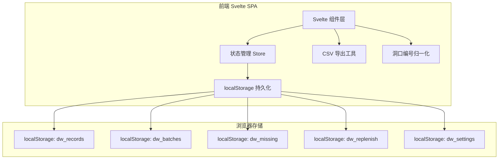
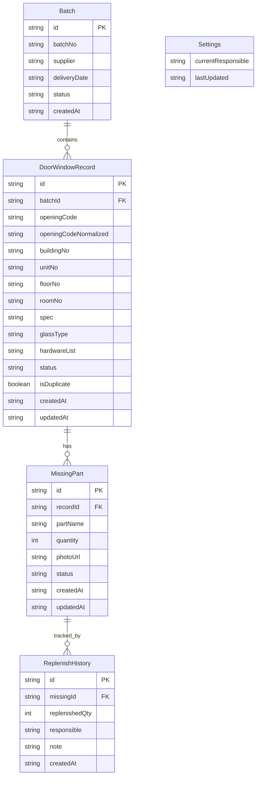

## 1. 架构设计

## 2. 技术说明

- **前端框架**：Svelte 5 + SvelteKit（静态 SPA 模式）
- **构建工具**：Vite 6
- **语言**：TypeScript
- **样式**：Tailwind CSS 4
- **状态管理**：Svelte 5 runes（$state / $derived）
- **持久化**：localStorage（JSON 序列化）
- **图标**：lucide-svelte
- **后端**：无，纯前端项目
- **数据库**：无，localStorage 替代

## 3. 路由定义

| 路由 | 用途 |
|------|------|
| / | 仪表盘：统计概览和待处理提醒 |
| /register | 进场登记：批次管理和门窗录入 |
| /missing | 缺件管理：缺件登记和状态流转 |
| /replenish | 补货记录：补货时间线和责任人 |
| /export | 导出中心：移交清单预览和 CSV 下载 |

## 4. API 定义

无后端 API，所有数据操作通过 localStorage 直接读写。

## 5. 服务端架构

不适用

## 6. 数据模型

### 6.1 数据模型定义

### 6.2 数据定义

- 所有实体使用 `crypto.randomUUID()` 生成主键
- `openingCodeNormalized`：洞口编号统一转大写并去除空格，用于去重比对
- `status` 枚举值：
  - 门窗记录：`pending` | `accepted` | `rejected`
  - 缺件状态：`missing` | `partial` | `resolved`
  - 批次状态：`in_transit` | `delivered` | `accepted` | `partial_accepted`
- `photoUrl`：使用 Base64 Data URL 存储照片（localStorage 容量限制下，单张建议 < 500KB）
- 所有时间字段使用 ISO 8601 格式字符串
