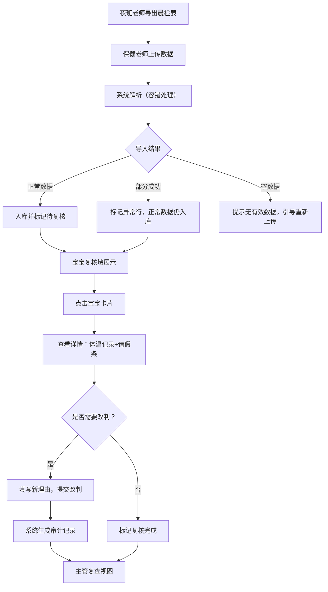

## 1. 产品概述

婴幼儿晨检复核墙（夜班交接版）是面向托育机构保健老师的晨检数据复核工具，解决夜班体温枪记录分散、早高峰备注简略、历史追溯困难等问题。系统支持从导出表反查宝宝详情、查看原始体温枪记录及请假条照片，提供完整的改判审计链路和异常数据容错机制。

核心价值：让晨检复核从"散落记录"变成"可追溯的闭环"，保障主管复查有据可依。

## 2. 核心功能

### 2.1 用户角色
| 角色 | 核心权限 |
|------|----------|
| 保健老师 | 导入数据、查看宝宝详情、人工改判、标记复核状态 |
| 主管 | 查看改判审计、审批复核结果、导出报告 |

### 2.2 功能模块
1. **数据导入看板**：上传晨检导出表，展示导入结果（成功/部分成功/失败统计）
2. **宝宝复核墙**：按日期/班级展示宝宝晨检列表，支持状态筛选
3. **宝宝详情页**：反查宝宝历史晨检、体温枪原始记录、请假条照片、改判审计时间线
4. **人工改判面板**：覆盖旧理由，强制填写新理由，自动生成审计记录
5. **主管审计视图**：改判历史对比、异常数据标记、复查确认

### 2.3 页面详情
| 页面名称 | 模块名称 | 功能描述 |
|----------|----------|----------|
| 数据导入看板 | 文件上传区 | 支持拖拽/点击上传晨检导出表（CSV/Excel），实时解析进度 |
| 数据导入看板 | 导入结果统计 | 成功条数、部分成功条数、脏数据条数、空数据条数可视化统计 |
| 数据导入看板 | 坏行详情 | 逐条展示解析失败/异常行，标注错误原因，不阻断正常数据入库 |
| 宝宝复核墙 | 日期导航 | 支持倒序浏览（最新日期在前），部分日期加载失败不影响其他日期 |
| 宝宝复核墙 | 宝宝卡片列表 | 展示体温、状态标记、最新备注，颜色区分正常/异常/待复核 |
| 宝宝复核墙 | 筛选器 | 按班级、体温状态、复核状态筛选，搜索宝宝姓名 |
| 宝宝详情页 | 基础信息卡 | 宝宝姓名、班级、年龄、监护人联系方式 |
| 宝宝详情页 | 体温枪记录时间轴 | 按时间倒序展示原始体温枪读数、测量时间、测量人 |
| 宝宝详情页 | 请假条附件区 | 展示请假条照片缩略图，点击放大查看 |
| 宝宝详情页 | 改判审计面板 | 记录每次改判的旧理由/新理由/操作人/时间戳，不可删除 |
| 人工改判弹窗 | 改判表单 | 下拉选择新状态、必填新理由输入框、确认提交 |
| 主管审计视图 | 改判对比表 | 并排展示改判前后状态和理由，支持一键确认复查 |

## 3. 核心流程

保健老师每日工作流程：夜班体温枪数据导出 → 上传至系统 → 系统自动解析并标记异常 → 老师浏览复核墙 → 点击异常宝宝查看详情 → 核对原始体温记录和请假条 → 如需改判则填写新理由 → 系统生成审计记录 → 主管复查确认。

## 4. 用户界面设计

### 4.1 设计风格
- **主色调**：深蓝 #1E3A5F（专业、信任），辅以柔和薄荷绿 #81C784（健康正常）和暖橙 #FFB74D（异常提示）
- **按钮风格**：圆角 8px，主按钮实心蓝白渐变，次按钮描边蓝底
- **字体**：标题使用 Noto Serif SC（稳重有温度），正文使用 Noto Sans SC（清晰易读）
- **布局风格**：卡片式栅格布局，顶部全局导航，左侧日期筛选侧栏
- **图标风格**：Lucide 线性图标，体温相关使用体温计、宝宝使用婴儿车、文档使用文件图标

### 4.2 页面设计概览
| 页面名称 | 模块名称 | UI 元素 |
|----------|----------|----------|
| 数据导入看板 | 上传区 | 虚线边框拖放区，中央大图标+引导文字，悬停时边框变实+背景微蓝 |
| 数据导入看板 | 结果统计 | 四色卡片并排（绿=正常、橙=脏数据、灰=空数据、蓝=部分成功），卡片有微动效 |
| 宝宝复核墙 | 日期侧栏 | 垂直时间轴，倒序排列日期，当前选中高亮，失败日期显示警告图标但仍可点击 |
| 宝宝复核墙 | 宝宝卡片 | 圆角卡片带轻微阴影，正常绿色底条、异常红色底条、待复核灰色底条，悬停上浮 2px |
| 宝宝详情页 | 体温时间轴 | 左侧竖线连接节点，节点颜色对应体温状态，体温数字放大突出 |
| 宝宝详情页 | 审计面板 | 类 Git commit 时间线，每次改判为一个节点，显示 diff 对比 |
| 人工改判弹窗 | 表单 | 半透明遮罩+白色弹窗，必填项红星标记，理由输入框带字数统计 |

### 4.3 响应式
桌面端优先（≥1280px），平板端（768-1279px）侧栏收起为顶部下拉，移动端（<768px）卡片改为单列，图片自适应宽度。

### 4.4 动画与交互
- 页面加载：卡片错落渐入（staggered fade-in，延迟 50ms）
- 状态变更：卡片颜色平滑过渡（transition 300ms）
- 体温异常：轻微脉冲动画（pulse）提醒
- 改判提交：按钮 loading 旋转→成功对勾微弹
