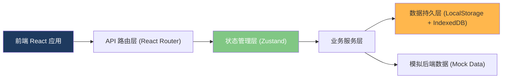
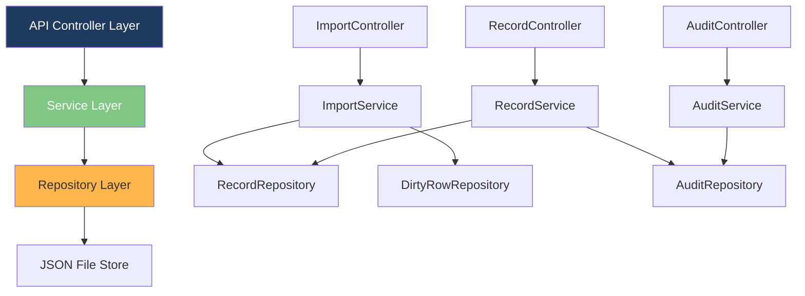
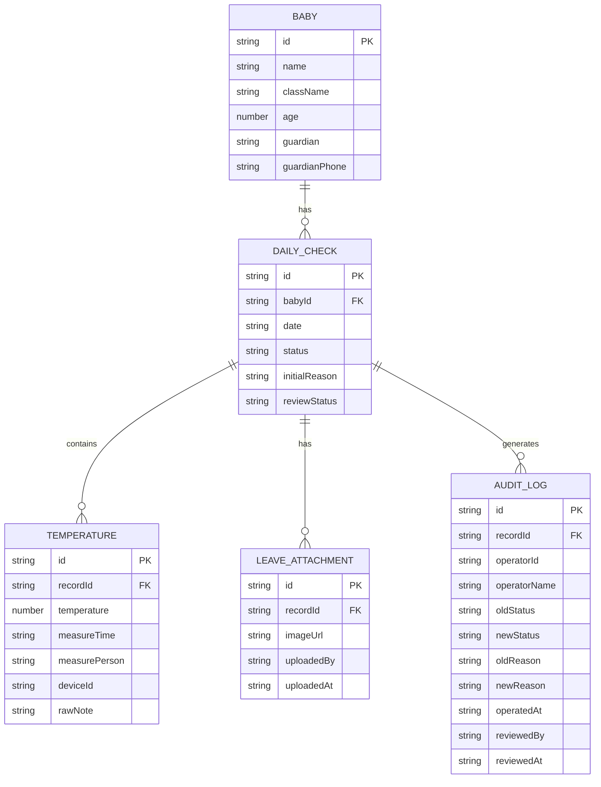

## 1. 架构设计



## 2. 技术说明

- **前端**：React@18 + TypeScript + Vite
- **样式**：TailwindCSS@3
- **路由**：React Router DOM@6
- **状态管理**：Zustand
- **图标库**：Lucide React
- **数据解析**：PapaParse (CSV) + SheetJS (Excel)
- **本地存储**：LocalStorage（配置）+ IndexedDB（大量记录和附件）
- **后端**：使用 Express@4 提供简单的 API 接口，数据以 JSON 文件持久化
- **初始化工具**：vite-init
- **数据库**：开发阶段使用 Mock 数据 + JSON 文件，模拟完整后端

## 3. 路由定义

| 路由 | 用途 |
|------|------|
| / | 数据导入看板（首页） |
| /review | 宝宝复核墙主页面 |
| /review/:babyId | 宝宝详情页 |
| /audit | 主管审计视图 |

## 4. API 定义

### 4.1 类型定义

```typescript
// 宝宝基础信息
interface Baby {
  id: string;
  name: string;
  className: string;
  age: number;
  guardian: string;
  guardianPhone: string;
}

// 体温枪原始记录
interface TemperatureRecord {
  id: string;
  babyId: string;
  temperature: number;
  measureTime: string;  // ISO datetime
  measurePerson: string;
  deviceId: string;
  rawNote?: string;
}

// 请假条附件
interface LeaveAttachment {
  id: string;
  babyId: string;
  date: string;  // YYYY-MM-DD
  imageUrl: string;
  uploadedBy: string;
  uploadedAt: string;
}

// 晨检记录（每日）
interface DailyCheckRecord {
  id: string;
  babyId: string;
  date: string;  // YYYY-MM-DD
  temperatures: TemperatureRecord[];
  status: 'normal' | 'abnormal' | 'pending' | 'leave';
  initialReason: string;
  leaveAttachments: LeaveAttachment[];
  reviewStatus: 'unreviewed' | 'reviewed' | 'appealed';
}

// 改判审计记录
interface AuditLog {
  id: string;
  recordId: string;
  babyId: string;
  operatorId: string;
  operatorName: string;
  oldStatus: string;
  newStatus: string;
  oldReason: string;
  newReason: string;
  operatedAt: string;
  reviewedBy?: string;
  reviewedAt?: string;
}

// 数据导入结果
interface ImportResult {
  totalRows: number;
  successRows: number;
  dirtyRows: number;
  emptyRows: number;
  partialSuccess: boolean;
  dirtyRowDetails: DirtyRowDetail[];
  importedRecords: DailyCheckRecord[];
}

interface DirtyRowDetail {
  rowNumber: number;
  rowData: Record<string, any>;
  errorType: 'empty' | 'invalid_temperature' | 'missing_baby' | 'format_error' | 'unknown';
  errorMessage: string;
}
```

### 4.2 接口列表

| 方法 | 路径 | 说明 |
|------|------|------|
| POST | /api/import | 上传并解析晨检导出表，返回 ImportResult |
| GET | /api/records | 按日期/班级/状态查询晨检记录列表 |
| GET | /api/records/:id | 获取单条晨检记录详情（含体温记录和附件） |
| GET | /api/babies/:id | 获取宝宝基础信息 |
| POST | /api/records/:id/review | 提交改判，自动生成 AuditLog |
| GET | /api/audit | 查询改判审计日志列表（主管视图） |
| POST | /api/audit/:id/confirm | 主管确认改判 |

## 5. 服务端架构图



## 6. 数据模型

### 6.1 ER 图



### 6.2 数据初始化说明

系统内置 3 组模拟数据，覆盖三种场景：
1. **正常数据**：3 个班级共 15 名宝宝，含完整体温记录、正常/异常/请假混合状态
2. **旧记录**：前一天的历史数据，含 2 条已完成改判的审计记录
3. **新补材料（含脏数据）**：模拟刚补录的不完整数据，含：
   - 2 行空数据
   - 3 行体温格式错误（如 "37.x"、"正常"、非数字）
   - 1 行宝宝姓名不存在
   - 5 行有效数据

### 6.3 容错机制设计

1. **逐行解析不中断**：解析器使用 try-catch 包裹每一行，单行失败不影响其他行
2. **部分成功标识**：ImportResult.partialSuccess = true 时，前端同时展示成功数据和错误详情
3. **日期倒序容错**：日期列表渲染时，单日数据加载失败只标记该日期为异常，不阻断其他日期
4. **状态回退**：改判写入失败时，前端自动回滚 UI 状态并提示重试
