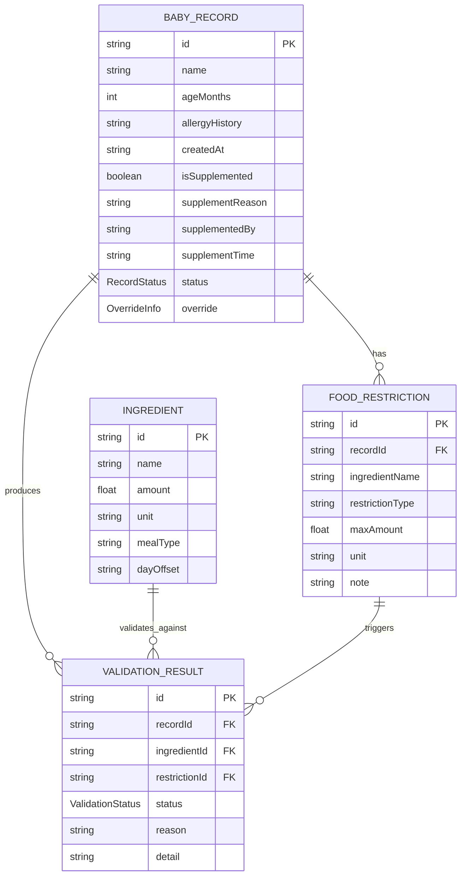

## 1. 架构设计

```mermaid
graph TD
    "UI 层 (React 组件)" --> "状态管理层 (React Context + useReducer)"
    "状态管理层" --> "业务逻辑层 (校验/改判/补录 Service)"
    "业务逻辑层" --> "数据层 (Mock Data + localStorage 持久化)"
    "数据层" --> "内置样例数据"
    "UI 层" --> "路由层 (React Router)"
    "路由层" --> "首页 / 详情页 / 补录页 / 导出预览"
```

## 2. 技术说明

- **前端框架**：React@18 + TypeScript
- **构建工具**：Vite@5
- **样式方案**：TailwindCSS@3
- **路由**：react-router-dom@6
- **状态管理**：React Context + useReducer（无需额外状态库）
- **数据持久化**：localStorage（浏览器本地存储）
- **字体方案**：Google Fonts - Noto Serif SC + Noto Sans SC
- **后端**：无（纯前端 Mock 数据应用）
- **数据库**：localStorage 存储 + 内置 JSON 样例数据

## 3. 路由定义

| 路由 | 页面 | 用途 |
|------|------|------|
| / | 交接本首页 | 记录列表、统计、筛选、操作入口 |
| /record/:id | 记录详情页 | 单条记录完整信息、校验详情、人工改判 |
| /supplement | 手工补录页 | 补录新的宝宝禁忌记录 |
| /export | 摘要导出页 | 预览并导出交接摘要 |

## 4. 数据模型

### 4.1 数据模型定义（ER 图）



### 4.2 TypeScript 类型定义

```typescript
// 记录状态
type RecordStatus = 'normal' | 'abnormal' | 'pending' | 'overridden_normal' | 'overridden_abnormal';

// 校验单项状态
type ValidationStatus = 'pass' | 'fail' | 'warning' | 'unit_mismatch' | 'boundary_triggered';

// 改判信息
interface OverrideInfo {
  by: string;
  time: string;
  reason: string;
  fromStatus: RecordStatus;
  toStatus: RecordStatus;
}

// 禁忌条目
interface FoodRestriction {
  id: string;
  ingredientName: string;
  restrictionType: 'allergy' | 'intolerance' | 'age_restriction' | 'other';
  maxAmount: number;
  unit: 'g' | 'ml' | 'mg' | 'piece';
  note?: string;
}

// 食材表条目
interface IngredientItem {
  id: string;
  name: string;
  amount: number;
  unit: 'g' | 'ml' | 'mg' | 'piece';
  mealType: 'breakfast' | 'lunch' | 'dinner' | 'snack';
  dayOffset: 0 | 1 | 2;
}

// 校验结果条目
interface ValidationItem {
  id: string;
  ingredientId: string;
  restrictionId: string;
  ingredientName: string;
  status: ValidationStatus;
  reason: string;
  detail: string;
  amount?: number;
  unit?: string;
  maxAllowed?: number;
  maxUnit?: string;
}

// 宝宝记录
interface BabyRecord {
  id: string;
  name: string;
  ageMonths: number;
  allergyHistory: string;
  createdAt: string;
  isSupplemented: boolean;
  supplementReason?: string;
  supplementedBy?: string;
  supplementTime?: string;
  status: RecordStatus;
  restrictions: FoodRestriction[];
  validations: ValidationItem[];
  override?: OverrideInfo;
}

// 应用状态
interface AppState {
  records: BabyRecord[];
  ingredients: IngredientItem[];
  activeDate: string;
  filter: RecordStatus | 'all';
  searchKeyword: string;
}
```

## 5. 核心业务逻辑

### 5.1 校验引擎规则
1. **食材名称匹配**：食材表名称与禁忌食材名称（含同义词）模糊匹配
2. **完全禁食校验**：maxAmount = 0 时，任何匹配食材触发异常（边界值规则）
3. **限量校验**：maxAmount > 0 时，超过阈值触发异常
4. **单位混用检测**：禁忌单位与食材单位不一致时触发 warning，标记待人工复核
5. **边界值提示**：amount 刚好等于 maxAmount，或 amount > 0 且 maxAmount = 0 时，额外说明原因

### 5.2 改判机制
- 改判必须填写原因
- 原始校验结果保留，改判信息叠加显示
- 改判后状态为 `overridden_normal` 或 `overridden_abnormal`
- 详情页同时展示原始校验结果和改判原因

### 5.3 补录机制
- 补录记录标记 `isSupplemented = true`
- 记录补录人、补录时间、补录原因
- 补录记录走正常校验流程

### 5.4 数据隔离
- 新旧记录通过独立 id 区分，互不引用
- 校验每条记录独立计算，某条记录校验失败不影响其他记录状态
- 导出摘要中补录记录单独分区展示

## 6. 初始化数据脚本

内置样例数据涵盖：
- 5条宝宝记录（A/B正常，C/D异常边界/单位混用，E待改判）
- 1条待补录记录的预设数据（F）用于演示补录前后
- 完整的三日食材表（含正常食材和触发异常的食材）
- 旧记录集（2条）+ 新材料集用于坏数据隔离测试
