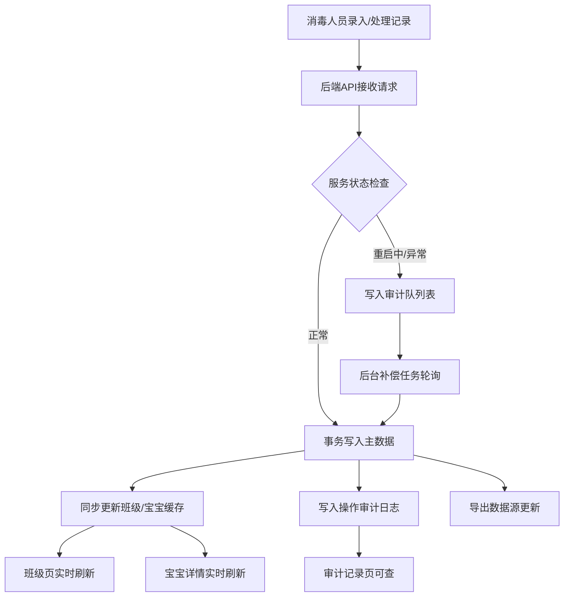
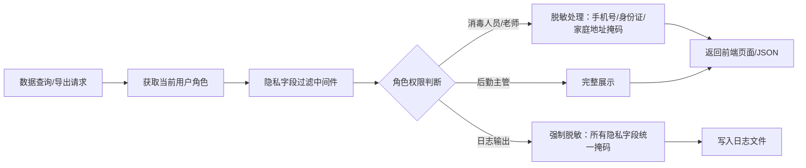

## 1. 产品概述

婴幼儿用品消毒清洗链夜班交接版是一套面向托育/幼教机构的消毒清洗管理系统，用于记录、跟踪婴幼儿用品（奶瓶、餐具、玩具、衣物等）的消毒清洗全流程，并支持夜班交接时的异常处理与审计追踪。

- **核心问题**：解决未清洁用品被再次发放导致的安全隐患，以及异常记录难以追溯、复查的痛点
- **目标用户**：夜班消毒人员、班级老师、后勤主管、机构管理员
- **核心价值**：确保消毒清洗链路闭环可追溯，异常处理多端同步，审计记录永不丢失

## 2. 核心功能

### 2.1 用户角色

| 角色 | 注册方式 | 核心权限 |
|------|----------|----------|
| 消毒人员 | 管理员分配 | 录入消毒记录、处理异常、手工补录、查看本班数据 |
| 班级老师 | 管理员分配 | 查看班级用品状态、宝宝详情、导出清单、查看敏感字段（脱敏） |
| 后勤主管 | 管理员分配 | 全量数据查看、异常审计、处理复查、导出完整数据、查看完整隐私字段 |
| 系统管理员 | 系统预置 | 用户管理、角色配置、系统设置 |

### 2.2 功能模块

1. **夜班交接首页**：今日消毒总览、异常列表、快捷操作入口、手工补录
2. **班级页**：班级用品消毒状态看板、宝宝列表、异常标记
3. **宝宝详情页**：单宝宝用品消毒历史、异常记录、用品清单
4. **异常处理弹窗**：异常原因录入、处理措施、责任人标记
5. **审计记录页**：操作历史、变更对比、异常复查
6. **导出管理**：按条件导出消毒清单、异常报告、审计日志

### 2.3 页面详情

| 页面名称 | 模块名称 | 功能描述 |
|----------|----------|----------|
| 夜班交接首页 | 数据总览卡片 | 显示今日消毒总数、待处理异常数、已完成数、补录数 |
| 夜班交接首页 | 异常记录列表 | 按时间倒序展示异常记录，支持状态筛选、快速处理 |
| 夜班交接首页 | 手工补录入口 | 弹窗录入遗漏的消毒记录，自动标记补录来源 |
| 夜班交接首页 | 样例数据对比 | 展示补录前后数据差异对比样例，含一条手工补录样例 |
| 班级页 | 班级状态看板 | 卡片式展示各班级消毒完成率、异常数量 |
| 班级页 | 宝宝列表 | 行内展示宝宝用品状态，异常宝宝高亮标记，支持隐私字段脱敏 |
| 宝宝详情页 | 用品消毒时间线 | 按时间轴展示用品消毒/发放/回收全流程 |
| 宝宝详情页 | 异常记录 | 关联展示该宝宝所有异常记录及处理状态 |
| 异常处理弹窗 | 异常信息录入 | 异常类型、原因描述、处理措施、责任人、处理时间 |
| 审计记录页 | 操作日志列表 | 记录所有数据变更操作，含变更前后对比、操作人、时间 |
| 审计记录页 | 复查标记 | 主管对异常处理结果标记已复查，填写复查意见 |
| 导出管理 | 导出配置 | 选择导出范围、字段、格式（CSV/Excel），按角色过滤隐私字段 |

## 3. 核心流程

### 3.1 异常处理同步流程

消毒人员在夜班交接页面处理一条异常记录后，系统需保证以下四处同步更新：
1. **班级页**：对应班级的异常计数减少，宝宝状态从"异常"恢复为"正常"
2. **宝宝详情页**：用品时间线新增处理记录，异常记录标记为已处理
3. **后台接口**：PUT /api/exceptions/:id 返回处理结果，关联数据同步刷新
4. **导出清单**：下次导出时自动包含最新处理状态，异常报告排除已处理项

服务重启容错：允许上述四处部分成功，系统通过审计日志记录每次成功/失败的同步操作，支持后台任务重试补偿。

### 3.2 数据流转

### 3.3 隐私字段处理流程

## 4. 用户界面设计

### 4.1 设计风格

- **主色调**：深青色 #0D7377（医疗/消毒专业感），搭配米白背景 #F5F5F0
- **强调色**：暖橙 #E8873A（异常警示），翠绿 #2E8B57（正常状态）
- **按钮风格**：圆角 6px，实心按钮带细微阴影，悬停上浮动效
- **字体**：标题使用 Noto Serif SC（庄重感），正文使用 Noto Sans SC（可读性）
- **布局风格**：顶部导航 + 左侧快捷栏 + 主内容卡片网格
- **图标风格**：Lucide 线性图标，异常状态使用填充红色图标增强警示

### 4.2 页面设计概述

| 页面名称 | 模块名称 | UI 元素 |
|----------|----------|---------|
| 夜班交接首页 | 数据总览 | 4 张渐变统计卡片，数字大号加粗，底部趋势微线图 |
| 夜班交接首页 | 异常列表 | 斑马行表格，异常行左侧橙条标记，操作列悬浮按钮 |
| 夜班交接首页 | 补录样例区 | 左右分栏对比布局，旧记录 vs 补录后记录，差异项黄色高亮 |
| 班级页 | 班级看板 | 卡片网格，每张卡片含环形进度条、异常徽标、班级名 |
| 班级页 | 宝宝列表 | 行内头像（首字占位）、状态徽章、隐私字段如 "138****1234" |
| 宝宝详情页 | 时间线 | 垂直时间轴，节点颜色区分消毒/发放/异常/补录 |
| 异常处理弹窗 | 表单 | 分组字段卡片，必填项红星标记，底部操作双按钮 |
| 审计记录页 | 日志列表 | 变更前后对比用 diff 样式展示，绿色新增红色删除 |
| 导出管理 | 配置面板 | 复选框字段选择，角色预览区实时展示脱敏效果 |

### 4.3 响应式

- 桌面端优先（1280px+），夜班交接场景以 PC 端操作为主
- 平板端（768-1279px）：卡片自动换行，统计卡片 2 列布局
- 移动端（<768px）：简化为列表视图，底部 Tab 导航，仅保留核心功能

### 4.4 特殊设计点

- **异常行隔离机制**：测试场景中，一条坏数据（异常记录）不会影响其他正常宝宝的状态展示，每行独立渲染，异常行使用局部样式隔离
- **补录前后对比区**：首页固定展示一组样例数据（含 1 条手工补录记录），直观演示补录效果，方便培训和试跑
