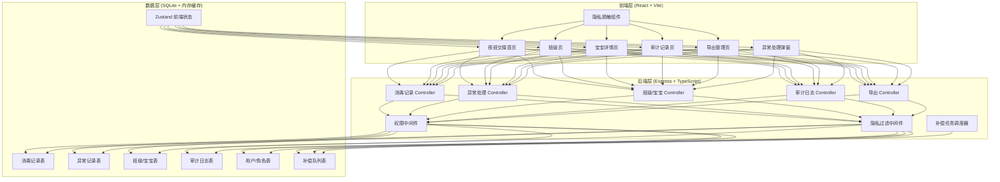
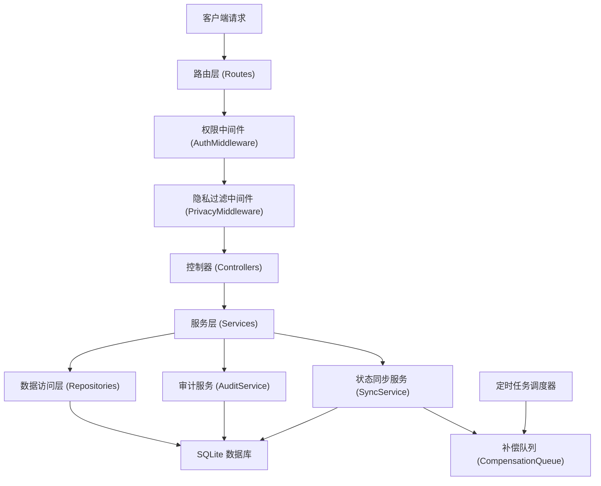

## 1. 架构设计



## 2. 技术说明

- **前端**：React@18 + TypeScript + Vite + tailwindcss@3 + zustand + react-router-dom + lucide-react
- **后端**：Express@4 + TypeScript + ESM
- **数据库**：SQLite（本地文件，无需外部服务），better-sqlite3 驱动
- **初始化工具**：vite-init（react-express-ts 模板）
- **状态管理**：zustand（前端全局状态）
- **图标**：lucide-react

## 3. 路由定义

### 3.1 前端路由

| 路由 | 页面 | 用途 |
|------|------|------|
| / | 夜班交接首页 | 数据总览、异常列表、手工补录、样例对比 |
| /classes | 班级页 | 班级看板、宝宝列表、隐私字段脱敏展示 |
| /baby/:id | 宝宝详情页 | 用品消毒时间线、异常记录 |
| /audit | 审计记录页 | 操作日志、变更对比、主管复查 |
| /export | 导出管理页 | 导出配置、按角色字段过滤预览 |

### 3.2 后端 API 路由

| 方法 | 路由 | 用途 |
|------|------|------|
| GET | /api/stats/overview | 获取首页总览统计数据 |
| GET | /api/records | 获取消毒记录列表 |
| POST | /api/records | 新增消毒记录（含手工补录） |
| PUT | /api/records/:id | 更新消毒记录 |
| GET | /api/exceptions | 获取异常记录列表 |
| PUT | /api/exceptions/:id | 处理异常（核心同步接口） |
| GET | /api/classes | 获取班级列表及状态 |
| GET | /api/classes/:id/babies | 获取班级宝宝列表 |
| GET | /api/babies/:id | 获取宝宝详情 |
| GET | /api/babies/:id/timeline | 获取宝宝用品时间线 |
| GET | /api/audit-logs | 获取审计日志列表 |
| PUT | /api/audit-logs/:id/review | 主管标记复查 |
| GET | /api/export/config | 获取可导出字段配置 |
| POST | /api/export/generate | 生成导出文件（按角色过滤隐私） |
| GET | /api/me | 获取当前登录用户及角色 |

## 4. API 定义（核心类型）

```typescript
// shared/types.ts

export type UserRole = 'disinfector' | 'teacher' | 'supervisor' | 'admin';

export interface User {
  id: string;
  name: string;
  role: UserRole;
}

export interface Baby {
  id: string;
  name: string;
  classId: string;
  className: string;
  parentPhone: string;      // 隐私字段
  parentIdCard: string;     // 隐私字段
  homeAddress: string;      // 隐私字段
  status: 'normal' | 'exception';
}

export interface DisinfectionRecord {
  id: string;
  babyId: string;
  babyName: string;
  classId: string;
  itemType: 'bottle' | 'tableware' | 'toy' | 'clothing' | 'other';
  itemName: string;
  status: 'pending' | 'disinfected' | 'distributed' | 'recycled' | 'exception';
  operatorId: string;
  operatorName: string;
  operateTime: string;
  isManual: boolean;        // 是否手工补录
  remark?: string;
}

export interface ExceptionRecord {
  id: string;
  recordId: string;
  babyId: string;
  babyName: string;
  classId: string;
  type: 'unclean_reissue' | 'missing_item' | 'damage' | 'other';
  reason: string;
  status: 'pending' | 'resolved';
  handlerId?: string;
  handlerName?: string;
  handleMeasure?: string;
  handleTime?: string;
  createTime: string;
  reviewedBy?: string;
  reviewedAt?: string;
  reviewComment?: string;
}

export interface AuditLog {
  id: string;
  action: 'create' | 'update' | 'delete' | 'handle_exception' | 'manual_record';
  targetType: 'record' | 'exception' | 'baby' | 'export';
  targetId: string;
  operatorId: string;
  operatorName: string;
  operateTime: string;
  beforeData: Record<string, unknown> | null;
  afterData: Record<string, unknown> | null;
  syncStatus: 'success' | 'failed' | 'partial';
  retryCount: number;
}

export interface PrivacyFieldConfig {
  field: keyof Baby;
  mask: 'phone' | 'idcard' | 'address' | 'full';
  rolesAllowFull: UserRole[];
}

// 异常处理请求
export interface HandleExceptionRequest {
  handleMeasure: string;
  handlerId: string;
}

// 异常处理响应 - 四处同步结果
export interface HandleExceptionResponse {
  success: boolean;
  exception: ExceptionRecord;
  syncResults: {
    classPage: 'success' | 'failed';
    babyDetail: 'success' | 'failed';
    backendCache: 'success' | 'failed';
    exportData: 'success' | 'failed';
  };
  auditLogId: string;
}
```

## 5. 服务端架构图



## 6. 数据模型

### 6.1 ER 图

```mermaid
erDiagram
    USER {
        string id PK
        string name
        string role
        string createdAt
    }
    CLASS {
        string id PK
        string name
        int capacity
    }
    BABY {
        string id PK
        string name
        string classId FK
        string parentPhone
        string parentIdCard
        string homeAddress
        string status
    }
    DISINFECTION_RECORD {
        string id PK
        string babyId FK
        string classId FK
        string itemType
        string itemName
        string status
        string operatorId FK
        string operateTime
        boolean isManual
        string remark
    }
    EXCEPTION_RECORD {
        string id PK
        string recordId FK
        string babyId FK
        string classId FK
        string type
        string reason
        string status
        string handlerId FK
        string handleMeasure
        string handleTime
        string reviewedBy FK
        string reviewedAt
        string reviewComment
        string createTime
    }
    AUDIT_LOG {
        string id PK
        string action
        string targetType
        string targetId
        string operatorId FK
        string operateTime
        text beforeData
        text afterData
        string syncStatus
        int retryCount
    }
    COMPENSATION_TASK {
        string id PK
        string auditLogId FK
        string targetType
        string targetId
        string payload
        string status
        int retryCount
        string nextRetryAt
        string createdAt
    }
    CLASS ||--o{ BABY : "contains"
    BABY ||--o{ DISINFECTION_RECORD : "has"
    BABY ||--o{ EXCEPTION_RECORD : "has"
    DISINFECTION_RECORD ||--o| EXCEPTION_RECORD : "may have"
    USER ||--o{ DISINFECTION_RECORD : "operates"
    USER ||--o{ EXCEPTION_RECORD : "handles/reviews"
    USER ||--o{ AUDIT_LOG : "operates"
    AUDIT_LOG ||--o{ COMPENSATION_TASK : "has"
```

### 6.2 初始化数据

系统启动时预置以下样例数据（用于试跑和演示）：
- 3 个班级（小班、中班、大班）
- 每个班级 3-5 名宝宝（含完整隐私字段）
- 15 条消毒记录（含 1 条异常记录、1 条手工补录标记的记录）
- 2 条异常记录（1 条待处理、1 条已处理）
- 4 个用户（4 种角色各 1 个）
- 首页样例对比区固定展示：补录前（缺一条记录）和补录后（多一条手工补录标记）的对比数据

### 6.3 核心设计约束

1. **隐私字段多级脱敏**：
   - 后端中间件在响应输出前统一处理，非授权角色强制脱敏
   - 日志输出时所有隐私字段强制掩码，不依赖前端控制
   - 导出文件生成时，按当前用户角色决定字段内容

2. **异常处理四端同步**：
   - 每次异常处理写入审计日志，记录四个同步目标的各自状态
   - 任一同步目标失败，写入补偿队列表，后台定时任务每 30s 重试
   - 前端轮询 `/api/audit-logs/:id` 展示各端同步进度

3. **审计永不丢失**：
   - 审计日志表使用 APPEND ONLY 模式，只增不删不改
   - 数据库使用 WAL 模式，崩溃后自动恢复
   - 补偿队列表持久化，服务重启后自动加载未完成任务继续重试

4. **异常行隔离**：
   - 宝宝列表每行独立组件，单条数据渲染异常不影响其他行
   - 前端 ErrorBoundary 包裹每行，坏行降级显示占位卡片
