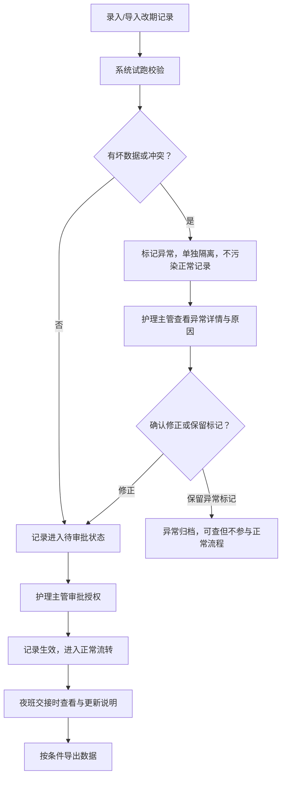
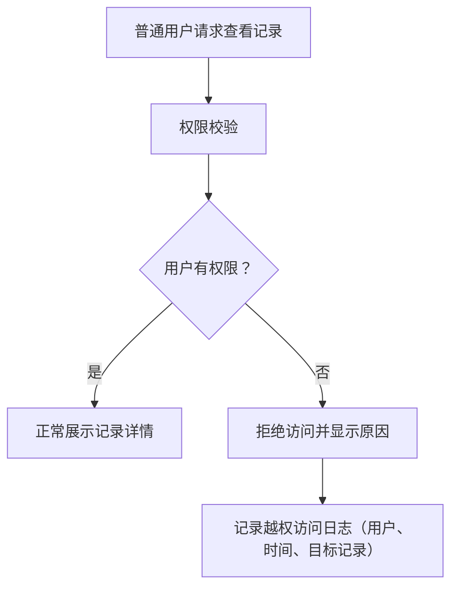

## 1. 产品概述

婴幼儿课程改期授权库（夜班交接版）是为三楼月子婴儿房设计的全流程管理系统，解决目前仅靠Excel表格撑着、转班名额被口头占用导致不敢放行的痛点。

- 核心目标：建立从录入→审批→交接→导出的完整闭环，护理主管可直接依据系统记录做决策
- 目标用户：护理主管、夜班护士、数据录入员

## 2. 核心功能

### 2.1 用户角色

| 角色 | 注册方式 | 核心权限 |
|------|----------|----------|
| 护理主管 | 系统分配 | 全量记录查看、审批改期、跨班处理、导出数据、查看越权原因 |
| 夜班护士 | 系统分配 | 录入本班记录、查看自己处理的记录、添加说明 |
| 普通用户 | 系统分配 | 仅可查看与自己相关的记录（越权时显示拒绝原因） |

### 2.2 功能模块

1. **记录列表页**：完整数据表格（非汇总卡片）、筛选/搜索、状态标记、导入入口
2. **记录详情页**：全字段展示、历史轨迹、异常原因说明、人工备注区
3. **录入/编辑页**：表单录入、批量导入（旧记录+新材料试跑）
4. **审批处理页**：改期授权、跨班确认、状态流转
5. **数据导出页**：按条件筛选后导出、导出审计日志

### 2.3 页面详情

| 页面名称 | 模块名称 | 功能描述 |
|----------|----------|----------|
| 记录列表页 | 数据表格 | 每行显示：来源文件、宝宝姓名、原班次、改期班次、处理人、当前状态、最近人工说明、操作按钮 |
| 记录列表页 | 筛选栏 | 按状态/班次/处理人/日期范围筛选，支持关键词搜索 |
| 记录列表页 | 导入试跑 | 上传旧记录+新材料，系统先校验不直接入库，标记坏行与正常行 |
| 记录详情页 | 基础信息区 | 完整字段展示，含来源文件名与上传时间 |
| 记录详情页 | 异常原因区 | 跨班冲突原因、越权查看原因、坏数据标记及说明 |
| 记录详情页 | 操作轨迹区 | 时间线形式展示所有处理动作、处理人、说明内容 |
| 记录详情页 | 人工备注 | 可追加最新人工说明，自动记录时间与处理人 |
| 录入编辑页 | 表单区 | 宝宝信息、班次信息、改期原因、来源文件上传 |
| 录入编辑页 | 批量导入 | 支持Excel/CSV，先试跑校验再确认入库 |
| 审批处理页 | 待办列表 | 展示待审批记录，可批量操作 |
| 审批处理页 | 授权操作 | 确认改期、标记跨班、驳回并填写原因 |
| 数据导出页 | 导出配置 | 按筛选条件导出，可选导出字段，自动生成导出日志 |

## 3. 核心流程

### 3.1 录入→审批→导出主流程

护理主管或夜班护士录入改期申请（可单条或批量导入试跑），系统自动校验数据完整性与跨班冲突，标记坏数据与异常。护理主管审批后记录生效，后续可按条件导出。

### 3.2 越权访问流程

## 4. 用户界面设计

### 4.1 设计风格

- **主色调**：深墨蓝 #1E3A5F 为底，配暖米白 #FAF7F2 文字，强调专业医护感
- **辅助色**：状态色严格区分：正常绿 #2D8659、待审批橙 #D9822B、异常红 #C63737、已归档灰 #6B7280
- **按钮风格**：圆角8px，主按钮实心配微光边框，次按钮描边配悬停填充
- **字体**：标题用思源宋体 CN（衬线，权威感），正文用思源黑体 CN（易读），数据表格用等宽字体
- **布局风格**：左侧导航栏+右侧内容区，表格为核心视觉，卡片为辅
- **图标风格**：线性图标，笔画粗细统一为1.5px，配色与状态色对应

### 4.2 页面设计概览

| 页面名称 | 模块名称 | UI元素 |
|----------|----------|--------|
| 记录列表页 | 数据表格 | 斑马行、状态色标签、行悬停高亮、固定表头、可调整列宽 |
| 记录列表页 | 顶部操作栏 | 搜索框、筛选下拉（状态/班次/日期）、导入按钮、导出按钮 |
| 记录详情页 | 左侧信息区 | 分块卡片：基础信息、班次信息、来源文件、处理人信息 |
| 记录详情页 | 右侧轨迹区 | 竖向时间线，节点配色对应状态，含处理人与说明 |
| 记录详情页 | 异常警示条 | 顶部红色/黄色警示条，完整说明异常原因与处理建议 |
| 录入编辑页 | 表单区 | 两列布局，必填项红星标注，实时校验提示 |
| 录入编辑页 | 导入预览表 | 试跑结果展示，坏行用红底白字标红并附原因列 |

### 4.3 响应式

- Desktop-first，优先保证1440px以上护理主管工作站体验
- 数据表格可水平滚动，核心列（姓名、状态、操作）固定
- 夜班护士移动端可查看与添加说明，录入操作建议在PC端完成

### 4.4 动效与交互

- 页面切换：淡入+轻微上移（200ms ease-out）
- 状态标签变化：颜色平滑过渡（300ms）
- 表格行展开：高度渐变展开
- 警示条出现：顶部滑入+轻微震动
