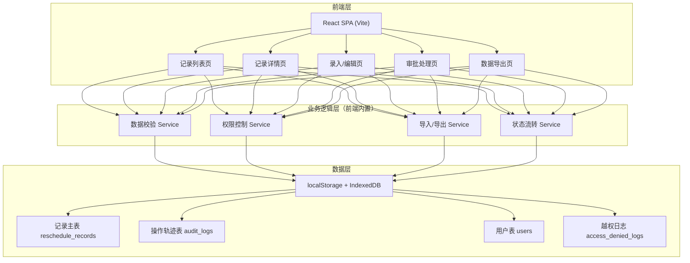
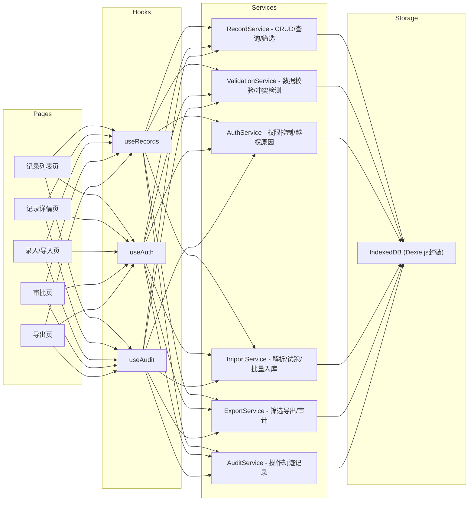
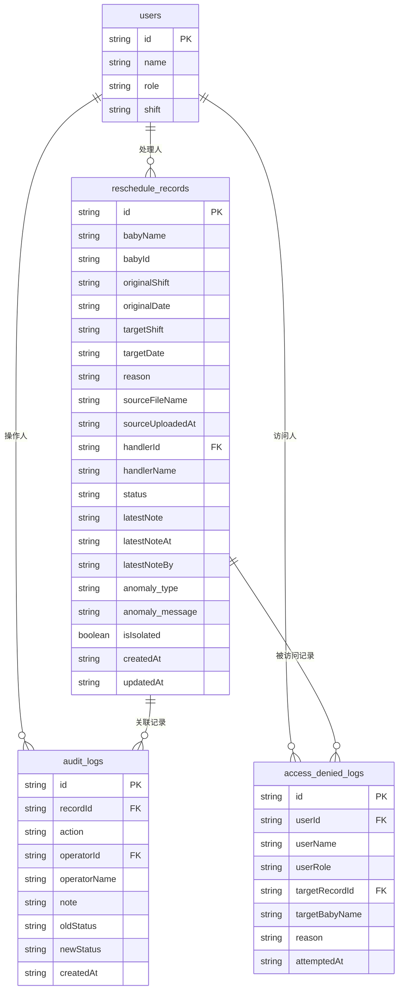

## 1. 架构设计



## 2. 技术说明

- **前端框架**：React@18 + TypeScript + Vite@5
- **样式方案**：TailwindCSS@3 + CSS Variables（主题系统）
- **状态管理**：React Context + useReducer（轻量，避免过度工程化）
- **路由**：React Router DOM@6
- **数据存储**：localStorage（配置与小数据）+ IndexedDB（记录数据，支持较大数据集）
- **UI组件库**：不引入重型组件库，自行构建符合医护风格的组件
- **图标**：lucide-react（线性图标，符合设计风格）
- **表格**：@tanstack/react-table（灵活、轻量、支持虚拟滚动）
- **表单**：react-hook-form + zod（校验与表单状态管理）
- **导入解析**：papaparse（CSV）+ xlsx（Excel）
- **导出**：xlsx（Excel导出）

## 3. 路由定义

| 路由 | 页面 | 权限要求 |
|------|------|----------|
| / | 记录列表页 | 所有登录用户（按角色过滤数据） |
| /records/:id | 记录详情页 | 护理主管/记录处理人/相关护士 |
| /records/new | 新建记录页 | 护理主管/夜班护士 |
| /records/import | 批量导入试跑页 | 护理主管 |
| /approvals | 审批处理页 | 护理主管 |
| /export | 数据导出页 | 护理主管 |
| /access-denied | 越权提示页 | 所有用户（展示拒绝原因） |

## 4. 类型定义

```typescript
// 用户角色
export type UserRole = 'supervisor' | 'nurse' | 'viewer';

export interface User {
  id: string;
  name: string;
  role: UserRole;
  shift?: 'morning' | 'afternoon' | 'night';
}

// 记录状态
export type RecordStatus = 
  | 'pending'      // 待审批
  | 'approved'     // 已授权
  | 'rejected'     // 已驳回
  | 'cross_shift'  // 跨班待确认
  | 'bad_data'     // 坏数据（隔离）
  | 'archived';    // 已归档

// 异常类型
export type AnomalyType = 
  | 'cross_shift_conflict'   // 跨班冲突
  | 'duplicate_baby'         // 同一宝宝重复记录
  | 'missing_required'       // 必填项缺失
  | 'invalid_data'           // 数据格式错误
  | 'slot_occupied'          // 名额已被占用
  | 'none';                  // 无异常

export interface AnomalyDetail {
  type: AnomalyType;
  message: string;
  conflictingRecordId?: string;
  resolution?: string;
}

// 改期记录主表
export interface RescheduleRecord {
  id: string;
  babyName: string;
  babyId: string;                  // 宝宝唯一编号
  originalShift: string;           // 原班次
  originalDate: string;            // 原日期 ISO
  targetShift: string;             // 改期班次
  targetDate: string;              // 改期日期 ISO
  reason: string;                  // 改期原因
  sourceFileName: string;          // 来源文件名
  sourceUploadedAt: string;        // 来源上传时间 ISO
  handlerId: string;               // 当前处理人ID
  handlerName: string;             // 当前处理人姓名
  status: RecordStatus;
  latestNote: string;              // 最近一次人工说明
  latestNoteAt: string;            // 最近说明时间 ISO
  latestNoteBy: string;            // 最近说明人
  anomaly: AnomalyDetail | null;   // 异常信息，null=正常
  isIsolated: boolean;             // 是否被隔离（坏数据不污染正常记录）
  createdAt: string;
  updatedAt: string;
}

// 操作轨迹
export interface AuditLog {
  id: string;
  recordId: string;
  action: 'create' | 'update_status' | 'add_note' | 'approve' | 'reject' | 'isolate' | 'export' | 'import';
  operatorId: string;
  operatorName: string;
  note?: string;
  oldStatus?: RecordStatus;
  newStatus?: RecordStatus;
  createdAt: string;
}

// 越权访问日志
export interface AccessDeniedLog {
  id: string;
  userId: string;
  userName: string;
  userRole: UserRole;
  targetRecordId: string;
  targetBabyName: string;
  reason: string;                 // 拒绝原因描述
  attemptedAt: string;
}

// 导入试跑结果
export interface ImportDryRunResult {
  totalRows: number;
  validRows: RescheduleRecord[];
  badRows: Array<{
    rowIndex: number;
    rawData: Record<string, unknown>;
    errors: string[];
  }>;
  sourceFileName: string;
}
```

## 5. 前端服务层架构



## 6. 数据模型

### 6.1 ER图



### 6.2 索引设计

```typescript
// reschedule_records 索引
- id (主键)
- status (状态筛选)
- babyId (宝宝维度查询，跨班冲突检测)
- handlerId (处理人筛选)
- isIsolated (隔离标记，坏数据过滤)
- createdAt (时间范围筛选)
- targetDate + targetShift (名额占用检测)

// audit_logs 索引
- recordId (按记录查轨迹)
- operatorId (按操作人查)
- createdAt (时间排序)

// access_denied_logs 索引
- userId (按用户查越权记录)
- targetRecordId (按记录查被越权情况)
```

### 6.3 初始数据

系统启动时内置以下模拟数据用于验证闭环：

```typescript
// 3个用户
[
  { id: 'u1', name: '王主管', role: 'supervisor' },
  { id: 'u2', name: '李护士', role: 'nurse', shift: 'night' },
  { id: 'u3', name: '张护士', role: 'viewer' }
]

// 8条记录（含2条正常+2条待审批+1条跨班+1条坏数据+1条已驳回+1条已归档）
// 其中包含"同一宝宝跨班"冲突示例和坏数据隔离示例

// 完整的操作轨迹
```
