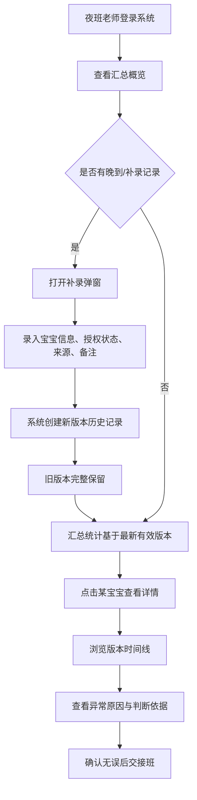

## 1. 产品概述
婴幼儿照片授权对账台（夜班交接版）用于托育机构夜班老师在交接班时核对婴幼儿照片授权状态，处理授权撤回记录晚到、补录等场景，确保历史结论可追溯、坏数据不污染统计。

- 主要解决授权撤回晚到导致旧结论不准、补录直接覆盖历史判断的问题
- 目标用户：托育机构夜班交接老师、对账审核人员
- 产品价值：保证对账历史不可篡改、统计口径可追溯、异常数据可审计

## 2. 核心功能

### 2.1 用户角色
| 角色 | 注册方式 | 核心权限 |
|------|----------|----------|
| 夜班老师 | 系统内置账号 | 查看汇总、录入补录记录、查看详情、交接班 |
| 审核人员 | 系统内置账号 | 全部权限 + 异常标记与说明 |

### 2.2 功能模块
1. **汇总概览页**：宝宝列表总览、授权状态统计、异常标识、交接班时间
2. **宝宝详情页**：该宝宝全部历史版本、每次判断的依据、异常原因、补录记录时间线
3. **补录操作**：手工录入新的授权/撤回记录，自动生成新版本而不覆盖旧判断
4. **异常详情**：照片缺失、数据异常的具体原因，以及为何被计入/未计入汇总的说明

### 2.3 页面详情
| 页面名称 | 模块名称 | 功能描述 |
|----------|----------|----------|
| 汇总概览页 | 顶部状态栏 | 当班日期、交接班时间、统计摘要（正常/异常/缺失/总数） |
| 汇总概览页 | 宝宝列表 | 表格展示每位宝宝最新授权状态、版本数、异常标记，点击进入详情 |
| 汇总概览页 | 补录入口 | 打开补录弹窗，录入宝宝姓名、授权状态、来源、备注 |
| 宝宝详情页 | 版本时间线 | 按时间倒序展示该宝宝所有历史版本，含判断依据、操作人、来源 |
| 宝宝详情页 | 异常说明区 | 若该记录被标记异常，展示具体原因及对汇总的影响 |
| 宝宝详情页 | 版本对比 | 相邻两个版本的差异高亮（授权状态变化、补录 vs 原始记录） |

## 3. 核心流程
夜班老师接班后打开汇总概览，浏览当前统计；发现晚到的授权撤回记录时，通过补录入口录入新信息，系统自动为对应宝宝生成新版本历史记录，旧结论完整保留；刷新页面或重启服务后数据不丢失；点击宝宝进入详情页可查看所有历史版本及异常原因；异常记录（照片缺失、格式错误）不会污染正常宝宝的汇总统计，但可在详情页中看到原因。

## 4. 用户界面设计

### 4.1 设计风格
- 主色：深夜蓝 `#0f172a` 为底色，搭配暖琥珀 `#f59e0b` 作强调（契合夜班场景）
- 辅助色：成功绿 `#10b981`、警示橙 `#f97316`、异常红 `#ef4444`
- 按钮风格：圆角 6px，微妙阴影，hover 有轻微位移
- 字体：标题使用「思源宋体 CN」或 Noto Serif SC，正文使用「思源黑体 CN」，营造台账式专业感
- 布局风格：顶部固定状态栏 + 主体卡片式表格 + 侧边详情抽屉；整体偏沉稳台账风，带轻微纸张纹理
- 图标：lucide-react 线性图标，与颜色语义匹配

### 4.2 页面设计概览
| 页面名称 | 模块名称 | UI 元素 |
|----------|----------|----------|
| 汇总概览页 | 顶部状态栏 | 深色横条，显示当班日期、交接班倒计时、四项统计数字卡片（正常/异常/缺失/总数），数字用大号衬线字体 |
| 汇总概览页 | 宝宝列表 | 斑马纹表格，每行显示宝宝姓名、最新授权状态徽章、版本数徽标、异常小红点；hover 行高变亮；最右有「详情」按钮 |
| 汇总概览页 | 补录按钮 | 右上角琥珀色主按钮，带加号图标；点击弹出模态表单 |
| 宝宝详情页 | 版本时间线 | 左侧竖线时间轴，每个节点一个卡片；卡片右上角显示版本号与操作时间；补录来源的卡片用琥珀色边框区分 |
| 宝宝详情页 | 异常说明区 | 若存在异常，红色边框卡片，含"原因"与"对汇总影响"两段说明文字 |
| 补录弹窗 | 表单 | 宝宝姓名下拉、授权状态单选、来源（撤回通知/手工补录/家长消息）、备注多行文本、提交/取消按钮 |

### 4.3 响应性
- Desktop-first，最小支持宽度 1024px
- 宝宝列表横向滚动兜底，移动端卡片折叠
- 详情抽屉在宽屏固定右侧，窄屏变为底部上滑抽屉

### 4.4 动效
- 页面加载：数字卡片依次淡入上移（stagger 80ms）
- 版本时间线：自上而下渐次显现
- 补录提交成功：Toast 从顶部滑入，2 秒后淡出
- 状态徽章：颜色变化时有 300ms 过渡
