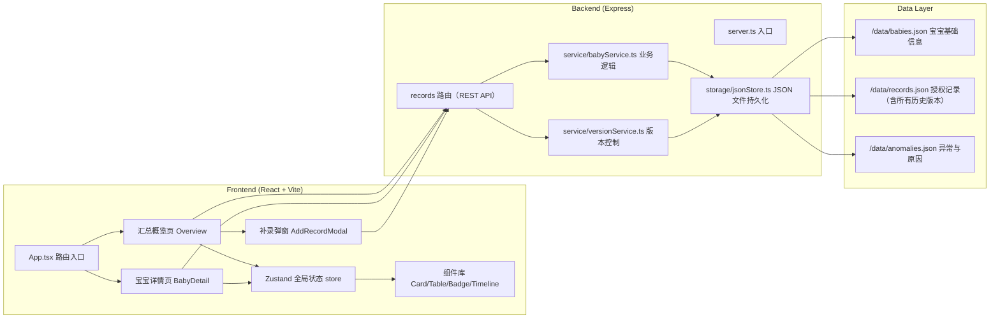
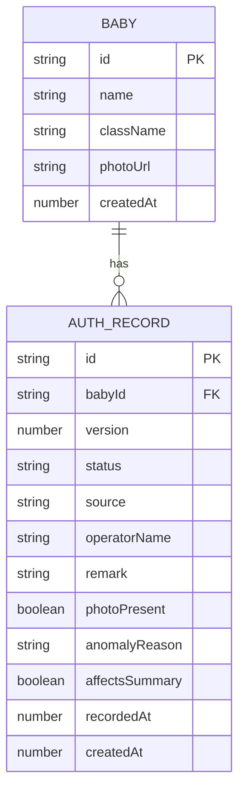

## 1. 架构设计



## 2. 技术描述
- 前端：React@18 + TypeScript + tailwindcss@3 + Vite + zustand + react-router-dom + lucide-react
- 后端：Express@4 + TypeScript + cors
- 数据存储：JSON 文件持久化（无需数据库，重启后数据仍保留；`fs` 读写，文件位于 `./data/`）
- 初始化工具：vite-init（react-express-ts 模板）

## 3. 路由定义
| 路由 | 用途 |
|------|------|
| / | 汇总概览页，展示全部宝宝最新状态与统计 |
| /baby/:id | 宝宝详情页，展示该宝宝所有历史版本时间线 |

## 4. API 定义

```typescript
// 宝宝基础信息
interface Baby {
  id: string;
  name: string;
  className: string;
  photoUrl?: string;
  createdAt: number;
}

// 授权记录（单个版本）
interface AuthRecord {
  id: string;
  babyId: string;
  version: number;
  status: 'authorized' | 'revoked' | 'pending' | 'missing';
  source: 'original' | 'supplement' | 'manual' | 'revocation_notice';
  operatorName: string;
  remark?: string;
  photoPresent: boolean;
  anomalyReason?: string;
  affectsSummary: boolean;   // 是否计入正常汇总
  recordedAt: number;         // 业务发生时间
  createdAt: number;          // 系统录入时间
}

// 聚合后的宝宝当前状态
interface BabySummary {
  baby: Baby;
  latestRecord: AuthRecord | null;
  versionCount: number;
  hasAnomaly: boolean;
}

// GET  /api/babies           -> BabySummary[]
// GET  /api/babies/:id       -> { baby: Baby, records: AuthRecord[] }
// POST /api/records          -> 录入一条新记录（自动升版本） body: { babyId, status, source, operatorName, remark?, photoPresent, anomalyReason?, recordedAt? }
// GET  /api/stats            -> { total, normal, anomaly, missing, byClass: [...] }
```

## 5. 数据模型



## 6. 业务规则实现要点

1. **历史版本不可覆盖**：每次 POST /api/records 时，查询该 babyId 当前最大 version，新记录 version = max + 1；旧记录绝不更新。
2. **刷新/重启持久化**：所有数据写入 `./data/*.json`，Express 启动时加载；前端 zustand store 从 API 拉取，不在 localStorage 做主存储。
3. **坏数据不污染汇总**：`affectsSummary=false` 的记录（如照片缺失、格式异常）在汇总统计时跳过，但详情页完整展示并给出 `anomalyReason`。
4. **幂等补录**：同一 `(babyId, recordedAt, source)` 重复提交时，后端检测到后不创建新记录，返回已有记录（保证重复提交不新增脏数据）。
5. **样例数据**：启动时若 JSON 文件为空则自动注入种子数据——含 8 位宝宝，其中：
   - 5 条正常宝宝
   - 1 条有旧版本 + 新补录的对比（体现补录不覆盖旧判断）
   - 1 条照片缺失异常（affectsSummary=false）
   - 1 条手工补录样例（source=manual）
