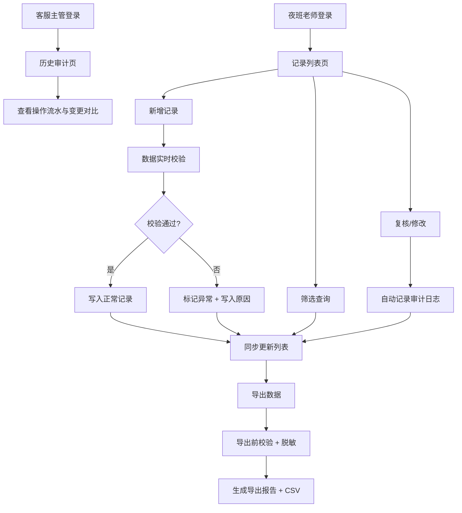

## 1. 产品概述

婴幼儿批次追溯巡检屏（夜班交接版）是面向托育机构夜班老师设计的记录管理系统，解决夜班交接时婴幼儿材料记录混乱、坏数据混入正常统计、隐私泄露难追溯等痛点。

- 核心目标：确保新增、筛选、复核、修改、历史、导出共用同一份数据，坏数据严格隔离不污染正常记录
- 目标用户：夜班托育老师（日常操作）、客服主管（审计核查）
- 产品价值：降低夜班交接出错率，保障数据合规可追溯

## 2. 核心功能

### 2.1 用户角色

| 角色 | 登录方式 | 核心权限 |
|------|----------|----------|
| 夜班托育老师 | 工号登录 | 新增记录、筛选查询、复核标记、修改内容、导出数据 |
| 客服主管 | 工号登录 | 所有老师权限 + 查看审计历史 + 数据质量核查 |

### 2.2 功能模块

1. **记录列表页**：批次筛选、状态筛选、数据质量标识、快速复核
2. **新增/编辑记录页**：基础信息录入、家长可见内容、内部备注、手机号格式校验
3. **记录详情页**：完整信息展示、数据问题原因、修改历史时间线、审计追踪
4. **历史审计页**：操作人、操作时间、修改前后对比、操作类型筛选
5. **导出功能**：字段脱敏、隐私保护、格式校验报告、CSV 导出

### 2.3 页面详情

| 页面名称 | 模块名称 | 功能描述 |
|----------|----------|----------|
| 记录列表页 | 筛选区 | 按批次号、日期、宝宝姓名、数据状态（正常/待复核/异常）筛选 |
| 记录列表页 | 数据列表 | 每行显示宝宝姓名、批次号、录入时间、状态标签、数据质量告警徽标 |
| 记录列表页 | 批量操作 | 批量复核、批量导出、异常标记 |
| 新增/编辑记录页 | 基础信息 | 宝宝姓名、性别、出生日期、批次号、家长手机号（实时格式校验） |
| 新增/编辑记录页 | 家长可见区 | 喂养记录、体温、睡眠情况（标注"家长可见"） |
| 新增/编辑记录页 | 内部备注区 | 特殊情况说明、交接注意事项（标注"仅内部可见"） |
| 记录详情页 | 信息总览 | 分栏展示家长可见内容与内部备注 |
| 记录详情页 | 数据质量区 | 列出手机号格式、隐私字段、必填项缺失等问题及原因说明 |
| 记录详情页 | 修改时间线 | 展示每次修改的操作人、时间、变更内容对比 |
| 历史审计页 | 审计筛选 | 按操作人、时间范围、操作类型（新增/修改/复核/删除）筛选 |
| 历史审计页 | 审计列表 | 展示操作流水，点击可查看修改前后字段对比 |
| 导出弹窗 | 导出配置 | 选择导出范围、勾选脱敏字段、预览导出报告 |
| 导出弹窗 | 数据质量报告 | 导出前展示待导出数据中的问题条数及原因摘要 |

## 3. 核心流程

夜班老师登录后进入记录列表，可新增临时补充记录或从已有批次中筛选记录进行复核。所有操作（新增、修改、复核）均写入同一份数据源并同步更新状态。修改时自动记录审计日志。导出前系统自动校验，标注坏数据且不与正常记录混淆。客服主管可随时查看所有操作的审计追踪。

## 4. 用户界面设计

### 4.1 设计风格

- 主色：深夜蓝 `#1e293b`，辅以琥珀橙 `#f59e0b` 作为告警标识
- 辅色：正常绿 `#10b981`、异常红 `#ef4444`、待复核灰 `#6b7280`
- 按钮风格：方正直角、低饱和，符合夜班操作的克制朴素风格
- 字体：系统等宽字体用于数据展示，确保数字列对齐；正文使用思源黑体
- 布局：顶部导航 + 左侧筛选 + 右侧主内容区，信息密度高但层次清晰
- 图标：Lucide 线性图标，统一 16px 尺寸

### 4.2 页面设计概述

| 页面名称 | 模块名称 | UI 元素 |
|----------|----------|---------|
| 记录列表页 | 筛选区 | 紧凑表单布局，标签 + 输入框 + 下拉，行高 32px |
| 记录列表页 | 数据列表 | 斑马纹表格，状态列用圆点+文字双重标识，异常行整行浅红底 |
| 新增/编辑记录页 | 分栏表单 | 左侧家长可见区（浅绿边），右侧内部备注区（浅灰边），视觉分区 |
| 记录详情页 | 数据质量区 | 问题卡片列表，每条显示图标 + 问题描述 + 原因说明 + 修复建议 |
| 记录详情页 | 修改时间线 | 左侧竖线时间轴，右侧操作卡片，hover 高亮变更字段 |
| 历史审计页 | 审计列表 | 表格展示操作流水，点击展开行内对比面板 |
| 导出弹窗 | 质量报告 | 顶部汇总条（正常 X 条 / 异常 Y 条），下方可折叠问题明细 |

### 4.3 响应性

- 桌面端优先设计，最小支持宽度 1280px
- 1280px ~ 1600px：标准布局
- 1600px 以上：列表列间距适度放大
- 不做移动端适配，夜班场景统一使用桌面巡检屏

### 4.4 试运行场景

系统内置两份演示数据用于试跑：
1. 一份旧记录（数据完整、格式正确、标记为"正常"）
2. 一份刚补的材料（含手机号格式错误、隐私字段未脱敏、必填项缺失，标记为"异常"）
验证目标：异常记录独立标识，不影响正常记录的统计与导出。
