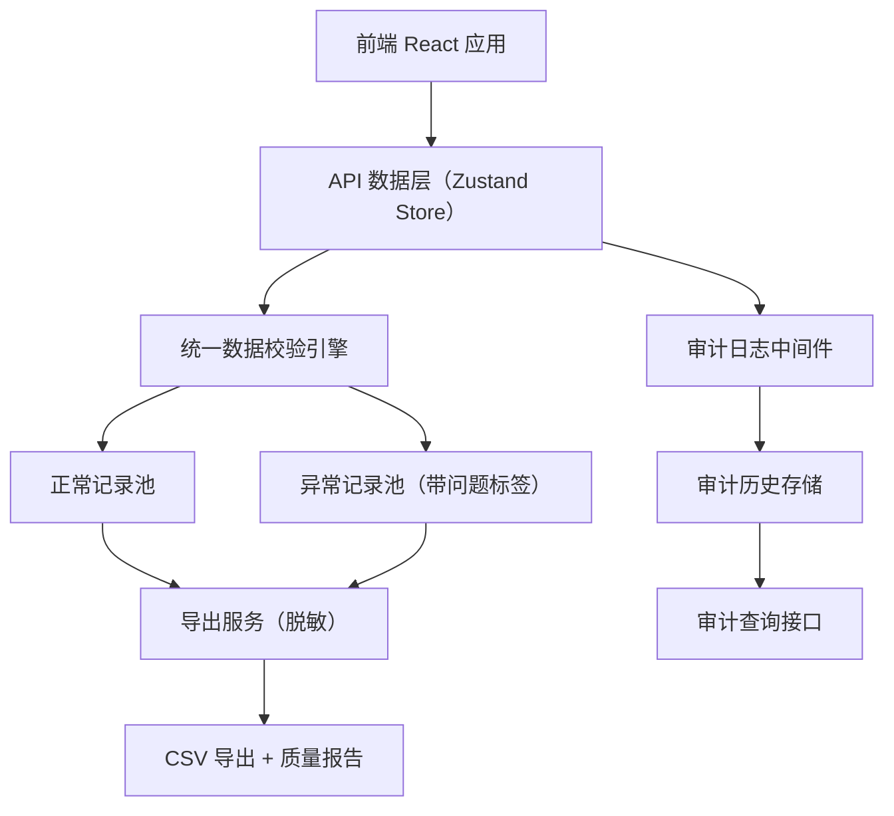
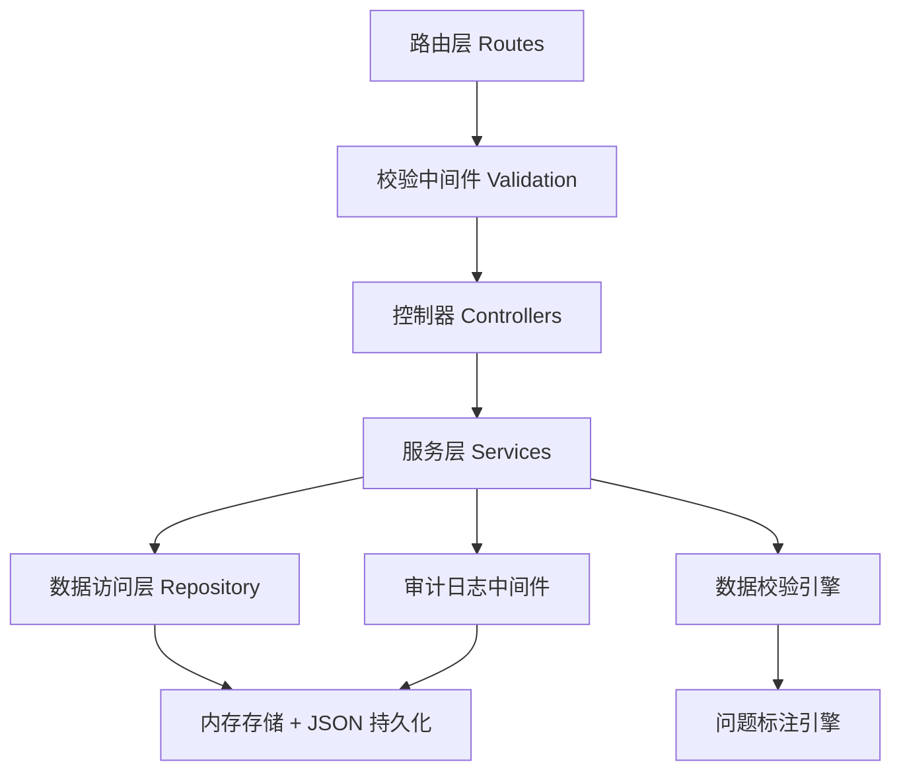
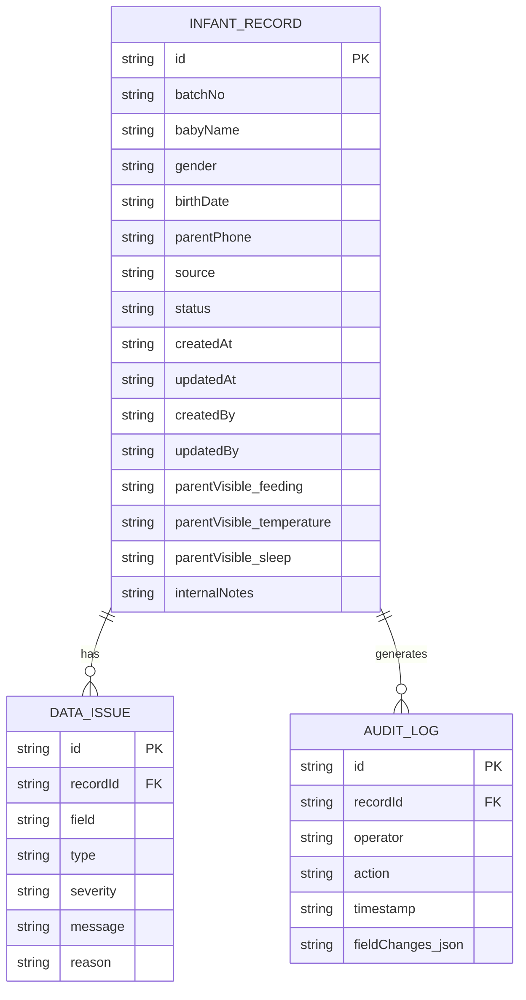

## 1. 架构设计



## 2. 技术说明

- 前端：React@18 + TypeScript + Vite
- 样式：TailwindCSS@3
- 状态管理：Zustand（单一数据源，所有模块共用同一份 store）
- 后端：Express@4（内存存储 + JSON 文件持久化，便于演示）
- 数据：Mock 数据（内置旧记录 + 临时补充记录两份试跑数据）
- 图标：lucide-react

## 3. 路由定义

| 路由 | 用途 |
|------|------|
| / | 记录列表页（首页） |
| /records/new | 新增记录页 |
| /records/:id | 记录详情页（含数据质量问题 + 修改历史） |
| /records/:id/edit | 编辑记录页 |
| /audit | 历史审计页 |

## 4. API 定义

```typescript
// 共享类型定义
export type RecordStatus = 'normal' | 'pending' | 'abnormal';
export type RecordSource = 'batch' | 'supplement'; // 批次记录 / 临时补充
export type Visibility = 'parent' | 'internal'; // 家长可见 / 仅内部

export interface DataIssue {
  id: string;
  field: string;
  type: 'phone_format' | 'privacy_leak' | 'required_missing' | 'invalid_data';
  severity: 'warning' | 'error';
  message: string;
  reason: string;
}

export interface InfantRecord {
  id: string;
  batchNo: string;
  babyName: string;
  gender: 'male' | 'female';
  birthDate: string;
  parentPhone: string;
  source: RecordSource;
  status: RecordStatus;
  createdAt: string;
  updatedAt: string;
  createdBy: string;
  updatedBy: string;
  parentVisible: {
    feeding: string;
    temperature: string;
    sleep: string;
  };
  internalNotes: string;
  issues: DataIssue[];
}

export interface AuditLog {
  id: string;
  recordId: string;
  operator: string;
  action: 'create' | 'update' | 'review' | 'export';
  timestamp: string;
  fieldChanges: {
    field: string;
    oldValue: string;
    newValue: string;
  }[];
}

// API 接口
// GET    /api/records              查询记录列表（支持筛选）
// POST   /api/records              新增记录
// GET    /api/records/:id          获取单条记录详情
// PUT    /api/records/:id          更新记录
// PATCH  /api/records/:id/review   复核记录（切换状态）
// GET    /api/records/:id/audit    获取单条记录的修改历史
// GET    /api/audit                查询审计日志（支持筛选）
// POST   /api/export               导出记录（返回 CSV + 质量报告）
```

## 5. 服务端架构图



## 6. 数据模型

### 6.1 数据模型定义



### 6.2 初始数据（试跑场景）

- **旧记录（正常）**：数据完整，手机号格式正确，无隐私泄露，状态 `normal`
- **临时补充（异常）**：含手机号格式错误、隐私字段未脱敏、必填项缺失，状态 `abnormal`，附带详细问题原因
