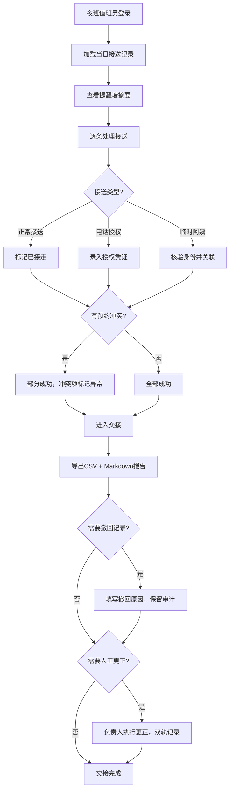

## 1. 产品概述

婴幼儿接送授权提醒墙（夜班交接版）是面向托育机构西门接送口的夜间交接班管理系统，解决夜班中电话授权与临时阿姨混编场景下授权变更追踪混乱的问题。系统以"审计可追溯、部分成功不拖垮、人工更正有路径"为核心原则，保障婴幼儿接送安全与管理合规。

- **目标用户**：夜班门岗值班员、门岗负责人、托育主管
- **核心问题**：旧流程无法记清电话授权与临时阿姨混合场景下谁改过授权记录
- **产品价值**：授权变更全链路审计、冲突场景部分成功、坏行隔离不影响正常记录

---

## 2. 核心功能

### 2.1 用户角色

| 角色 | 注册方式 | 核心权限 |
|------|----------|----------|
| 夜班门岗值班员 | 工号登录 | 查看提醒墙、记录接送、电话授权登记、导出报告 |
| 门岗负责人 | 工号登录+权限 | 人工更正记录、审核异常、标记交接完成 |
| 托育主管 | 管理员账号 | 审计回溯、查看变更历史、复查撤回记录 |

### 2.2 功能模块

1. **提醒墙首页**：夜班概览摘要、待接送列表、异常警示、授权状态看板
2. **接送详情页**：单条记录全生命周期、授权变更时间线、电话授权录音/记录关联
3. **导出中心**：CSV 结构化报告、Markdown 交接报告、两者状态严格一致
4. **审计追踪**：变更历史、撤回原因、操作人追溯、主管复查入口
5. **人工更正**：负责人更正路径、失败记录复盘、坏行隔离标记

### 2.3 页面详情

| 页面名称 | 模块名称 | 功能描述 |
|----------|----------|----------|
| 提醒墙首页 | 夜班摘要看板 | 当日应接/实接/异常/电话授权/临时阿姨数量统计，与导出报告完全对齐 |
| 提醒墙首页 | 待接送列表 | 按宝宝姓名展示接送状态，支持正常/异常状态筛选，坏行独立标记 |
| 提醒墙首页 | 冲突处理区 | 预约冲突时展示部分成功结果，已成功记录不被回滚 |
| 接送详情页 | 授权变更时间线 | 完整展示从创建→电话授权→临时阿姨→撤回的每一步操作人与时间 |
| 接送详情页 | 电话授权凭证 | 记录通话人、通话时间、授权内容、授权人身份核验状态 |
| 接送详情页 | 撤回审计 | 已确认记录被撤回时强制填写原因、保留操作人、不可删除仅标记无效 |
| 导出中心 | CSV 导出 | 包含全部字段，与页面摘要/详情状态一一对应，含审计标记列 |
| 导出中心 | Markdown 导出 | 夜班交接报告，含摘要、异常清单、变更历史、人工更正记录 |
| 人工更正页 | 失败路径复盘 | 展示失败记录处理流程，门岗负责人可按步骤回溯 |
| 人工更正页 | 更正执行 | 负责人对异常记录更正，保留原记录+更正记录双轨 |

---

## 3. 核心流程

### 3.1 主流程描述

夜班值班员到岗后打开提醒墙首页，系统自动加载当日夜班所有婴幼儿接送记录。值班员逐一确认接送：
- 正常接送：标记为已接走
- 电话授权接送：录入授权电话、授权人、接走人员信息
- 临时阿姨接送：核实阿姨身份并关联授权记录
- 预约冲突：系统允许部分成功，冲突项标记异常但不影响已处理项
- 记录撤回：已确认记录需撤回时，强制填写原因，保留完整审计痕迹

交接时通过导出中心同时输出 CSV 与 Markdown 报告，两者内容严格一致。门岗负责人可通过人工更正页面对异常记录进行复盘与更正。

### 3.2 核心流程图

---

## 4. 用户界面设计

### 4.1 设计风格

- **主色调**：深夜蓝 `#0f172a`（夜班氛围基调）+ 警示琥珀 `#f59e0b`（异常标记）+ 安全绿 `#10b981`（正常状态）
- **辅色调**：电话授权蓝 `#3b82f6`、临时阿姨紫 `#8b5cf6`、撤回红 `#ef4444`
- **按钮风格**：方中带圆（圆角 6px），悬浮状态有 2px 边框发光，禁用态灰度 50%
- **字体**：标题用「思源宋体 SemiBold」传达庄重感（安全场景），正文用「JetBrains Mono」等宽字体便于核对编号与时间戳
- **布局风格**：信息密度偏高的值班看板布局，左侧导航固定，中间主列表+右侧详情抽屉，顶栏实时显示夜班剩余时长
- **图标风格**：Lucide 线性图标，状态点用实心小圆点配合颜色编码

### 4.2 页面设计概览

| 页面名称 | 模块名称 | UI 元素 |
|----------|----------|---------|
| 提醒墙首页 | 夜班摘要看板 | 深色卡片网格，5 个数据块（应接/实接/异常/电话授权/临时阿姨），数字用大号等宽字体，底部显示更新时间戳，与导出报告头部完全一致 |
| 提醒墙首页 | 待接送列表 | 斑马纹表格，每行显示宝宝姓名/班级/授权人/状态标签/操作按钮，状态标签颜色编码：绿=正常、蓝=电话授权、紫=临时阿姨、琥珀=异常、红灰=已撤回 |
| 提醒墙首页 | 冲突处理区 | 顶部浮动警示条，琥珀色背景，展示"部分成功 X 条，异常 Y 条"，点击展开异常明细 |
| 接送详情页 | 授权变更时间线 | 垂直时间轴，节点圆形图标+操作人+时间，电话授权节点附带蓝色话机图标，撤回节点红色并附带原因标签 |
| 导出中心 | 报告预览 | 双栏 Tab 切换（CSV/Markdown），预览窗口等宽字体，行号与高亮匹配异常记录，导出按钮旁显示"状态一致性校验中 ✓"标记 |
| 人工更正页 | 失败路径复盘 | 步骤引导卡片，每步编号+说明+可点击跳转，右侧展示原记录快照与更正表单 |

### 4.3 响应式

桌面端优先设计（1440px 以上），适配夜班双屏值班场景。平板端（768-1024px）将右侧详情抽屉改为底部抽屉。移动端（<768px）仅保留摘要查看与紧急标记功能，完整操作需使用桌面端。

### 4.4 动效细节

- 页面加载：卡片错落淡入（stagger 80ms），数字从 0 滚动到目标值
- 状态变更：对应行高亮闪烁 2 次绿色/琥珀色后渐隐
- 撤回操作：弹窗出现时有轻微震动感（translateY 2px 抖动 2 次），提示操作严肃性
- 时间轴节点：hover 时节点放大 1.3 倍，关联操作人标签浮出
