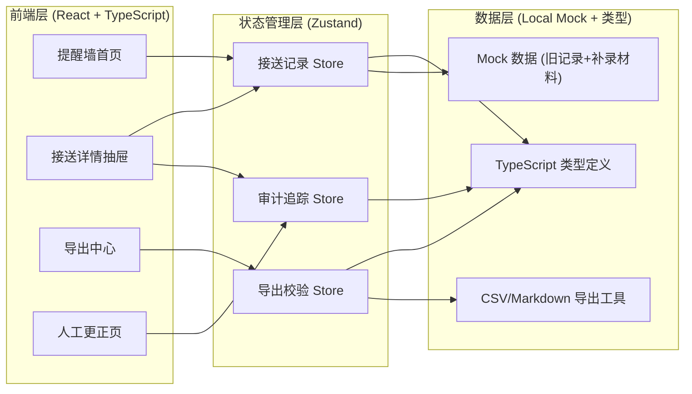
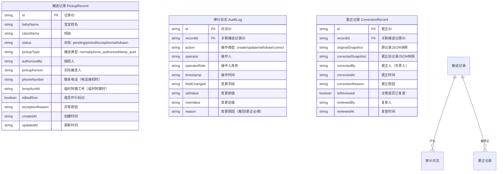

## 1. 架构设计



## 2. 技术说明

- **前端框架**：React@18 + TypeScript + Vite
- **样式方案**：TailwindCSS@3（深色主题，自定义语义化颜色 token）
- **状态管理**：Zustand（分模块管理接送记录、审计、导出状态）
- **路由**：React Router DOM@6
- **图标**：lucide-react
- **后端**：纯前端 Mock 数据（localStorage 持久化模拟），无需真实后端
- **数据持久化**：localStorage 模拟后端存储，预置旧记录 + 补录材料的测试数据

## 3. 路由定义

| 路由 | 用途 |
|------|------|
| `/` | 提醒墙首页（默认路由）—— 夜班摘要 + 接送列表 + 冲突处理 |
| `/export` | 导出中心 —— CSV/Markdown 预览与下载，状态一致性校验 |
| `/correction` | 人工更正页 —— 失败路径复盘 + 更正执行（双轨记录） |

## 4. 数据模型

### 4.1 ER 图



### 4.2 TypeScript 类型定义

```typescript
export type PickupStatus = 'pending' | 'picked' | 'exception' | 'withdrawn';
export type PickupType = 'normal' | 'phone_authorized' | 'temp_aunt';
export type AuditAction = 'create' | 'update' | 'withdraw' | 'correct' | 'partial_success';
export type UserRole = 'duty_officer' | 'gate_supervisor' | 'director';

export interface PhoneAuthInfo {
  callerName: string;
  callerPhone: string;
  authTime: string;
  identityVerified: boolean;
  authContent: string;
}

export interface TempAuntInfo {
  auntName: string;
  auntId: string;
  verifiedAt: string;
  relationNote: string;
}

export interface PickupRecord {
  id: string;
  babyName: string;
  className: string;
  status: PickupStatus;
  pickupType: PickupType;
  authorizedBy: string;
  pickupPerson: string;
  phoneAuth?: PhoneAuthInfo;
  tempAunt?: TempAuntInfo;
  isBadRow: boolean;
  exceptionReason?: string;
  conflictNote?: string;
  createdAt: string;
  updatedAt: string;
  withdrawnReason?: string;
  withdrawnBy?: string;
  withdrawnAt?: string;
}

export interface AuditLog {
  id: string;
  recordId: string;
  action: AuditAction;
  operator: string;
  operatorRole: UserRole;
  timestamp: string;
  fieldChanged?: string;
  oldValue?: string;
  newValue?: string;
  reason?: string;
}

export interface CorrectionRecord {
  id: string;
  recordId: string;
  originalSnapshot: PickupRecord;
  correctedSnapshot: PickupRecord;
  correctedBy: string;
  correctedAt: string;
  correctionReason: string;
  isReviewed: boolean;
  reviewedBy?: string;
  reviewedAt?: string;
}

export interface BatchOperationResult {
  total: number;
  succeeded: number;
  failed: number;
  succeededIds: string[];
  failedIds: string[];
  failedDetails: { recordId: string; reason: string }[];
}

export interface ExportReport {
  summary: {
    totalExpected: number;
    totalPicked: number;
    totalException: number;
    totalPhoneAuthorized: number;
    totalTempAunt: number;
    totalWithdrawn: number;
    generatedAt: string;
    shiftName: string;
  };
  records: PickupRecord[];
  auditLogs: AuditLog[];
  corrections: CorrectionRecord[];
  consistencyHash: string;
}
```

## 5. 核心业务规则

1. **部分成功原则**：批量处理接送记录时，单条失败不影响其他已成功记录，返回 `BatchOperationResult` 展示明细。
2. **撤回审计原则**：已确认为 `picked` 的记录被撤回时，必须填写 `withdrawnReason`、`withdrawnBy`、`withdrawnAt`，记录状态变为 `withdrawn` 但不删除，审计日志完整保留。
3. **导出一致性原则**：CSV 与 Markdown 报告基于同一份 `ExportReport` 数据生成，计算 `consistencyHash`（SHA-256）确保两者内容可互相对证。
4. **坏行隔离原则**：标记 `isBadRow = true` 的记录在列表中独立分组展示，不影响正常记录的统计与处理流程。
5. **人工更正双轨原则**：更正记录保留原记录快照（`originalSnapshot`）与更正后快照（`correctedSnapshot`），原接送记录状态不变，更正记录独立存在并进入主管复查流程。
