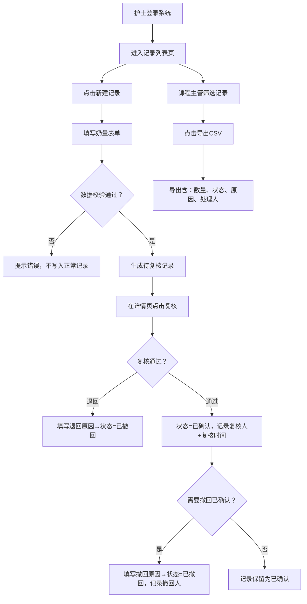

## 1. 产品概述

婴幼儿奶量交接本儿保随访版是面向社区儿童保健科护士与课程主管的奶量记录管理系统，解决家长群留言与纸质交接单不同步、底账不一致、坏数据污染、历史追溯缺失等问题。

- 核心目标：建立统一电子底账，护士录入/复核奶量记录，课程主管按筛选条件导出明细报表
- 目标用户：社区儿保护士（录入、复核、修改）、课程主管（筛选、导出、审计）

## 2. 核心功能

### 2.1 用户角色

| 角色 | 登录方式 | 核心权限 |
|------|----------|----------|
| 儿保护士 | 本地模拟登录 | 新建记录、修改记录、复核确认、撤回确认、查看详情与历史 |
| 课程主管 | 本地模拟登录 | 筛选列表、查看详情、导出报表（含数量、状态、原因、处理人） |

### 2.2 功能模块

1. **记录列表页**：奶量记录表格、筛选栏（日期/婴儿/状态/处理人）、搜索、新建按钮、导出按钮、状态统计卡片
2. **记录详情页**：基本信息展示、状态流转时间线、冲突/撤回原因展示、变更历史（旧值、处理人、复核时间）
3. **复核面板**：复核操作区（通过/退回/撤回）、原因输入框、处理人信息

### 2.3 页面详情

| 页面名称 | 模块名称 | 功能描述 |
|----------|----------|----------|
| 记录列表页 | 顶部筛选栏 | 日期范围、婴儿姓名、记录状态（待复核/已确认/已撤回/冲突）、处理人下拉筛选 |
| 记录列表页 | 状态统计卡片 | 待复核数、已确认数、冲突数、已撤回数的4张统计卡片 |
| 记录列表页 | 记录表格 | 序号、婴儿姓名、日期、奶量(ml)、状态、处理人、创建时间、操作（详情/复核/撤回） |
| 记录列表页 | 操作按钮栏 | 新建记录、导出CSV（与筛选结果一致） |
| 记录详情页 | 基本信息区 | 婴儿姓名、日期、班次、奶量、喂养方式、备注 |
| 记录详情页 | 状态区 | 当前状态标签、冲突原因/撤回原因展示（如有） |
| 记录详情页 | 复核面板 | 复核通过、退回（填原因）、撤回已确认（填原因）按钮，显示处理人 |
| 记录详情页 | 变更历史 | 时间倒序展示每次变更：字段、旧值、新值、处理人、处理时间、复核时间 |
| 新建/编辑弹窗 | 表单区 | 婴儿姓名、日期、班次、奶量(ml)、喂养方式、备注，提交时校验数据不污染正常记录 |

## 3. 核心流程

## 4. 用户界面设计

### 4.1 设计风格
- **主色调**：医疗冷静蓝 `#2563EB`（强调专业可信）
- **辅助色**：柔和薄荷绿 `#10B981`（已确认）、暖橙 `#F59E0B`（待复核）、珊瑚红 `#EF4444`（冲突/撤回）
- **中性色**：石板灰 `#1F2937` 文字、`#F8FAFC` 背景、白色卡片
- **按钮风格**：圆角 8px，实色填充主按钮，描边次按钮，hover 时阴影与微缩放
- **字体**：标题使用 Noto Serif SC（衬线感体现档案感），正文使用 Noto Sans SC（清晰易读）
- **布局风格**：卡片式布局 + 细边框分隔，顶部导航栏 + 左侧筛选 + 右侧表格
- **图标**：Lucide 线性图标，保持统一线宽

### 4.2 页面设计概述

| 页面名称 | 模块名称 | UI 元素 |
|----------|----------|---------|
| 记录列表页 | 顶部导航 | 品牌标识「奶量交接本」、用户切换下拉、当前日期 |
| 记录列表页 | 状态卡片组 | 4 张带渐变左侧边的卡片，显示数字 + 标签 + 图标 |
| 记录列表页 | 筛选工具栏 | 标签式状态切换 + 日期选择器 + 搜索框 + 导出按钮 |
| 记录列表页 | 数据表格 | 斑马纹行、状态彩色标签、行内操作按钮 |
| 记录详情页 | 顶部面包屑 | 返回列表 / 记录编号 / 当前状态大标签 |
| 记录详情页 | 双栏布局 | 左栏基本信息卡片 + 变更历史，右栏复核面板（sticky） |
| 记录详情页 | 时间线 | 垂直时间线展示状态流转，圆点颜色对应状态 |
| 记录详情页 | 历史表格 | 字段/旧值/新值/处理人/时间对比展示 |

### 4.3 响应式

- 桌面端（≥1024px）：双栏详情布局、完整筛选栏
- 平板（768-1024px）：单栏详情、筛选栏折叠
- 移动端（<768px）：表格横向滚动、卡片堆叠

### 4.4 动效与微交互

- 页面加载：卡片从下往上渐入，stagger 100ms
- 状态变更：状态标签颜色平滑过渡 300ms
- 复核成功：面板区显示绿色对勾脉冲动画
- 表格行 hover：背景浅蓝 + 左侧出现彩色指示条
- 模态框：缩放 + 背景模糊淡入
