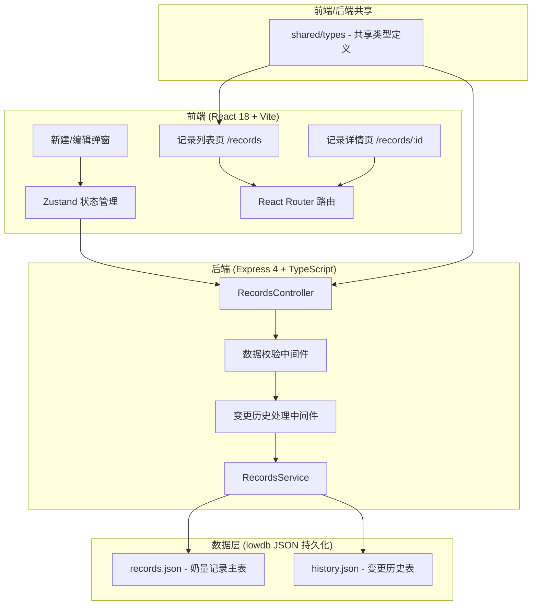
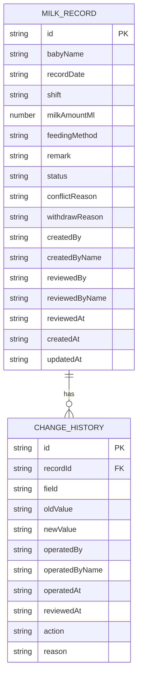

## 1. 架构设计



## 2. 技术描述

- **前端框架**：React 18 + TypeScript
- **构建工具**：Vite 5
- **UI 样式**：TailwindCSS 3
- **状态管理**：Zustand
- **路由**：React Router DOM 6
- **图标库**：Lucide React
- **后端**：Express 4 + TypeScript (ESM)
- **数据库**：lowdb（JSON 文件持久化，无需外部服务）
- **数据导出**：前端 CSV 原生生成

## 3. 路由定义

### 前端路由

| 路由 | 页面组件 | 用途 |
|------|----------|------|
| `/` | 重定向至 `/records` | 首页跳转 |
| `/records` | `RecordsListPage` | 记录列表页（筛选、搜索、导出） |
| `/records/:id` | `RecordDetailPage` | 记录详情页（信息、复核、历史） |

### 后端 API 路由

| Method | Route | 用途 |
|--------|-------|------|
| `GET` | `/api/records` | 按筛选条件获取记录列表 |
| `GET` | `/api/records/:id` | 获取单条记录详情 + 关联历史 |
| `POST` | `/api/records` | 新建奶量记录（含数据校验） |
| `PUT` | `/api/records/:id` | 修改记录（自动写入变更历史） |
| `POST` | `/api/records/:id/review` | 复核通过/退回 |
| `POST` | `/api/records/:id/withdraw` | 撤回已确认记录 |
| `GET` | `/api/records/:id/history` | 获取记录变更历史 |

## 4. API 数据类型定义

```typescript
// shared/types/index.ts

export type RecordStatus = 'pending' | 'confirmed' | 'withdrawn' | 'conflict';
export type FeedingMethod = 'breast' | 'formula' | 'mixed' | 'other';
export type Shift = 'morning' | 'afternoon' | 'night';
export type UserRole = 'nurse' | 'supervisor';

export interface User {
  id: string;
  name: string;
  role: UserRole;
}

export interface MilkRecord {
  id: string;
  babyName: string;
  recordDate: string;           // ISO date YYYY-MM-DD
  shift: Shift;
  milkAmountMl: number;
  feedingMethod: FeedingMethod;
  remark: string;
  status: RecordStatus;
  conflictReason?: string;      // 冲突原因（预约冲突等）
  withdrawReason?: string;      // 撤回原因
  createdBy: string;            // 创建人 ID
  createdByName: string;
  reviewedBy?: string;          // 复核人 ID
  reviewedByName?: string;
  reviewedAt?: string;          // 复核时间 ISO
  createdAt: string;
  updatedAt: string;
}

export interface ChangeHistory {
  id: string;
  recordId: string;
  field: string;                // 变更字段名
  oldValue: any;
  newValue: any;
  operatedBy: string;           // 处理人 ID
  operatedByName: string;
  operatedAt: string;           // 处理时间 ISO
  reviewedAt?: string;          // 复核时间（如该次变更涉及复核）
  action: 'create' | 'update' | 'review' | 'withdraw';
  reason?: string;              // 操作原因
}

export interface RecordFilter {
  dateFrom?: string;
  dateTo?: string;
  babyName?: string;
  status?: RecordStatus;
  operatorName?: string;
}

export interface ReviewPayload {
  pass: boolean;
  reason?: string;              // 退回时必填
}

export interface WithdrawPayload {
  reason: string;               // 撤回必填
}
```

## 5. 服务端架构

```mermaid
graph LR
    A[路由层 api/routes/records.ts] --> B[校验中间件 api/middleware/validate.ts]
    B --> C[业务服务层 api/services/recordsService.ts]
    C --> D[历史记录 api/services/historyService.ts]
    C --> E[数据访问层 api/db/index.ts (lowdb)]
    E --> F[(records.json)]
    D --> G[(history.json)]
```

## 6. 数据模型

### 6.1 ER 图



### 6.2 数据初始化（lowdb seed）

初始数据将包含：
- 10+ 条跨状态（pending/confirmed/withdrawn/conflict）的奶量记录
- 5+ 条变更历史记录（含旧值、处理人、复核时间）
- 2 个模拟用户：护士「张护士」、主管「李主管」

### 6.3 核心业务约束

1. **坏数据隔离**：新建/修改时校验 milkAmountMl ∈ [1, 300]、日期不晚于今天、婴儿姓名非空；校验失败直接返回错误，不写入主表
2. **预约冲突检测**：同一婴儿 + 同一日期 + 同一班次已有记录时，新记录标记 `status=conflict` 并写入 `conflictReason`
3. **历史不可篡改**：任何 PUT / review / withdraw 操作都必须同步写入 `CHANGE_HISTORY`，旧值由服务端查询后保存
4. **CSV 导出一致性**：导出使用与列表 API 完全相同的 `RecordFilter` 参数，导出字段包含：序号、婴儿姓名、日期、班次、奶量、状态、原因（冲突/撤回）、处理人、创建时间
