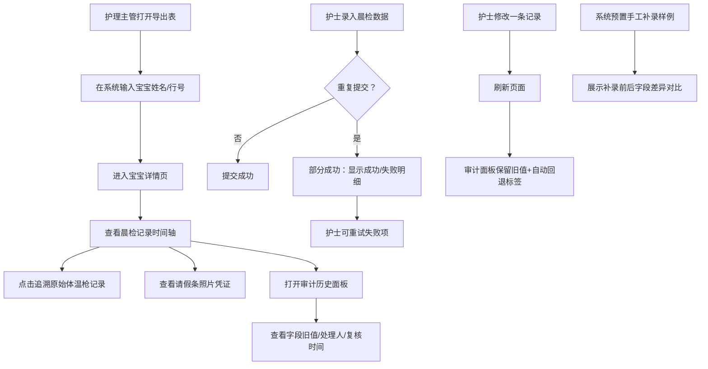

## 1. 产品概述

婴幼儿晨检复核清洗链儿保随访版是面向母婴店护理主管与护士的晨检数据追溯与复核系统。解决月底复盘时保健复核数据找不到来源、前后口径不一致的问题，通过完整的数据追溯链（导出表→宝宝详情→原始体温枪记录+请假条照片）让每一笔数据都有据可查。

- 目标用户：护理主管、护士
- 核心价值：数据可追溯、审计留痕、部分成功容错、多状态页面反馈

## 2. 核心功能

### 2.1 用户角色

| 角色 | 登录方式 | 核心权限 |
|------|----------|----------|
| 护理主管 | 工号登录 | 数据复核、导出反查、审计查看、状态回退 |
| 护士 | 工号登录 | 晨检录入、记录修改、手工补录、查看历史 |

### 2.2 功能模块

1. **晨检列表页**：数据三态反馈（空数据/脏数据/正常数据）、筛选搜索、导出、批量复核
2. **宝宝详情页**：宝宝基础信息、晨检记录时间轴、原始体温枪记录、请假条照片展示
3. **记录编辑/补录弹窗**：编辑已有记录、手工补录缺失记录、重复提交部分成功处理
4. **审计历史面板**：字段变更旧值、处理人、复核时间、操作类型标签
5. **数据追溯链**：从导出表行号定位宝宝→查看原始设备记录和凭证照片

### 2.3 页面详情

| 页面名称 | 模块名称 | 功能描述 |
|----------|----------|----------|
| 晨检列表页 | 三态反馈容器 | 空数据显示引导插画+添加按钮；脏数据高亮告警行+修复入口；正常数据展示表格 |
| 晨检列表页 | 数据表格 | 宝宝姓名、体温、状态、晨检时间、复核状态、操作列（详情/编辑/审计） |
| 晨检列表页 | 顶部筛选栏 | 日期范围、班级、复核状态、数据状态筛选 + 导出按钮 |
| 宝宝详情页 | 信息头卡 | 头像、姓名、班级、家长电话、健康档案编号 |
| 宝宝详情页 | 晨检时间轴 | 按日期展示晨检记录卡片，显示体温、口腔/手部/皮肤检查项 |
| 宝宝详情页 | 原始记录追溯 | 体温枪设备编号、测量时间、原始值快照；请假条照片预览（可放大） |
| 宝宝详情页 | 补录对比区 | 高亮手工补录记录，显示补录前后字段差异对比 |
| 记录编辑弹窗 | 表单区 | 体温、检查项、备注录入，支持上传请假条照片 |
| 记录编辑弹窗 | 部分成功提示 | 重复提交时展示成功/失败明细，允许重试失败项 |
| 审计历史面板 | 变更列表 | 每条变更显示：字段名、旧值→新值、处理人、复核时间、操作类型 |
| 审计历史面板 | 状态回退保留 | 刷新页面后状态回退的变更仍保留审计记录，标记"自动回退"标签 |

## 3. 核心流程

护理主管收到月底复盘导出表，在系统内输入导出行号或宝宝姓名定位记录，进入宝宝详情页查看原始体温枪数据和请假条照片凭证。护士日常录入晨检数据，系统对重复提交做部分成功处理；护士修改记录后刷新，历史审计面板保留旧值、处理人、复核时间。系统内置一条手工补录样例数据，方便演示补录前后差异。

## 4. 用户界面设计

### 4.1 设计风格

- 主色调：医疗青 `#0EA5A0`，辅助色：暖橙 `#F59E0B`（告警）、米白 `#FEFCE8`（背景）
- 按钮风格：圆角 8px，主色按钮带 2px 内阴影的微凸起质感
- 字体：标题用"思源宋体"彰显专业感，正文用"思源黑体"保证可读性
- 布局风格：顶部导航 + 左侧筛选 + 右侧主内容卡片式布局
- 图标风格：Lucide 线性图标，数据状态用不同色点标记

### 4.2 页面设计概览

| 页面名称 | 模块名称 | UI 元素 |
|----------|----------|----------|
| 晨检列表页 | 三态容器 | 空数据：插画+大号提示+主按钮；脏数据：黄色告警条+闪烁红点；正常数据：斑马纹表格 |
| 晨检列表页 | 数据行 | 体温异常红色标记、复核状态胶囊标签、脏数据行浅黄底 |
| 宝宝详情页 | 追溯链 | 面包屑式追溯路径（导出行 → 宝宝 → 原始记录），步骤间用箭头连接 |
| 宝宝详情页 | 时间轴 | 左侧竖线 + 日期节点，记录卡片悬浮上浮 |
| 审计历史面板 | 变更对比 | 旧值删除线灰色 + 新值高亮绿色，处理人头像+时间戳 |
| 记录编辑弹窗 | 部分成功 | 成功项打勾绿色、失败项红叉+错误信息、进度条动画 |

### 4.3 响应式

桌面优先（1440px 基准），平板自适应折叠筛选栏，移动端切换为卡片列表。

### 4.4 动画细节

- 页面入场：卡片从下往上 staggered 渐入，间隔 60ms
- 状态标签：hover 时轻微放大 1.05 倍
- 审计面板：展开时高度平滑过渡，变更记录逐条淡入
- 三态切换：空/脏/正常状态切换时用溶解过渡
