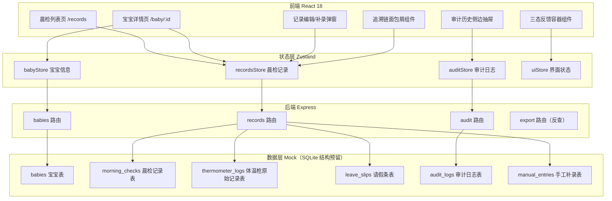
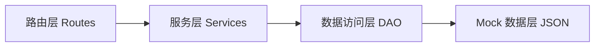
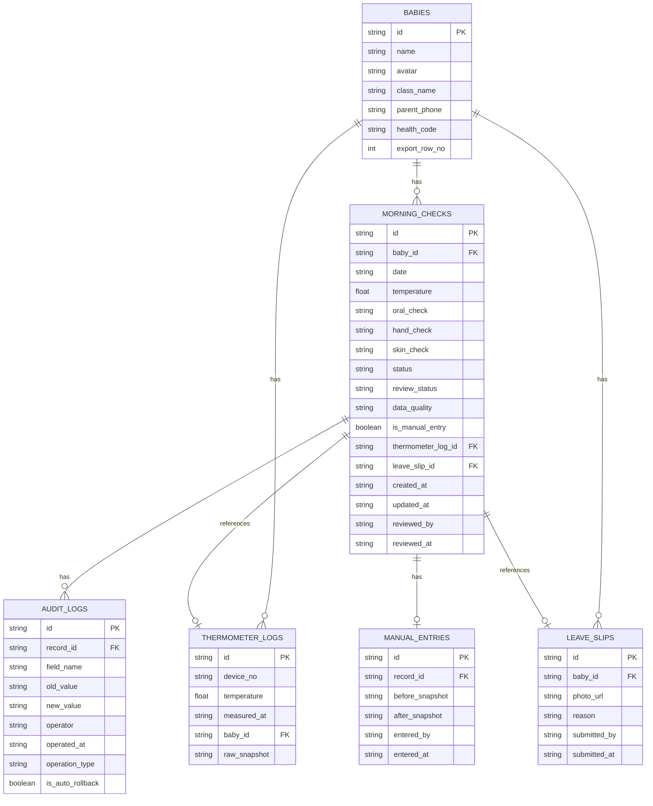

## 1. 架构设计



## 2. 技术说明

- 前端：React@18 + TypeScript + tailwindcss@3 + Vite + React Router v6 + Zustand + Lucide React
- 初始化工具：vite-init
- 后端：Express@4 + TypeScript（ESM）
- 数据库：Mock 数据（内存 JSON），SQLite 结构预留用于后续升级
- 图片：请假条照片使用外部图片服务 URL

## 3. 路由定义

| 路由 | 用途 |
|------|------|
| / | 重定向到 /records |
| /records | 晨检列表页（三态反馈 + 筛选 + 导出） |
| /baby/:id | 宝宝详情页（时间轴 + 原始记录追溯 + 补录对比） |

## 4. API 定义

```typescript
// 宝宝信息
interface Baby {
  id: string;
  name: string;
  avatar: string;
  className: string;
  parentPhone: string;
  healthCode: string;
  exportRowNo?: number;
}

// 晨检记录
interface MorningCheck {
  id: string;
  babyId: string;
  date: string;
  temperature: number;
  oralCheck: 'normal' | 'abnormal';
  handCheck: 'normal' | 'abnormal';
  skinCheck: 'normal' | 'abnormal';
  status: 'normal' | 'abnormal' | 'leave';
  reviewStatus: 'pending' | 'approved' | 'rejected' | 'rolled-back';
  dataQuality: 'clean' | 'dirty' | 'empty';
  isManualEntry: boolean;
  thermometerLogId?: string;
  leaveSlipId?: string;
  createdAt: string;
  updatedAt: string;
  reviewedBy?: string;
  reviewedAt?: string;
}

// 体温枪原始记录
interface ThermometerLog {
  id: string;
  deviceNo: string;
  temperature: number;
  measuredAt: string;
  babyId: string;
  rawSnapshot: string;
}

// 请假条
interface LeaveSlip {
  id: string;
  babyId: string;
  photoUrl: string;
  reason: string;
  submittedBy: string;
  submittedAt: string;
}

// 审计日志
interface AuditLog {
  id: string;
  recordId: string;
  fieldName: string;
  oldValue: string | number | null;
  newValue: string | number | null;
  operator: string;
  operatedAt: string;
  operationType: 'create' | 'update' | 'delete' | 'manual-entry' | 'rollback';
  isAutoRollback: boolean;
}

// 部分提交结果
interface PartialSubmitResult {
  success: boolean[];
  failed: { index: number; error: string }[];
  message: string;
}
```

**API 端点：**
- `GET /api/babies` - 获取宝宝列表
- `GET /api/babies/:id` - 获取宝宝详情
- `GET /api/records` - 获取晨检记录列表（支持筛选）
- `GET /api/records/:id` - 获取单条晨检记录
- `POST /api/records` - 创建晨检记录（支持部分成功）
- `PUT /api/records/:id` - 更新晨检记录（自动写审计日志）
- `POST /api/records/manual` - 手工补录记录
- `GET /api/records/:id/audit` - 获取记录审计历史
- `GET /api/thermometer/:id` - 获取体温枪原始记录
- `GET /api/leaves/:id` - 获取请假条详情
- `GET /api/export/lookup?rowNo=` - 导出表反查宝宝

## 5. 服务端架构图



## 6. 数据模型

### 6.1 数据模型定义



### 6.2 初始数据设计

样例数据包含：
- 8 个宝宝（含 1 个绑定导出表行号，用于反查演示）
- 12 条晨检记录：3 条空数据状态、2 条脏数据状态、7 条正常数据状态
- 1 条手工补录样例（带前后对比快照）
- 5 条体温枪原始记录
- 3 张请假条照片
- 6 条审计日志（含 1 条"自动回退"标签记录）
