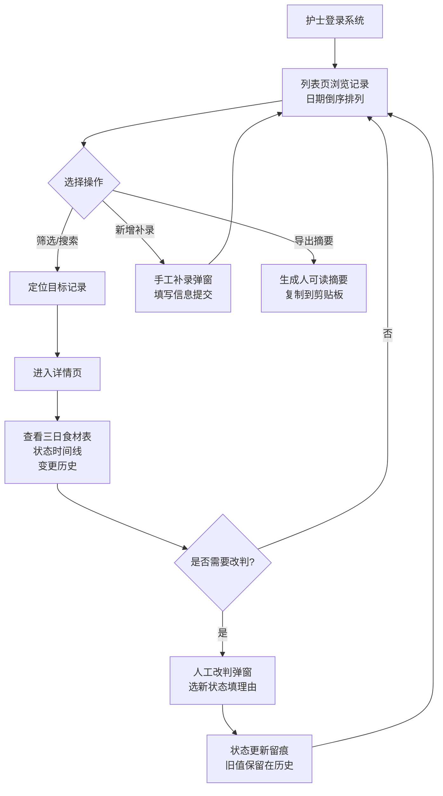

## 1. 产品概述

婴幼儿辅食禁忌授权库儿保随访版是面向社区儿保护士的辅助工具，用于管理婴幼儿三日辅食食材的审核、状态跟踪、人工改判及结果导出。解决家长补充信息后护士需重新确认、异常数据人工复核、随访记录可追溯等核心痛点。

- **目标用户**：社区儿保护士
- **核心价值**：三日食材表快速审核、异常数据人工改判留痕、随访记录完整可追溯、导出报告同事可读

## 2. 核心功能

### 2.1 用户角色

| 角色 | 注册方式 | 核心权限 |
|------|---------|---------|
| 儿保护士 | 系统内置账号 | 查看食材记录、审核状态、人工改判、手工补录、导出摘要 |

### 2.2 功能模块

1. **随访记录列表页**：记录卡片（日期倒序）、状态筛选标签、搜索、新增补录、导出按钮
2. **随访记录详情页**：三日食材表展示、状态时间线、变更历史（旧值、处理人、复核时间）、改判原因、人工改判操作
3. **人工改判弹窗**：选择新状态、填写改判理由、确认提交
4. **手工补录弹窗**：录入婴幼儿信息、三日食材、初始状态、补录说明
5. **导出功能**：生成人可读格式的摘要（不含内部字段名和错误码），可直接转发同事

### 2.3 页面详情

| 页面名称 | 模块名称 | 功能描述 |
|---------|---------|----------|
| 随访记录列表页 | 顶部操作栏 | 状态筛选标签（全部/正常/异常/已改判/补录）、搜索框、新增补录按钮、导出按钮 |
| 随访记录列表页 | 记录卡片列表 | 日期倒序排列，每条显示婴幼儿姓名、年龄段、状态标签、家长备注摘要、更新时间，点击进入详情 |
| 随访记录详情页 | 基本信息区 | 婴幼儿姓名、性别、月龄、随访日期、家长补充信息 |
| 随访记录详情页 | 三日食材表 | 表格展示三天早/中/晚辅食食材，异常项高亮标注 |
| 随访记录详情页 | 状态追踪时间线 | 显示状态流转节点、时间、处理人 |
| 随访记录详情页 | 变更历史 | 逐条展示字段变更前后值、操作人、操作时间、改判理由 |
| 随访记录详情页 | 操作区 | 人工改判按钮（仅异常/正常状态可改判） |
| 人工改判弹窗 | 改判表单 | 新状态下拉（正常/异常）、改判理由文本框、确认/取消 |
| 手工补录弹窗 | 补录表单 | 婴幼儿基础信息、三日食材表格录入、初始状态选择、补录说明 |
| 导出功能 | 摘要生成 | 生成包含核心信息的人可读摘要文本，复制到剪贴板 |

## 3. 核心流程

### 主流程描述
护士打开系统后，在列表页按日期倒序浏览随访记录。可通过状态筛选快速定位异常记录。点击记录进入详情页，查看三日食材表、家长补充信息、完整变更历史（含旧值、处理人、复核时间、改判理由）。对异常记录执行人工改判，填写理由后状态更新并留痕。可手工补录新记录，补录前后差异可在历史中查看。选中记录后导出人可读摘要直接转发同事。

## 4. 用户界面设计

### 4.1 设计风格
- **主色调**：专业医疗感的墨绿 `#1a6b4a` 搭配柔和米白 `#fafaf7`
- **辅助色**：正常状态绿 `#22c55e`，异常状态橙红 `#f97316`，改判状态蓝紫 `#6366f1`，补录状态琥珀 `#d97706`
- **按钮风格**：圆角 10px，主按钮实心填充带轻微阴影，次按钮描边
- **字体**：标题用思源宋体（庄重感），正文用系统无衬线字体（易读性）
- **布局风格**：卡片式布局，清晰的信息层级，充足留白
- **图标风格**：Lucide 线性图标，简洁专业

### 4.2 页面设计概览

| 页面名称 | 模块名称 | UI 元素 |
|---------|---------|----------|
| 随访记录列表页 | 顶部操作栏 | 左侧标题 + 副标题说明，右侧筛选标签组、搜索框、补录按钮、导出按钮 |
| 随访记录列表页 | 记录卡片 | 左侧色块标识状态，中间显示姓名/月龄/日期/家长备注摘要，右侧状态标签和箭头，hover 有轻微上浮阴影 |
| 随访记录详情页 | 信息分栏 | 左侧基本信息卡 + 三日食材表，右侧状态时间线 + 变更历史，两栏布局 |
| 随访记录详情页 | 变更历史条目 | 时间轴设计，每个节点有图标、操作人、时间、变更字段前后对比、改判理由引用块 |
| 人工改判弹窗 | 表单 | 半透明遮罩，居中卡片，状态下拉单选、理由文本框（必填提示）、底部双按钮 |
| 导出功能 | 摘要预览 | 弹窗展示格式化的摘要文本（带分段和项目符号），底部一键复制按钮 |

### 4.3 响应式
桌面端优先（护士使用办公电脑），最小支持宽度 1280px，双栏布局。宽度不足 1024px 时自动切换为单栏纵向滚动布局，触摸目标不小于 44px。
