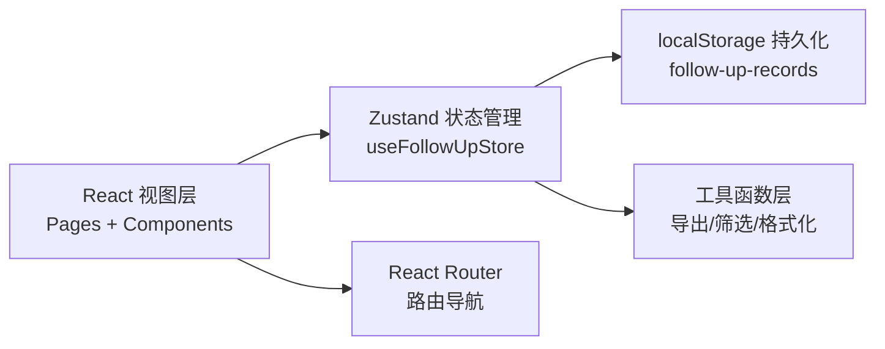

## 1. 架构设计

纯前端单页应用，状态管理采用 Zustand，数据持久化使用 localStorage（模拟后端存储，避免坏数据污染），路由使用 React Router。



## 2. 技术说明

- **前端框架**：React@18 + TypeScript + Vite
- **初始化工具**：vite-init
- **样式方案**：Tailwind CSS@3
- **状态管理**：Zustand
- **路由**：react-router-dom
- **图标库**：lucide-react
- **数据存储**：localStorage（内置 Mock 样例数据）
- **后端**：无（纯前端演示，全部数据在前端状态管理）

## 3. 路由定义

| 路由 | 页面组件 | 用途 |
|------|---------|------|
| `/` | FollowUpListPage | 随访记录列表页（首页） |
| `/record/:id` | FollowUpDetailPage | 单条随访记录详情页 |

## 4. 数据模型

### 4.1 类型定义

```typescript
// 记录状态
type RecordStatus = 'normal' | 'abnormal' | 'revised' | 'manual';

// 婴幼儿信息
interface InfantInfo {
  name: string;
  gender: 'male' | 'female';
  ageMonths: number;
}

// 单餐辅食
interface MealItem {
  meal: 'breakfast' | 'lunch' | 'dinner';
  food: string;
  isAbnormal: boolean;
  remark?: string;
}

// 单天食材
interface DayMeals {
  date: string;
  meals: MealItem[];
}

// 变更历史条目
interface HistoryEntry {
  id: string;
  timestamp: string;
  operator: string;
  field: string;
  oldValue: string;
  newValue: string;
  reason?: string;
}

// 随访记录
interface FollowUpRecord {
  id: string;
  infant: InfantInfo;
  followUpDate: string;
  updatedAt: string;
  status: RecordStatus;
  parentNote?: string;
  threeDayMeals: DayMeals[];
  history: HistoryEntry[];
  isManualEntry: boolean;
  manualEntryNote?: string;
  reviseReason?: string;
}
```

### 4.2 内置 Mock 样例数据

系统启动时注入以下样例数据，覆盖三条核心路径：

1. **果果（正常路径）**：6月龄女婴，三日食材全部正常，无家长补充信息，状态为"正常"
2. **豆豆（异常路径）**：8月龄男婴，三日食材中含有蜂蜜（禁忌）和整颗花生（窒息风险），状态为"异常"，家长补充"豆豆昨天吃了家里自制花生酱后有点红疹"
3. **萌萌（人工改判路径）**：10月龄女婴，系统初判异常（标记蛋黄为过敏风险），护士人工改判为正常，改判理由为"家长确认已逐步添加蛋黄满2周无过敏反应，既往记录可佐证"，变更历史保留旧值和复核时间
4. **壮壮（手工补录路径）**：7月龄男婴，由护士手工补录的历史记录，补录说明为"家长6月1日上门咨询时未及时录入，今日补登"，历史中可见补录前后差异

### 4.3 状态流转规则

- `normal` ↔ `abnormal`：可互相人工改判，改判后状态变为 `revised`
- `revised`：已改判状态不可再次改判（避免反复覆盖），但可查看改判历史
- `manual`：手工补录记录，初始状态可选 normal 或 abnormal，后续可正常改判
- 所有状态变更必须记录：处理人、时间戳、改判理由、变更前旧值

## 5. 数据隔离策略

- 正常记录与手工补录记录通过 `isManualEntry` 字段区分，筛选时可分别过滤
- 改判操作不直接覆盖原数据，原状态和原食材异常标记保留在 `history` 数组中
- localStorage key 使用版本前缀 `v1:follow-up-records`，后续数据结构升级时不污染旧数据
- 用户操作（改判、补录）不影响内置样例数据的初始状态，刷新页面可恢复（可配置开关）

## 6. 导出摘要格式

导出的摘要采用人可读的文本格式，包含分段和项目符号，不含任何内部字段名：

```
【婴幼儿辅食随访摘要】
随访对象：XXX（X月龄，X/X）
随访日期：YYYY年MM月DD日
当前状态：正常/异常/已人工改判

三日食材记录：
- 6月1日 早餐：XXX；午餐：XXX；晚餐：XXX
- ...

家长补充信息：
XXX

处理说明（如有）：
XXX

复核人：XXX
复核时间：YYYY-MM-DD HH:mm
```
