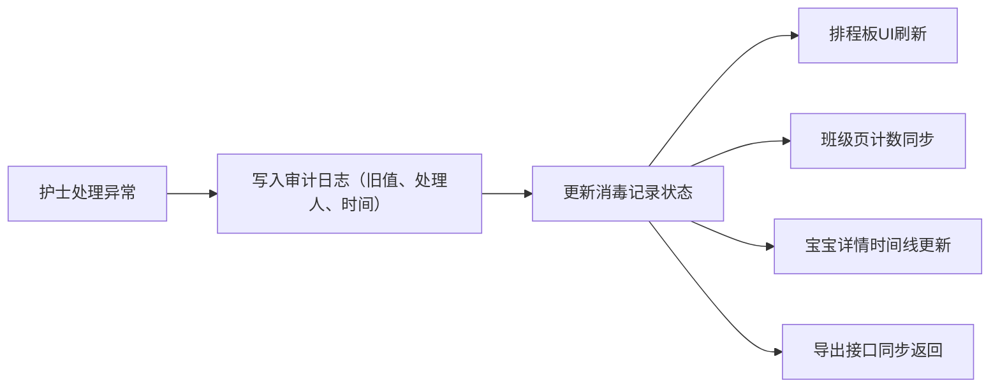
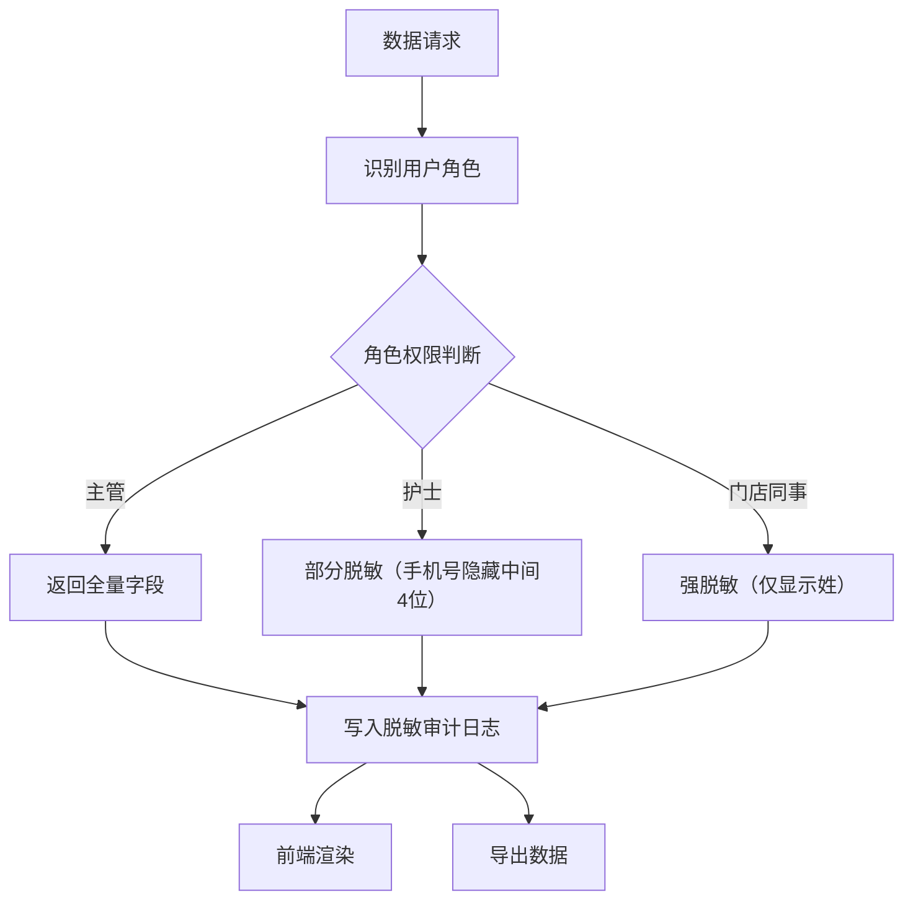

## 1. 产品概述
婴幼儿用品消毒排程板儿保随访版是面向托育机构和社区儿保门诊的婴幼儿用品消毒管理与儿保随访追踪系统。通过扫码借还、异常处理、审计追溯和角色权限管理，解决门店消毒记录不透明、异常处理无迹可查、隐私数据泄露等核心问题。

- 目标用户：门店同事、社区儿保护士、主管/管理员
- 核心价值：消毒过程全链路可追溯、异常处理责任到人、隐私数据分级保护

## 2. 核心功能

### 2.1 用户角色

| 角色 | 登录方式 | 核心权限 |
|------|----------|----------|
| 门店同事 | 账号密码 | 扫码借还登记、标记异常处理、查看本班消毒记录 |
| 社区儿保护士 | 账号密码 | 查看消毒排程、处理异常、查看完整历史记录、导出清单 |
| 主管/管理员 | 账号密码 | 全量数据查看、审计日志复查、角色管理、边界值审计 |

### 2.2 功能模块

1. **登录页**：角色选择、账号登录、身份切换
2. **排程板首页**：消毒排程看板、异常处理入口、处理人实时显示
3. **班级页**：按班级聚合展示消毒记录与宝宝状态
4. **宝宝详情页**：单宝宝完整消毒记录、历史变更、随访信息
5. **历史审计面板**：旧值对比、处理人、复核时间、边界值审计标记
6. **导出中心**：按角色脱敏导出、补录记录标记、部分成功提示

### 2.3 页面详情

| 页面名称 | 模块名称 | 功能描述 |
|----------|----------|----------|
| 登录页 | 角色选择器 | 切换门店同事/护士/主管三种身份登录，预览不同角色可见数据差异 |
| 登录页 | 登录表单 | 账号密码登录，记住登录状态 |
| 排程板首页 | 消毒排程表 | 时间轴展示当日消毒任务，含状态标签（待消毒/消毒中/已完成/异常） |
| 排程板首页 | 异常处理卡片 | 显示异常记录，标记处理人姓名，点击展开处理详情 |
| 排程板首页 | 扫码记录区 | 借还扫码流水，包含操作人、时间、物品、处理状态 |
| 排程板首页 | 手工补录入口 | 护士可手工补录遗漏记录，带「补录」标记 |
| 班级页 | 班级列表 | 卡片式展示各班消毒完成率、异常数、关联宝宝数 |
| 班级页 | 班级消毒明细 | 表格展示该班所有消毒记录，支持按状态筛选 |
| 宝宝详情页 | 基本信息卡 | 宝宝姓名（脱敏）、班级、过敏史（按角色可见） |
| 宝宝详情页 | 消毒时间线 | 该宝宝关联用品的完整消毒历史，含变更记录 |
| 宝宝详情页 | 随访记录 | 儿保护士填写的随访备注、下次随访时间 |
| 历史审计面板 | 变更对比视图 | 左右对比显示字段旧值/新值，标注变更人、变更时间 |
| 历史审计面板 | 边界值审计标记 | 当边界值被当作正常值处理时，高亮标记便于主管复查 |
| 历史审计面板 | 处理人与复核时间 | 每次处理操作显示处理人和护士复核时间戳 |
| 导出中心 | 导出选项 | 选择导出范围、格式（CSV/JSON），预览脱敏效果 |
| 导出中心 | 部分成功提示 | 单位混用时显示部分成功记录及失败原因 |

## 3. 核心流程

### 3.1 异常处理同步流程
护士在排程板处理一条异常记录 → 系统记录处理人、处理时间、处理备注 → 班级页实时更新该班异常计数 → 宝宝详情页时间线新增处理节点 → 后台API状态变更 → 重新导出清单时包含最新状态。

### 3.2 角色隐私处理流程
任意数据请求 → 后端按当前登录角色过滤隐私字段 → 返回脱敏数据 → 前端仅渲染可见字段 → 日志记录脱敏后数据 → 导出时再次按角色脱敏。

### 3.3 单位混用部分成功流程
批量处理时遇到不同单位 → 逐条校验 → 成功的记录写入并标记 → 失败的记录收集错误信息 → 返回部分成功结果 + 错误明细 → UI区分展示成功/失败。

## 4. 用户界面设计

### 4.1 设计风格
- 主色：医疗感青色 `#0EA5E9`，辅色：柔和薄荷绿 `#10B981`，警示色：暖橙 `#F59E0B`、危险红 `#EF4444`
- 按钮风格：圆角 10px，轻微投影，悬停上浮 1px + 阴影加深
- 字体：中文使用「思源宋体」做标题、「思源黑体」做正文；英文数字使用「JetBrains Mono」
- 布局：左侧导航栏 + 顶部状态栏 + 主内容区，卡片式模块分区
- 图标风格：Lucide 线性图标，统一 18px

### 4.2 页面设计概览

| 页面名称 | 模块名称 | UI 元素 |
|----------|----------|---------|
| 登录页 | 品牌展示 | 左侧医疗渐变插画 + 右侧登录表单，卡片悬浮投影 |
| 排程板首页 | 时间轴排程 | 纵向时间轴，每条任务为圆角卡片，状态色左边框 |
| 排程板首页 | 异常卡片 | 橙色边框 + 警示图标，展开后显示处理人标签和处理备注 |
| 班级页 | 班级卡片网格 | 3 列卡片网格，卡片含进度环、异常徽章、补录标记 |
| 宝宝详情页 | 时间线 | 左侧渐变竖线时间轴，节点为圆形图标，hover 放大 |
| 历史审计面板 | 变更对比 | 双栏对比布局，删除线标注旧值，绿色标注新值 |
| 导出中心 | 预览表格 | 可滚动表格，脱敏字段用 `****` 占位，悬停显示角色权限提示 |

### 4.3 响应式
桌面端优先（1280px 起步），平板（768px）折叠侧栏为抽屉，移动端（375px）卡片堆叠单列展示。

## 5. 特殊业务规则

| 规则编号 | 规则描述 | 触发条件 | 处理方式 |
|----------|----------|----------|----------|
| R-001 | 处理人必须可追溯 | 门店同事标记「已处理」 | 系统自动写入处理人 user_id 和姓名，扫码记录区展示 |
| R-002 | 异常处理多端同步 | 任意端处理异常 | 班级页、宝宝详情、API、导出四端同步刷新 |
| R-003 | 单位混用部分成功 | 批量导入/导出含多种单位 | 成功记录入库，失败记录返回错误列表，UI分区展示 |
| R-004 | 边界值审计保留 | 数值处于边界阈值 ±5% 且被当正常值处理 | 自动写入审计日志并高亮标记，主管页单独列出 |
| R-005 | 隐私字段全链路脱敏 | 页面/JSON/日志/导出 | 后端按角色过滤，前端不接收敏感原始值，日志脱敏后写入 |
| R-006 | 历史保留旧值与处理人 | 护士修改记录后刷新 | 历史面板展示旧值、新值、处理人、复核时间戳 |
| R-007 | 手工补录样例数据 | 系统初始化 | 预置一条手工补录记录，带「补录」标签和补录人 |
