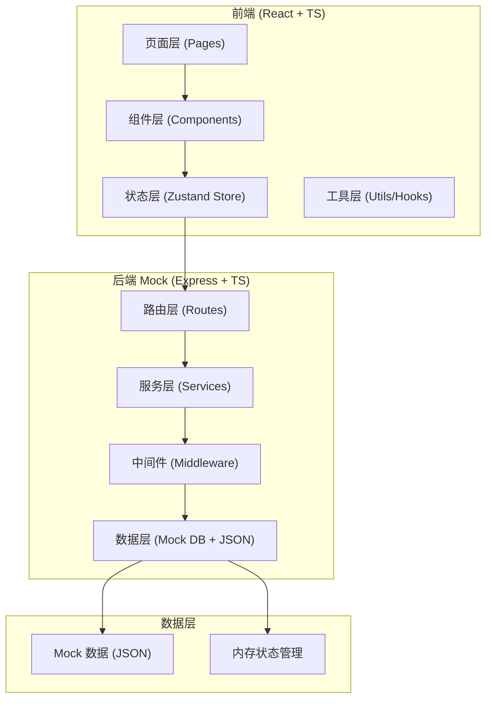
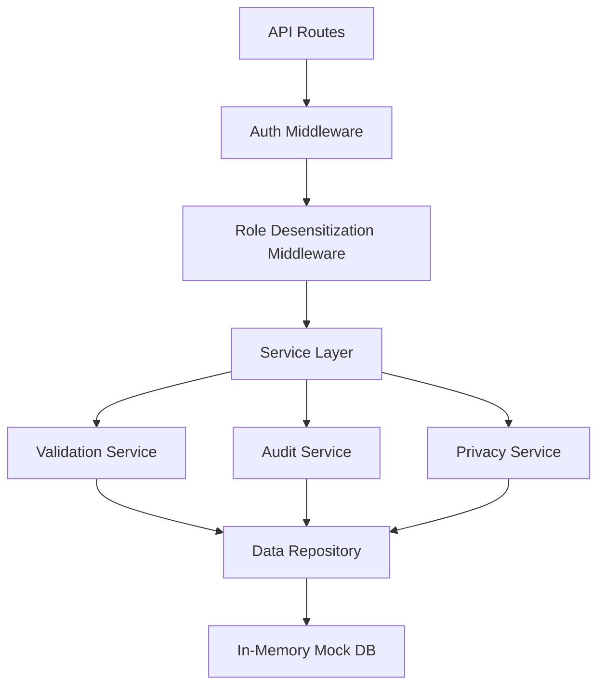

## 1. 架构设计



## 2. 技术说明

- 前端：React 18 + TypeScript + Vite + TailwindCSS 3 + Zustand + React Router DOM 6 + Lucide React
- 后端：Express 4 + TypeScript + CORS（Mock API 服务）
- 数据存储：内存型 Mock 数据库（JSON 文件初始化 + 运行时内存状态）
- 导出格式：CSV、JSON
- 初始化工具：vite-init 选择 react-express-ts 模板

## 3. 路由定义

| 前端路由 | 用途 |
|----------|------|
| /login | 登录页，角色选择与身份验证 |
| /dashboard | 消毒排程板首页（默认页） |
| /classes | 班级列表与班级消毒明细 |
| /baby/:id | 宝宝详情页（含消毒时间线与随访） |
| /audit | 历史审计面板（变更对比、边界值审计） |
| /export | 导出中心（预览脱敏、部分成功提示） |

| 后端 API 路由 | 方法 | 用途 |
|---------------|------|------|
| /api/auth/login | POST | 登录验证，返回 token 与角色信息 |
| /api/schedules | GET | 获取消毒排程列表（按角色脱敏） |
| /api/schedules/:id | PUT | 更新排程状态（处理异常），自动写入审计 |
| /api/classes | GET | 获取班级聚合数据 |
| /api/babies | GET | 获取宝宝列表（脱敏） |
| /api/babies/:id | GET | 获取单宝宝详情 + 消毒历史 |
| /api/audit-logs | GET | 获取审计日志（含边界值标记） |
| /api/export | POST | 生成导出数据（按角色脱敏，支持部分成功） |
| /api/scan-records | GET | 获取扫码借还记录（含处理人） |

## 4. API 类型定义

```typescript
// ===== 共享类型 (shared/types.ts) =====
export type UserRole = 'staff' | 'nurse' | 'supervisor';

export interface User {
  id: string;
  name: string;
  role: UserRole;
  phone?: string;
}

export type DisinfectionStatus = 'pending' | 'processing' | 'completed' | 'exception';

export type RecordSource = 'scan' | 'manual';

export interface DisinfectionRecord {
  id: string;
  babyId: string;
  classId: string;
  itemName: string;
  scheduledTime: string;
  actualTime?: string;
  status: DisinfectionStatus;
  temperature: number;
  duration: number;
  operatorId?: string;
  operatorName?: string;
  handlerId?: string;
  handlerName?: string;
  reviewedById?: string;
  reviewedByName?: string;
  reviewedAt?: string;
  exceptionNote?: string;
  source: RecordSource;
  isBoundaryAudit?: boolean;
  boundaryReason?: string;
  createdAt: string;
  updatedAt: string;
}

export interface Baby {
  id: string;
  name: string;
  classId: string;
  birthday: string;
  allergies?: string;
  guardianPhone?: string;
  guardianName?: string;
}

export interface ClassInfo {
  id: string;
  name: string;
  babyCount: number;
  completionRate: number;
  exceptionCount: number;
}

export interface AuditLog {
  id: string;
  recordId: string;
  fieldName: string;
  oldValue: unknown;
  newValue: unknown;
  operatorId: string;
  operatorName: string;
  operatedAt: string;
  isBoundaryAudit?: boolean;
}

export interface ExportResult {
  success: boolean;
  totalCount: number;
  successCount: number;
  failedCount: number;
  failedItems: Array<{ rowIndex: number; reason: string }>;
  dataUrl?: string;
  format: 'csv' | 'json';
}
```

## 5. 服务端架构图



## 6. 数据模型

### 6.1 ER 图

```mermaid
erDiagram
    USER ||--o{ DISINFECTION_RECORD : "处理/操作"
    CLASS ||--o{ BABY : "包含"
    BABY ||--o{ DISINFECTION_RECORD : "关联"
    DISINFECTION_RECORD ||--o{ AUDIT_LOG : "变更追踪"
    
    USER {
        string id PK
        string name
        string role
        string phone
    }
    
    CLASS {
        string id PK
        string name
    }
    
    BABY {
        string id PK
        string name
        string classId FK
        string birthday
        string allergies
        string guardianPhone
        string guardianName
    }
    
    DISINFECTION_RECORD {
        string id PK
        string babyId FK
        string classId FK
        string itemName
        string scheduledTime
        string actualTime
        string status
        number temperature
        number duration
        string operatorId
        string handlerId
        string reviewedById
        string reviewedAt
        string exceptionNote
        string source
        boolean isBoundaryAudit
    }
    
    AUDIT_LOG {
        string id PK
        string recordId FK
        string fieldName
        string oldValue
        string newValue
        string operatorId
        string operatedAt
        boolean isBoundaryAudit
    }
```

### 6.2 隐私字段脱敏规则

| 字段 | 主管 (supervisor) | 护士 (nurse) | 门店同事 (staff) |
|------|-------------------|--------------|------------------|
| baby.name | 明文 | 明文 | 仅显示姓（如「张**」） |
| baby.guardianPhone | 明文 | `138****1234` | `***********` |
| baby.guardianName | 明文 | 明文 | 仅显示姓 |
| baby.allergies | 明文 | 明文 | 空值或「***」 |
| user.phone | 明文 | 明文 | 空值 |

## 7. 目录结构

```
src/
├── components/          # 通用组件
│   ├── Layout.tsx       # 主布局（侧栏+顶栏）
│   ├── StatusBadge.tsx  # 状态徽章
│   ├── Timeline.tsx     # 时间轴组件
│   ├── AuditDiff.tsx    # 变更对比组件
│   ├── RoleSwitcher.tsx # 角色切换器
│   └── PrivacyCell.tsx  # 脱敏单元格
├── pages/
│   ├── Login.tsx
│   ├── Dashboard.tsx
│   ├── Classes.tsx
│   ├── BabyDetail.tsx
│   ├── AuditPanel.tsx
│   └── ExportCenter.tsx
├── store/               # Zustand 状态
│   ├── authStore.ts
│   ├── scheduleStore.ts
│   └── auditStore.ts
├── utils/
│   ├── privacy.ts       # 脱敏工具
│   ├── audit.ts         # 审计工具
│   ├── export.ts        # 导出工具
│   └── mockData.ts      # Mock 数据（含手工补录样例）
├── types/
│   └── index.ts         # 全局类型
└── App.tsx

api/
├── index.ts             # Express 入口
├── routes/
│   ├── auth.ts
│   ├── schedules.ts
│   ├── classes.ts
│   ├── babies.ts
│   ├── audit.ts
│   └── export.ts
├── middleware/
│   ├── auth.ts          # 鉴权中间件
│   └── privacy.ts       # 脱敏中间件
├── services/
│   ├── auditService.ts  # 审计服务（边界值检测）
│   ├── privacyService.ts
│   └── validationService.ts
└── db/
    └── mockDb.ts        # 内存 Mock 数据库
```
