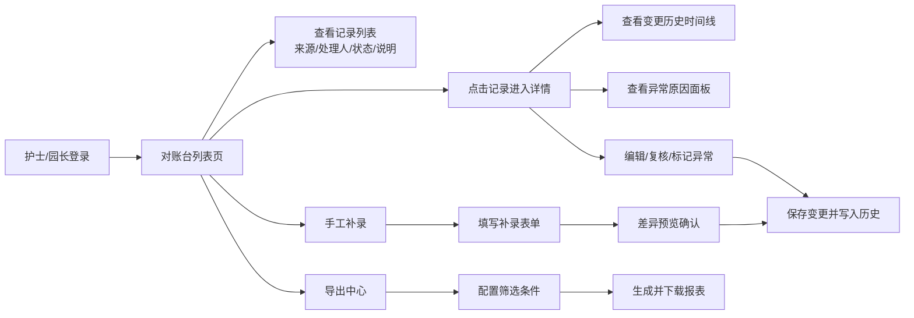

## 1. 产品概述

婴幼儿课程改期对账台儿保随访版是亲子餐厅内部运营的核心审计追溯系统，用于管理婴幼儿课程改期记录的全生命周期——从录入、复核、补录到导出，确保每条记录可追溯、可复核、可审计。

- 核心问题：旧系统仅提供汇总卡片，无法追溯记录来源、处理人、历史变更；坏数据与正常数据混杂；服务重启或数据丢失无原因记录
- 目标用户：园长（决策审计）、护士（录入复核）
- 产品价值：建立从录入到导出的完整闭环，让每条改期承诺都有迹可循

## 2. 核心功能

### 2.1 用户角色

| 角色 | 注册方式 | 核心权限 |
|------|---------|---------|
| 园长 | 系统分配 | 全量查看、导出报表、标记坏数据、查看异常原因 |
| 护士 | 系统分配 | 录入记录、修改记录、复核记录、补充说明、手工补录 |

### 2.2 功能模块

1. **对账台首页（列表页）**：记录列表展示、筛选搜索、状态概览、快捷操作入口
2. **记录详情页**：完整信息展示、编辑历史时间线、异常原因面板、复核操作
3. **手工补录页**：补录表单、来源标注、差异预览
4. **导出中心**：筛选条件、格式选择、导出日志

### 2.3 页面详情

| 页面名称 | 模块名称 | 功能描述 |
|---------|---------|-----------|
| 对账台首页 | 顶部导航栏 | 品牌标识、角色切换、搜索框、筛选按钮、手工补录入口、导出按钮 |
| 对账台首页 | 状态概览条 | 待复核/已复核/异常/补录四类数量实时统计 |
| 对账台首页 | 记录列表 | 每行展示：婴幼儿姓名、课程名称、原日期→新日期、来源文件、处理人、当前状态、最近人工说明标签、操作按钮 |
| 对账台首页 | 列表筛选器 | 按状态、处理人、日期范围、数据来源（正常/补录/坏数据）筛选 |
| 记录详情页 | 基础信息卡 | 婴幼儿信息、课程信息、改期前后日期、来源文件链接、创建时间 |
| 记录详情页 | 处理轨迹区 | 处理人、当前状态、最近一次人工说明全文 |
| 记录详情页 | 变更历史时间线 | 每次变更的旧值→新值、处理人、复核时间、说明备注，按时间倒序 |
| 记录详情页 | 异常信息面板 | 坏数据标注原因、服务重启记录、历史数据丢失原因及恢复说明 |
| 记录详情页 | 操作区 | 编辑、复核、标记异常、添加说明 |
| 手工补录页 | 补录表单 | 婴幼儿信息、课程信息、改期信息、来源文件上传、补录原因 |
| 手工补录页 | 差异预览 | 补录前后对比高亮展示 |
| 导出中心 | 导出配置 | 筛选条件、导出格式（Excel/CSV）、字段选择 |
| 导出中心 | 导出日志 | 历史导出记录、操作人、时间、下载链接 |

## 3. 核心流程

### 护士日常操作流程
护士登录系统 → 浏览对账台列表 → 点击录入/修改记录 → 填写改期信息与说明 → 提交保存 → 刷新页面确认变更历史已记录（旧值、处理人、复核时间）

### 园长审计流程
园长登录 → 查看状态概览 → 筛选异常/补录记录 → 进入详情页查看完整时间线与异常原因 → 批量导出对账报表

## 4. 用户界面设计

### 4.1 设计风格
- 主色调：深青色 `#0F4C5C`（专业可信），暖橙色 `#E36414`（提醒强调）
- 辅助色：米白 `#FBF7F4` 为背景，灰蓝 `#5F747B` 为文字
- 按钮风格：圆角 6px，实心按钮带微妙 hover 上浮阴影
- 字体：标题用 **Noto Serif SC**（衬线体，编辑级专业感），正文用 **Noto Sans SC**（清晰可读）
- 布局风格：杂志式分栏布局，左侧固定时间线，右侧主内容区
- 图标风格：lucide-react 线性图标，与主题色统一

### 4.2 页面设计概述

| 页面名称 | 模块名称 | UI 元素 |
|---------|---------|---------|
| 对账台首页 | 顶部导航栏 | 深色导航栏，左侧品牌 Logo（衬线体大字），右侧搜索+操作按钮组 |
| 对账台首页 | 状态概览条 | 四张统计卡片横向排列，每张有独立渐变背景和数据动效 |
| 对账台首页 | 记录列表 | 宽表格式，斑马纹行，状态用彩色胶囊标签，来源文件用可点击链接样式，人工说明截断显示+悬浮展开 |
| 对账台首页 | 列表筛选器 | 横向展开式筛选栏，多条件组合筛选 |
| 记录详情页 | 双栏布局 | 左侧：变更历史时间线（竖向，带连接线和节点动画）；右侧：基础信息+处理轨迹+异常面板+操作区 |
| 记录详情页 | 变更历史时间线 | 每个节点含：变更图标、时间、处理人、旧值（删除线灰字）→ 新值（高亮）、说明文本 |
| 记录详情页 | 异常信息面板 | 琥珀色警示边框，折叠式卡片组，每条含异常类型标签、时间戳、原因详情 |
| 手工补录页 | 补录表单 | 分组表单，左侧输入区，右侧实时差异预览卡片，补录字段高亮橙色边框 |
| 导出中心 | 导出配置 | 步骤式配置面板，字段多选、格式切换、实时预览导出条数 |

### 4.3 响应式
- Desktop-first 设计，主内容区最小宽度 1280px
- 列表页：平板端表格横向滚动，移动端转为卡片堆叠
- 详情页：平板端上下分栏，移动端单栏全滚动
- 所有触摸目标 ≥ 44px × 44px

### 4.4 动效设计
- 页面加载：标题淡入 + 统计数字滚动计数 + 列表行渐次上浮
- 时间线节点：滚动触发逐个浮现，连接线绘制动画
- 状态变更：胶囊标签颜色过渡动画（0.3s ease）
- 按钮 Hover：0.15s 上移 1px + 阴影增强
- 详情页切换：左侧时间线固定，右侧内容区滑动切换
