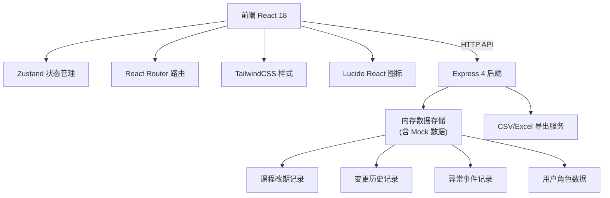
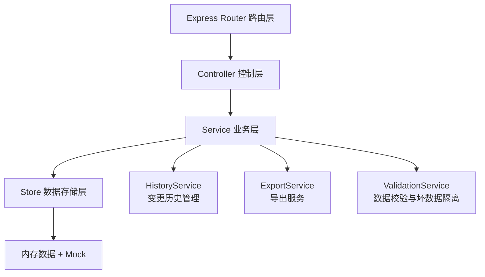
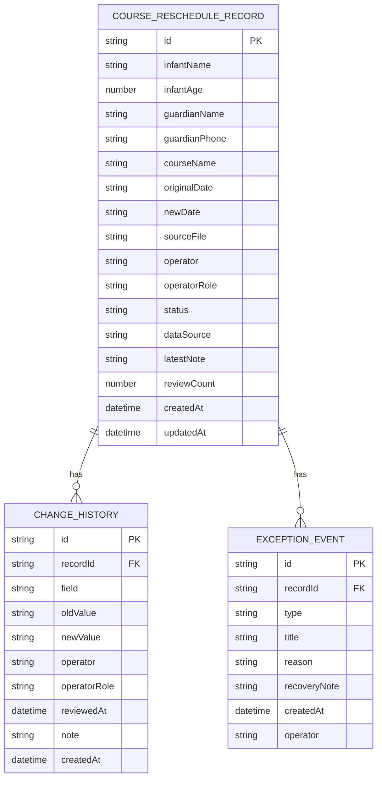

## 1. 架构设计



## 2. 技术说明

- 前端：React@18 + TypeScript + TailwindCSS@3 + Vite
- 路由：react-router-dom@6
- 状态管理：zustand
- 图标：lucide-react
- 初始化工具：vite-init
- 后端：Express@4 + TypeScript
- 数据库：内存存储（含 Mock 数据，用于演示）
- 导出功能：原生 CSV 生成 + xlsx 库（如需要 Excel）

## 3. 路由定义

| 路由 | 用途 |
|------|------|
| `/` | 对账台首页 - 记录列表与概览 |
| `/records/:id` | 记录详情页 - 完整信息与变更历史 |
| `/supplement` | 手工补录页 - 补录表单与差异预览 |
| `/export` | 导出中心 - 导出配置与日志 |

## 4. API 定义

### 4.1 TypeScript 类型定义

```typescript
export type RecordStatus = 'pending' | 'reviewed' | 'exception' | 'supplemented';

export type DataSource = 'normal' | 'supplement' | 'corrupted';

export type ExceptionType = 'service_restart' | 'data_loss' | 'bad_data' | 'system_error';

export interface ChangeHistory {
  id: string;
  recordId: string;
  field: string;
  oldValue: string;
  newValue: string;
  operator: string;
  operatorRole: 'nurse' | 'director';
  reviewedAt: string;
  note: string;
  createdAt: string;
}

export interface ExceptionEvent {
  id: string;
  recordId: string;
  type: ExceptionType;
  title: string;
  reason: string;
  recoveryNote?: string;
  createdAt: string;
  operator?: string;
}

export interface CourseRescheduleRecord {
  id: string;
  infantName: string;
  infantAge: number;
  guardianName: string;
  guardianPhone: string;
  courseName: string;
  originalDate: string;
  newDate: string;
  sourceFile: string;
  sourceFileUrl?: string;
  operator: string;
  operatorRole: 'nurse' | 'director';
  status: RecordStatus;
  dataSource: DataSource;
  latestNote: string;
  reviewCount: number;
  createdAt: string;
  updatedAt: string;
  changeHistory: ChangeHistory[];
  exceptions: ExceptionEvent[];
}

export interface ExportLog {
  id: string;
  operator: string;
  filters: Record<string, any>;
  format: 'csv' | 'xlsx';
  recordCount: number;
  downloadUrl: string;
  createdAt: string;
}
```

### 4.2 API 接口

| 方法 | 路径 | 说明 |
|------|------|------|
| GET | `/api/records` | 获取记录列表（支持筛选、分页、搜索） |
| GET | `/api/records/:id` | 获取单条记录详情（含历史与异常） |
| POST | `/api/records` | 创建新记录 |
| PUT | `/api/records/:id` | 更新记录（自动写入变更历史） |
| POST | `/api/records/:id/review` | 复核记录 |
| POST | `/api/records/:id/note` | 添加人工说明 |
| POST | `/api/records/:id/exception` | 标记异常事件 |
| POST | `/api/records/supplement` | 手工补录记录 |
| GET | `/api/records/:id/history` | 获取变更历史 |
| GET | `/api/export` | 导出记录（CSV/Excel） |
| GET | `/api/export/logs` | 获取导出日志 |
| GET | `/api/stats/summary` | 获取状态统计概览 |

## 5. 服务端架构



## 6. 数据模型

### 6.1 实体关系图



### 6.2 初始化 Mock 数据

系统启动时注入以下示例数据：
- 8 条正常课程改期记录（含不同状态）
- 2 条手工补录记录（展示补录差异）
- 3 条标记为坏数据/异常的记录（含服务重启原因、数据丢失原因）
- 每条记录含 2-5 条变更历史（展示旧值、处理人、复核时间）
- 2 条导出日志记录
