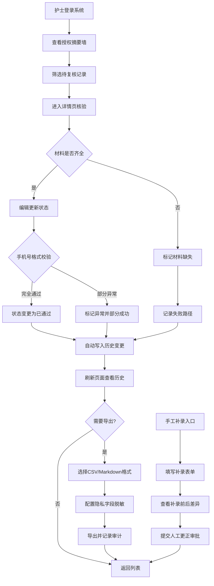

## 1. 产品概述

婴幼儿接送授权复核墙儿保随访版是一款面向社区儿童保健护士的专业管理工具，用于对婴幼儿接送授权进行身份核验、材料审核和状态跟踪。系统通过"昵称-身份-材料-状态"四位一体的绑定机制，确保接送安全，同时提供完整的审计追踪和导出报告功能。

- 核心目标：杜绝冒领错接，保障婴幼儿接送安全
- 目标用户：社区儿保护士、店长、主管部门

## 2. 核心功能

### 2.1 用户角色

| 角色 | 登录方式 | 核心权限 |
|------|---------|---------|
| 儿保护士 | 工号登录 | 录入、复核、编辑授权记录，查看历史变更 |
| 店长 | 工号登录 | 查看全部记录、复盘失败路径、审批人工更正 |
| 主管 | 工号登录 | 审计导出记录、隐私字段审查、全量数据查看 |

### 2.2 功能模块

1. **授权列表页（摘要墙）**：卡片式摘要展示、状态筛选、快速搜索、批量操作
2. **详情页**：完整信息展示、历史变更时间线、材料附件、审计日志
3. **复核编辑页**：身份核验、材料审核、状态变更、手机号校验（部分成功）
4. **导出中心**：CSV导出、Markdown报告、隐私字段脱敏审计
5. **手工补录页**：离线数据补录、前后差异对比、人工更正路径

### 2.3 页面详情

| 页面名称 | 模块名称 | 功能描述 |
|---------|---------|---------|
| 授权列表页 | 摘要卡片墙 | 展示昵称、婴幼儿姓名、授权状态、紧急标识 |
| 授权列表页 | 筛选面板 | 按状态、日期、护士、有无异常筛选 |
| 授权列表页 | 搜索栏 | 支持昵称/姓名/手机号模糊搜索 |
| 授权列表页 | 统计概览 | 待复核、已通过、已驳回、异常数量统计 |
| 详情页 | 身份信息区 | 婴幼儿信息、授权人信息、关系证明 |
| 详情页 | 材料审核区 | 身份证、户口本、授权书等材料状态 |
| 详情页 | 历史变更时间线 | 展示旧值、处理人、复核时间、变更说明 |
| 详情页 | 审计日志区 | 导出记录、查看记录、隐私字段访问日志 |
| 复核编辑页 | 表单编辑区 | 可编辑字段、状态下拉、备注输入 |
| 复核编辑页 | 手机号校验 | 格式混乱时部分成功提示，标记异常 |
| 导出中心 | 导出配置 | 选择格式（CSV/Markdown）、选择字段、脱敏选项 |
| 导出中心 | 导出审计 | 记录导出人、时间、字段范围、是否含隐私字段 |
| 手工补录页 | 补录表单 | 支持离线数据补录、标记补录来源 |
| 手工补录页 | 差异对比 | 补录前后字段差异高亮展示 |

## 3. 核心流程

主要用户流程：护士登录后查看待复核列表 → 点击进入详情核验身份和材料 → 编辑更新状态（系统自动记录旧值、处理人、时间）→ 刷新页面确认历史变更已留存 → 批量或单条导出报告（系统记录导出审计）→ 遇到异常走失败路径记录 → 需要人工更正时提交审批。

## 4. 用户界面设计

### 4.1 设计风格
- **主色调**：医疗暖蓝 `#2563EB`（专业可信），辅助色：生命绿 `#059669`（安全通过）、警示橙 `#D97706`（待复核）、风险红 `#DC2626`（异常驳回）
- **按钮风格**：圆角8px，悬停有微妙阴影上浮效果，状态色区分明确
- **字体**：标题使用"思源宋体"（庄重感），正文使用"Noto Sans SC"（清晰度）
- **布局风格**：卡片式墙面布局（对应"复核墙"概念），左侧导航，顶部状态栏
- **图标风格**：Lucide 线性图标，医疗/儿童主题语义化图标

### 4.2 页面设计概述

| 页面名称 | 模块名称 | UI元素 |
|---------|---------|--------|
| 授权列表页 | 摘要卡片墙 | 彩色状态标签、紧急标识徽章、渐入动画、悬停放大 |
| 授权列表页 | 统计概览 | 数字卡片、趋势箭头、背景渐变色块 |
| 详情页 | 历史变更时间线 | 竖线时间轴、圆形节点、新旧值对比色块 |
| 详情页 | 材料审核区 | 文件缩略图卡片、通过/驳回图标覆盖 |
| 复核编辑页 | 表单区域 | 聚焦态蓝边、校验错误红边提示、部分成功黄边 |
| 导出中心 | 导出配置 | 复选框树形选择、脱敏开关切换、预览面板 |
| 手工补录页 | 差异对比 | 左右分栏布局、删除线+新增高亮、Diff着色 |

### 4.3 响应式
桌面端优先（1280px+），平板端（768px）卡片折行展示，移动端（<640px）单列纵向滚动，触控目标≥44px。

### 4.4 动效设计
- 页面加载：卡片依次淡入上移（stagger 80ms）
- 状态变更：徽章颜色平滑过渡（300ms ease）
- 时间线展开：节点弹跳放大，内容下拉展开
- 导出成功：绿色对勾圆形扩散动画
