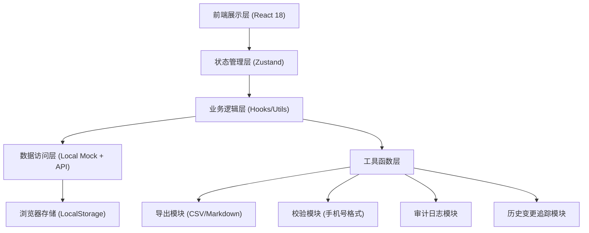
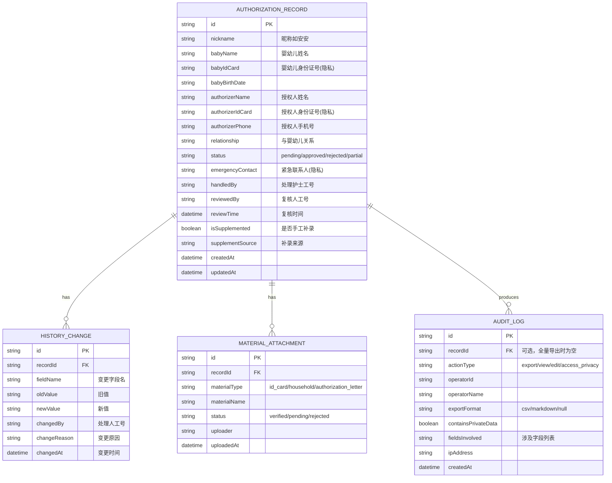

## 1. 架构设计



## 2. 技术描述

- **前端框架**：React@18 + TypeScript@5
- **构建工具**：Vite@6
- **样式方案**：Tailwind CSS@3 + PostCSS
- **状态管理**：Zustand@4（轻量、不可变更新、支持中间件）
- **路由管理**：React Router DOM@6
- **图标库**：Lucide React（线性风格，符合医疗专业感）
- **数据持久化**：LocalStorage（通过 zustand/middleware persist）
- **后端服务**：Express@4（可选，当前使用 Mock 数据）
- **数据库**：无后端数据库，使用 Mock 数据 + LocalStorage

## 3. 路由定义

| 路由 | 页面用途 |
|------|---------|
| `/` | 授权摘要列表墙（首页） |
| `/record/:id` | 授权详情页（含历史时间线） |
| `/record/:id/edit` | 复核编辑页（状态变更、手机号校验） |
| `/export` | 导出中心（CSV/Markdown 报告） |
| `/supplement` | 手工补录页（差异对比） |
| `/audit` | 审计日志页（导出记录、隐私访问） |

## 4. 数据模型

### 4.1 数据模型定义（ER图）



### 4.2 核心类型定义

```typescript
type AuthorizationStatus = 'pending' | 'approved' | 'rejected' | 'partial';

interface AuthorizationRecord {
  id: string;
  nickname: string;
  babyName: string;
  babyIdCard: string;
  babyBirthDate: string;
  authorizerName: string;
  authorizerIdCard: string;
  authorizerPhone: string;
  relationship: string;
  status: AuthorizationStatus;
  emergencyContact: string;
  handledBy: string;
  reviewedBy?: string;
  reviewTime?: string;
  isSupplemented: boolean;
  supplementSource?: string;
  remark?: string;
  createdAt: string;
  updatedAt: string;
}

interface HistoryChange {
  id: string;
  recordId: string;
  fieldName: string;
  fieldLabel: string;
  oldValue: string;
  newValue: string;
  changedBy: string;
  changedByName: string;
  changeReason: string;
  changedAt: string;
}

interface MaterialAttachment {
  id: string;
  recordId: string;
  materialType: 'id_card' | 'household' | 'authorization_letter' | 'birth_certificate';
  materialName: string;
  status: 'verified' | 'pending' | 'rejected';
  uploader: string;
  uploadedAt: string;
}

interface AuditLog {
  id: string;
  recordId?: string;
  actionType: 'export' | 'view' | 'edit' | 'access_privacy';
  operatorId: string;
  operatorName: string;
  exportFormat?: 'csv' | 'markdown';
  containsPrivateData: boolean;
  fieldsInvolved: string[];
  ipAddress: string;
  createdAt: string;
}

interface PhoneValidationResult {
  valid: boolean;
  partialSuccess: boolean;
  originalValue: string;
  normalizedValue: string;
  issues: string[];
}

interface ExportConfig {
  format: 'csv' | 'markdown';
  fields: string[];
  desensitizePrivate: boolean;
  includeHistory: boolean;
  recordIds?: string[];
}
```

## 5. 核心模块说明

### 5.1 历史变更追踪模块
- 每次编辑前对原数据深拷贝
- 对比变更字段，生成变更记录
- 自动填充 `changedBy`、`changedAt`
- 变更记录写入后不可删除/修改

### 5.2 手机号校验模块（部分成功机制）
- 支持格式：中国大陆 11 位手机号、带国家区号、空格/横线分隔
- 部分成功场景：格式有瑕疵但可识别（如 "138-0013 8000"）→ 自动规范化 + 标记异常
- 完全失败场景：位数不足、非数字字符过多 → 不允许通过，需人工更正

### 5.3 隐私字段脱敏与审计模块
- 隐私字段列表：`babyIdCard`, `authorizerIdCard`, `emergencyContact`
- 脱敏规则：身份证号保留前 6 后 4，手机号保留前 3 后 4
- 每次访问/导出隐私字段均写入审计日志，记录操作人、时间、涉及字段

### 5.4 导出模块
- CSV 导出：UTF-8 BOM 编码（Excel 兼容），字段与页面摘要严格对应
- Markdown 导出：表格 + 状态标签，与详情页展示一致
- 导出审计：每次导出生成 `AUDIT_LOG` 记录，包含是否含隐私数据、脱敏状态
