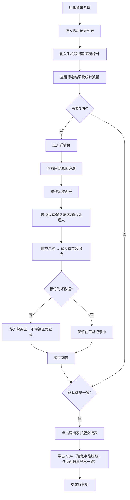

## 1. 产品概述

婴幼儿奶量交接授权库门店售后版是面向母婴门店店长及客服的售后数据管理系统，解决夜间补录串号返工、聊天记录凑结论、数据质量不可控的痛点。通过规范化的录入、复核、导出流程，确保售后记录可追溯、可审计，坏数据与正常记录物理隔离，家长带走的交接表与页面筛选结果严格一致。

- **目标用户**：南门母婴店店长、售后客服
- **核心价值**：告别聊天记录凑结论，售后数据全链路可追溯，导出数量与页面数量零误差

## 2. 核心功能

### 2.1 用户角色

| 角色 | 核心权限 |
|------|----------|
| 门店店长 | 全部权限：列表筛选、详情查看、复核操作、数据导出、标记坏数据 |
| 售后客服 | 列表查看、详情查看、提交复核意见、查看导出结果 |

### 2.2 功能模块

1. **售后记录列表页**：多条件筛选、手机号精确搜索、状态过滤、批量导出、数据总量统计
2. **售后记录详情页**：完整信息展示、问题原因追溯、复核操作面板、操作日志
3. **复核面板**：状态流转、原因标注、处理人签名、提交后立即写库
4. **数据导出服务**：按当前筛选条件导出、隐私字段脱敏、坏数据标记隔离、家长版交接表格式

### 2.3 页面详情

| 页面名称 | 模块名称 | 功能描述 |
|-----------|-------------|---------------------|
| 售后记录列表 | 顶部筛选栏 | 手机号搜索、状态下拉、日期范围、重置按钮、搜索按钮 |
| 售后记录列表 | 数据表格 | 序号、婴儿姓名、家长手机号、奶量数量、状态、原因、处理人、操作时间、操作 |
| 售后记录列表 | 统计栏 | 显示当前筛选结果总数、坏数据数量、正常数据数量 |
| 售后记录列表 | 导出按钮 | 按当前筛选条件一键导出家长版交接表（CSV） |
| 售后记录详情 | 基础信息区 | 婴儿信息、家长信息、奶量信息、授权信息 |
| 售后记录详情 | 问题追溯区 | 手机号格式问题原因、隐私字段泄露风险提示、数据质量标记 |
| 售后记录详情 | 复核面板 | 状态选择、原因输入、处理人确认、提交按钮（立即持久化） |
| 售后记录详情 | 操作日志 | 展示所有状态变更历史、操作人、操作时间 |

## 3. 核心流程

店长日常流程：按手机号搜索 → 确认列表显示数量 → 逐条复核（详情页操作）→ 标记异常数据为坏数据 → 确认列表统计数量 → 导出家长版交接表 → 交客服核对

## 4. 用户界面设计

### 4.1 设计风格

- **主色调**：温暖柔和的奶粉米色（#FFF8F0）搭配母婴感粉色（#F48FB1）作为强调色，深灰（#37474F）用于文本
- **辅助色**：健康绿（#66BB6A）标记正常、警示橙（#FFA726）标记待复核、危险红（#EF5350）标记坏数据
- **按钮风格**：圆角 8px，实心按钮带轻微阴影，hover 时阴影加深、上移 1px 的微交互
- **字体**：显示字体使用"Noto Serif SC"打造专业信任感，正文字体使用"PingFang SC"保证可读性
- **布局风格**：卡片式布局，顶部导航 + 左侧筛选 + 主内容区三栏结构，12px 圆角卡片带柔和投影
- **图标**：使用 Lucide 线性图标，与粉色强调色搭配

### 4.2 页面设计概览

| 页面名称 | 模块名称 | UI 元素 |
|-----------|-------------|-------------|
| 售后记录列表 | 顶部导航 | 品牌 Logo、系统名称、用户头像下拉、浅色背景 |
| 售后记录列表 | 筛选卡片 | 米色背景卡片，粉色搜索按钮，输入框圆角 8px |
| 售后记录列表 | 数据表格 | 斑马纹行，状态标签带颜色胶囊，hover 高亮整行 |
| 售后记录列表 | 统计卡片 | 三个数字卡片并排，粉色边框强调，带淡入动画 |
| 售后记录详情 | 信息分区 | 左右两栏布局，左侧基础信息，右侧复核面板 |
| 售后记录详情 | 问题追溯区 | 红色边框警示卡片，带感叹号图标，逐条显示问题原因 |
| 售后记录详情 | 复核面板 | 固定在右侧的粘性卡片，提交按钮醒目粉色 |
| 售后记录详情 | 操作日志 | 时间线布局，节点颜色对应当前状态 |

### 4.3 响应式设计

- 桌面端优先（1280px+），列表页三栏布局
- 平板端（768px-1279px）：筛选栏折叠为顶部展开区，表格支持横向滚动
- 移动端（<768px）：列表改为卡片流，详情页变为单栏上下布局

### 4.4 数据质量与隔离设计

- **坏数据标记**：详情页红色"标记为坏数据"按钮，点击后记录移入隔离区
- **隔离区标识**：列表中坏数据行整体浅红色背景 + 删除线效果
- **问题原因详情**：手机号格式问题显示原始值与期望格式对比；隐私泄露风险显示具体字段名与泄露场景
- **导出校验**：导出前再次比对页面显示数量与待导出数量，不一致则禁止导出并提示错误
