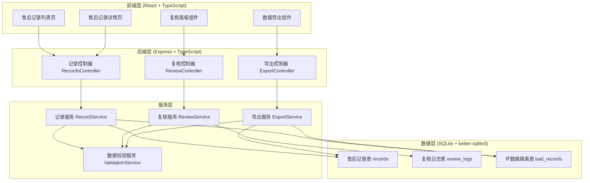
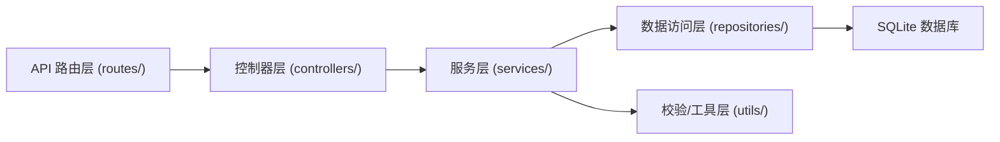
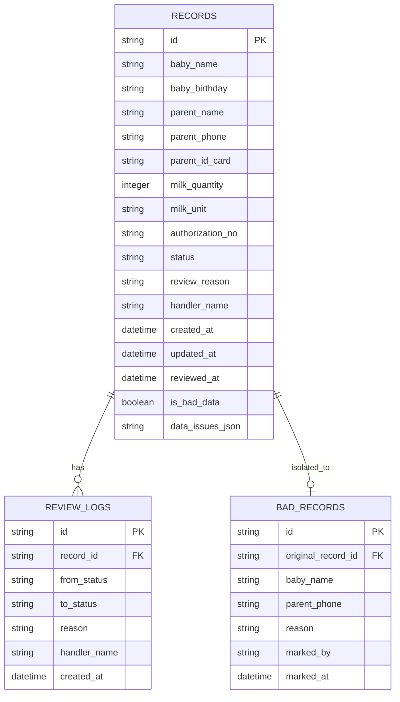

## 1. 架构设计



## 2. 技术说明

- **前端**：React@18 + TypeScript + react-router-dom@6 + tailwindcss@3 + zustand@4 + lucide-react
- **后端**：Express@4 + TypeScript (ESM)
- **数据库**：SQLite (better-sqlite3)，本地持久化，零依赖部署
- **初始化工具**：vite-init，使用 react-express-ts 模板
- **状态管理**：zustand 管理全局筛选条件、用户信息
- **HTTP 客户端**：前端使用 fetch API 直接调用后端接口

## 3. 路由定义

### 前端路由

| 路由 | 用途 |
|-------|---------|
| / | 售后记录列表页（默认首页） |
| /records/:id | 售后记录详情页（含复核面板） |

### 后端 API 路由

| 方法 | 路由 | 用途 |
|------|------|------|
| GET | /api/records | 获取售后记录列表（支持筛选、分页） |
| GET | /api/records/:id | 获取单条售后记录详情 |
| PUT | /api/records/:id | 更新售后记录（复核操作） |
| POST | /api/records/:id/mark-bad | 标记为坏数据（移入隔离区） |
| POST | /api/records/:id/restore | 从坏数据隔离区恢复 |
| GET | /api/records/:id/review-logs | 获取单条记录的复核日志 |
| GET | /api/export/records | 按筛选条件导出家长版交接表（CSV） |
| GET | /api/records/stats | 获取当前筛选条件下的统计数据 |

## 4. API 定义

### TypeScript 类型定义

```typescript
export type RecordStatus = 'pending' | 'approved' | 'rejected' | 'bad_data';

export interface DataIssue {
  type: 'phone_format' | 'privacy_leak' | 'data_inconsistency' | 'duplicate';
  field: string;
  reason: string;
  originalValue?: string;
  expectedFormat?: string;
}

export interface MilkRecord {
  id: string;
  babyName: string;
  babyBirthday: string;
  parentName: string;
  parentPhone: string;
  parentIdCard?: string;
  milkQuantity: number;
  milkUnit: 'ml' | 'bottle';
  authorizationNo: string;
  status: RecordStatus;
  reviewReason?: string;
  handlerName?: string;
  createdAt: string;
  updatedAt: string;
  reviewedAt?: string;
  isBadData: boolean;
  dataIssues: DataIssue[];
}

export interface ReviewLog {
  id: string;
  recordId: string;
  fromStatus: RecordStatus;
  toStatus: RecordStatus;
  reason: string;
  handlerName: string;
  createdAt: string;
}

export interface ListFilters {
  phone?: string;
  status?: RecordStatus;
  includeBadData?: boolean;
  startDate?: string;
  endDate?: string;
}

export interface ExportRow {
  序号: number;
  婴儿姓名: string;
  家长手机号: string;
  奶量数量: string;
  状态: string;
  原因: string;
  处理人: string;
}
```

### 请求/响应示例

**获取列表**
```
GET /api/records?phone=138&status=pending
Response: {
  data: MilkRecord[],
  total: number,
  normalCount: number,
  badCount: number
}
```

**提交复核**
```
PUT /api/records/:id
Body: {
  status: 'approved' | 'rejected',
  reviewReason: string,
  handlerName: string
}
Response: MilkRecord (更新后的完整记录)
```

**导出 CSV**
```
GET /api/export/records?phone=138&status=pending
Response: text/csv 二进制流，Content-Disposition: attachment
```

## 5. 服务端架构图



## 6. 数据模型

### 6.1 数据模型 ER 图



### 6.2 DDL 语句

```sql
CREATE TABLE IF NOT EXISTS records (
  id TEXT PRIMARY KEY,
  baby_name TEXT NOT NULL,
  baby_birthday TEXT,
  parent_name TEXT NOT NULL,
  parent_phone TEXT NOT NULL,
  parent_id_card TEXT,
  milk_quantity INTEGER NOT NULL,
  milk_unit TEXT NOT NULL DEFAULT 'ml',
  authorization_no TEXT NOT NULL,
  status TEXT NOT NULL DEFAULT 'pending',
  review_reason TEXT,
  handler_name TEXT,
  created_at TEXT NOT NULL,
  updated_at TEXT NOT NULL,
  reviewed_at TEXT,
  is_bad_data INTEGER NOT NULL DEFAULT 0,
  data_issues_json TEXT NOT NULL DEFAULT '[]'
);

CREATE INDEX IF NOT EXISTS idx_records_phone ON records(parent_phone);
CREATE INDEX IF NOT EXISTS idx_records_status ON records(status);
CREATE INDEX IF NOT EXISTS idx_records_created_at ON records(created_at);

CREATE TABLE IF NOT EXISTS review_logs (
  id TEXT PRIMARY KEY,
  record_id TEXT NOT NULL,
  from_status TEXT NOT NULL,
  to_status TEXT NOT NULL,
  reason TEXT,
  handler_name TEXT NOT NULL,
  created_at TEXT NOT NULL,
  FOREIGN KEY (record_id) REFERENCES records(id)
);

CREATE INDEX IF NOT EXISTS idx_review_logs_record ON review_logs(record_id);

CREATE TABLE IF NOT EXISTS bad_records (
  id TEXT PRIMARY KEY,
  original_record_id TEXT NOT NULL,
  baby_name TEXT NOT NULL,
  parent_phone TEXT NOT NULL,
  reason TEXT NOT NULL,
  marked_by TEXT NOT NULL,
  marked_at TEXT NOT NULL,
  FOREIGN KEY (original_record_id) REFERENCES records(id)
);
```

### 6.3 初始种子数据

系统将内置 15 条模拟售后记录，覆盖以下场景：
- 5 条正常待复核记录（手机号格式正确，无隐私问题）
- 3 条存在手机号格式问题的记录（含空格、短横线、非 11 位）
- 2 条存在隐私泄露风险的记录（身份证号完整显示、住址明文）
- 2 条已复核通过的记录
- 2 条已标记为坏数据的记录
- 1 条复核被拒绝的记录
