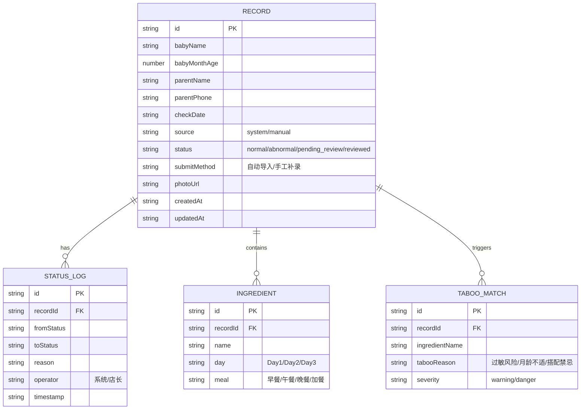

## 1. 架构设计

```mermaid
flowchart LR
    "React 前端 (Vite)" --> "Zustand 状态管理"
    "Zustand 状态管理" --> "内置 Mock 数据层"
    "内置 Mock 数据层" --> "localStorage 持久化"
    "React 前端 (Vite)" --> "路由 (react-router-dom)"
    "路由 (react-router-dom)" --> "列表页 /"
    "路由 (react-router-dom)" --> "详情页 /record/:id"
    "React 前端 (Vite)" --> "Tailwind CSS 样式层"
    "React 前端 (Vite)" --> "lucide-react 图标库"
```

## 2. 技术描述

- **前端框架**：React@18 + TypeScript@5
- **构建工具**：Vite@5
- **路由**：react-router-dom@6
- **状态管理**：zustand@4
- **样式方案**：Tailwind CSS@3
- **图标库**：lucide-react
- **后端/数据库**：无后端，使用内置 Mock 数据 + localStorage 持久化
- **初始化工具**：vite-init（react-ts 模板）

## 3. 路由定义

| 路由 | 页面组件 | 用途 |
|------|----------|------|
| `/` | `RecordListPage` | 对账列表页（首页），展示全部记录、筛选、导出、补录入口 |
| `/record/:id` | `RecordDetailPage` | 对账详情页，展示单条记录详情、状态时间线、人工改判操作 |

## 4. 数据模型

### 4.1 数据实体定义



### 4.2 TypeScript 类型定义

```typescript
export type RecordStatus = 'normal' | 'abnormal' | 'pending_review' | 'reviewed';
export type RecordSource = 'system' | 'manual';
export type Severity = 'warning' | 'danger';

export interface Ingredient {
  id: string;
  name: string;
  day: 'Day1' | 'Day2' | 'Day3';
  meal: '早餐' | '午餐' | '晚餐' | '加餐';
}

export interface TabooMatch {
  id: string;
  ingredientName: string;
  tabooReason: string;
  severity: Severity;
}

export interface StatusLog {
  id: string;
  fromStatus: RecordStatus | null;
  toStatus: RecordStatus;
  reason: string;
  operator: '系统' | '店长';
  timestamp: string;
}

export interface CheckRecord {
  id: string;
  babyName: string;
  babyMonthAge: number;
  parentName: string;
  parentPhone: string;
  checkDate: string;
  source: RecordSource;
  status: RecordStatus;
  submitMethod: string;
  photoUrl?: string;
  ingredients: Ingredient[];
  taboos: TabooMatch[];
  statusLogs: StatusLog[];
  createdAt: string;
  updatedAt: string;
}
```

### 4.3 内置样例数据（5 条，覆盖全场景）

| 编号 | 场景 | 状态 | 手机号 | 说明 |
|------|------|------|--------|------|
| 1 | 正常路径 | normal | 13800138001 | 无禁忌匹配，系统自动判定正常 |
| 2 | 异常路径 | abnormal | 13800138002 | 含蜂蜜（1岁以下禁忌）+ 芒果（高致敏），系统判定异常 |
| 3 | 人工改判路径 | reviewed | 13800138003 | 原判定异常→店长改判正常，含改判原因"家长确认宝宝已耐受芒果" |
| 4 | 重复提交拦截 | abnormal | 13800138004 | 状态日志含"重复提交已拦截，内容与 10 分钟前提交一致" |
| 5 | 手工补录 | pending_review | 13800138005 | source=manual，标记"手工补录"，与系统导入记录形成差异对照 |

## 5. 核心模块目录结构

```
src/
├── components/           # 可复用组件
│   ├── StatusBadge.tsx       # 状态标签
│   ├── RecordCard.tsx        # 列表卡片
│   ├── StatusTimeline.tsx    # 状态时间线
│   ├── IngredientTable.tsx   # 食材对照表
│   ├── TabooList.tsx         # 禁忌匹配列表
│   ├── ManualEntryModal.tsx  # 手工补录弹窗
│   ├── ReviewModal.tsx       # 人工改判弹窗
│   └── StatsCard.tsx         # 统计卡片
├── pages/
│   ├── RecordListPage.tsx    # 列表页
│   └── RecordDetailPage.tsx  # 详情页
├── store/
│   └── useRecordStore.ts     # zustand 状态管理（含数据、操作方法）
├── data/
│   └── mockData.ts           # 内置样例数据
├── utils/
│   ├── export.ts             # 导出摘要生成逻辑
│   └── id.ts                 # ID 生成等工具函数
├── types/
│   └── index.ts              # 全局类型定义
├── App.tsx
├── main.tsx
└── index.css
```

## 6. 关键业务规则实现说明

### 6.1 坏数据隔离
- 新提交记录通过 `validateRecord()` 校验，失败则不写入主列表，仅在内存中保留错误提示
- 已持久化记录在加载时再次校验，校验失败标记 `corrupted: true` 并从列表过滤

### 6.2 重复提交拦截
- 提交前对比：手机号 + 对账日期 + 食材清单 hash 完全一致 → 拦截
- 拦截后写入 StatusLog：`{ toStatus: 当前状态, reason: "重复提交已拦截：与 ${time} 提交的记录内容一致" }`

### 6.3 刷新状态回退追踪
- 状态变更均写入 localStorage，详情页时间线完整展示
- 刷新后从 localStorage 恢复，若检测到版本冲突，写入日志：`{ reason: "检测到页面刷新，状态已从本地存储恢复，若与预期不符请联系管理员" }`

### 6.4 导出摘要格式（人类可读）
```
━━━━━━━━━━━━━━━━━━━━━━━━━━━━━━━━━━━
婴幼儿辅食禁忌对账摘要
生成时间：2026-06-07 08:30
共 3 条记录，对应 2 位家长
━━━━━━━━━━━━━━━━━━━━━━━━━━━━━━━━━━━

【家长】王女士（138****8002）
  宝宝：乐乐  11月龄
  对账日期：2026-06-07
  对账结果：⚠️ 异常（2 条禁忌）
    1. 蜂蜜 —— 1 岁以下婴儿禁止食用（高风险）
    2. 芒果 —— 首次添加建议少量试吃（中风险）
  处理建议：请客服联系家长确认是否已出现过敏反应

━━━━━━━━━━━━━━━━━━━━━━━━━━━━━━━━━━━
```
