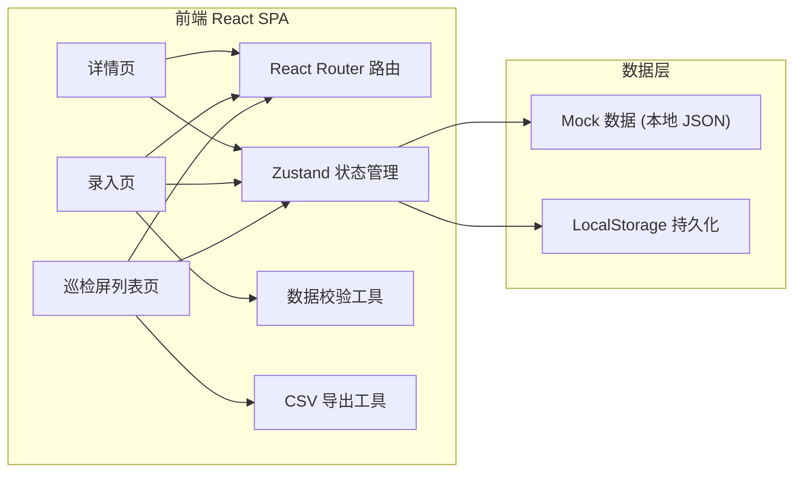
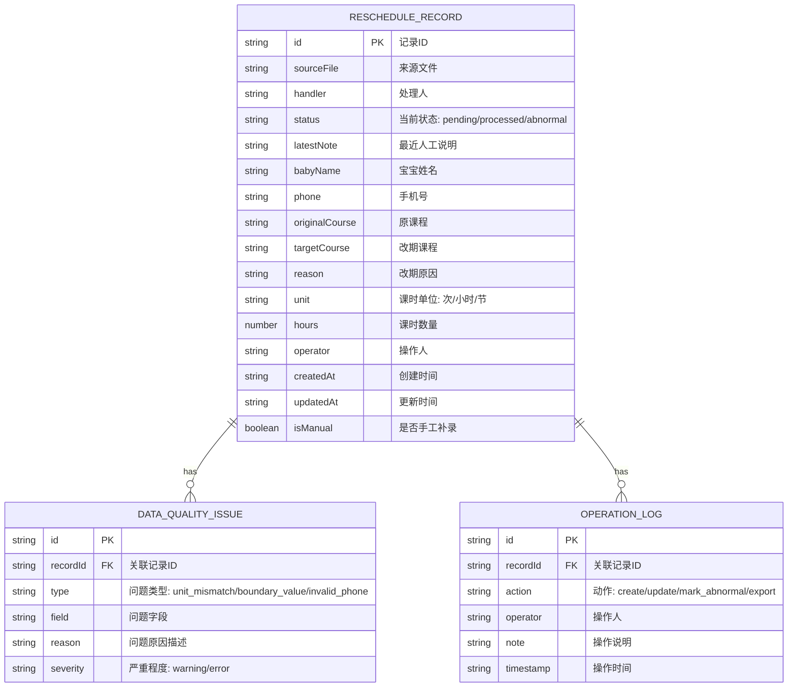

## 1. 架构设计



## 2. 技术选型

- 前端：React 18 + TypeScript + Vite
- 样式：Tailwind CSS 3
- 路由：react-router-dom v6
- 状态管理：zustand
- 图标：lucide-react
- 后端：无，纯前端 Mock + LocalStorage 持久化
- 数据：内置 Mock 数据，含正常记录、异常记录、手工补录样例各若干条

## 3. 路由定义

| 路由 | 页面 | 说明 |
|------|------|------|
| `/` | 巡检屏列表页 | 默认首页，记录列表 + 筛选 + 导出 |
| `/entry` | 录入页 | 标准录入 + 手工补录样例入口 |
| `/detail/:id` | 详情页 | 完整信息 + 数据质量校验原因 + 操作流水 |

## 4. 数据模型

### 4.1 数据模型定义



### 4.2 类型定义（TypeScript）

```typescript
export type RecordStatus = 'pending' | 'processed' | 'abnormal';
export type IssueSeverity = 'warning' | 'error';
export type IssueType = 'unit_mismatch' | 'boundary_value' | 'invalid_phone';

export interface DataQualityIssue {
  id: string;
  recordId: string;
  type: IssueType;
  field: string;
  reason: string;
  severity: IssueSeverity;
}

export interface OperationLog {
  id: string;
  recordId: string;
  action: string;
  operator: string;
  note: string;
  timestamp: string;
}

export interface RescheduleRecord {
  id: string;
  sourceFile: string;
  handler: string;
  status: RecordStatus;
  latestNote: string;
  babyName: string;
  phone: string;
  originalCourse: string;
  targetCourse: string;
  reason: string;
  unit: string;
  hours: number;
  operator: string;
  createdAt: string;
  updatedAt: string;
  isManual: boolean;
  issues: DataQualityIssue[];
  logs: OperationLog[];
}
```

## 5. 核心工具函数

| 函数名 | 用途 |
|--------|------|
| `validateRecord(data)` | 校验记录，返回 DataQualityIssue 数组 |
| `detectUnitMismatch(unit, hours)` | 检测单位混用（如单位写"小时"但值>12为异常边界） |
| `detectBoundaryValue(field, value)` | 检测边界值（课时 0 或 > 30 标记） |
| `validatePhone(phone)` | 校验手机号格式（11位、1开头） |
| `exportToCSV(records)` | 导出 CSV，确保条数与页面严格一致 |
| `generateId()` | 生成唯一记录 ID |

## 6. 数据校验规则

| 规则 | 触发条件 | 严重程度 | 异常原因描述 |
|------|----------|----------|--------------|
| 手机号格式 | 非 11 位数字或不以 1 开头 | error | 手机号格式不正确，应为 11 位有效号码 |
| 单位混用 | 同一手机号多条记录 unit 字段不一致（次/小时/节混用） | warning | 该学员历史记录单位为"次"，本次为"小时"，存在单位混用风险 |
| 课时边界值 0 | hours === 0 | error | 课时数量为 0，属于异常边界值 |
| 课时边界值过大 | hours > 30 | warning | 课时数量超过 30，超出单次改期正常范围，请确认 |
| 宝宝姓名空 | babyName 为空或长度 < 2 | error | 宝宝姓名不能为空或过短 |
| 改期课程相同 | originalCourse === targetCourse | warning | 原课程与改期课程相同，疑似误操作 |
