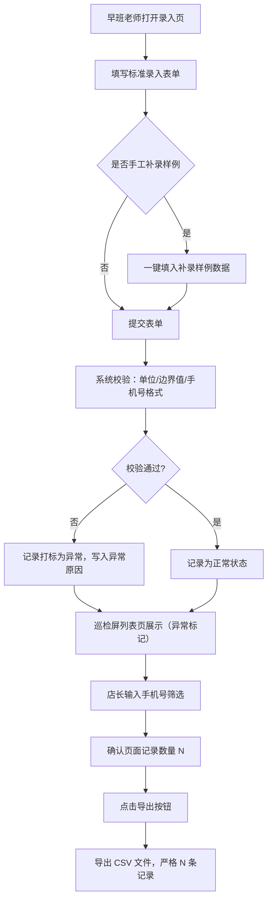

## 1. 产品概述

海豚泳池婴幼儿课程改期巡检屏门店售后版，解决门店改期记录靠 Excel 表格撑着、口头占用转班名额无据可查、坏数据混入正常记录、导出数据与页面数量不一致等问题。面向早班老师录入、店长按手机号筛选导出客服核对的完整闭环。

## 2. 核心功能

### 2.1 用户角色

| 角色 | 注册方式 | 核心权限 |
|------|----------|----------|
| 早班老师 | 系统内置账号 | 录入改期记录、补录、查看列表与详情 |
| 店长 | 系统内置账号 | 手机号筛选、导出、查看列表与详情、标记坏数据 |

### 2.2 功能模块

1. **巡检屏列表页**：逐条展示改期记录（来源文件、处理人、状态、最近人工说明），坏数据独立标识，汇总指标卡为辅
2. **录入页**：标准录入表单 + 手工补录入口，含字段校验
3. **详情页**：完整记录信息 + 数据质量校验原因（单位混用、边界值等）
4. **筛选导出**：手机号精确筛选，页面数量与导出数量严格一致

### 2.3 页面详情

| 页面名称 | 模块名称 | 功能描述 |
|----------|----------|----------|
| 巡检屏列表页 | 顶部汇总指标卡 | 待处理 / 已处理 / 异常数据 3 项指标 |
| 巡检屏列表页 | 记录列表表格 | 来源文件、处理人、当前状态、最近人工说明、操作列 |
| 巡检屏列表页 | 筛选栏 | 手机号搜索框、状态筛选、异常标记筛选、导出按钮 |
| 录入页 | 标准录入表单 | 宝宝姓名、手机号、原课程、改期课程、改期原因、课时单位、数量 |
| 录入页 | 手工补录入口 | 一键填入补录样例数据，供对比 |
| 录入页 | 字段校验提示 | 实时校验单位合法性、边界值范围 |
| 详情页 | 基础信息卡 | 完整字段展示 |
| 详情页 | 数据质量面板 | 逐条列出校验异常及原因（单位混用、边界值等） |
| 详情页 | 操作流水 | 记录状态变更与处理说明历史 |

## 3. 核心流程

早班老师录入改期记录 → 系统实时校验字段合法性（单位、边界值）→ 记录入库，异常数据打标独立展示 → 店长在巡检屏按手机号筛选 → 确认页面显示数量 → 点击导出 CSV → 导出文件行数与页面数量严格一致。

## 4. 用户界面设计

### 4.1 设计风格

- 主色调：深海蓝 `#1E3A5F`（专业、可信赖）
- 辅助色：水青绿 `#2DD4BF`（婴儿友好）、警示橙 `#F59E0B`、异常红 `#EF4444`
- 中性色：石板灰系列 `#1F2937 / #4B5563 / #9CA3AF / #F9FAFB`
- 按钮风格：圆角 8px，主色实心 + 白底描边次级按钮
- 字体：标题 `Noto Serif SC` 衬线体（稳重），正文 `Noto Sans SC` 无衬线体（清晰）
- 布局风格：左侧导航 + 右侧内容区，数据以表格为主，辅以卡片
- 图标：lucide-react 线性图标

### 4.2 页面设计概览

| 页面名称 | 模块名称 | UI 元素 |
|----------|----------|---------|
| 巡检屏列表页 | 汇总指标卡 | 三列卡片，数值 + 趋势箭头，蓝色渐变背景 |
| 巡检屏列表页 | 记录列表 | 斑马纹表格，异常行橙色左边框，hover 高亮 |
| 录入页 | 表单区 | 两列栅格，label 左对齐，输入框 focus 蓝色边框 |
| 录入页 | 补录样例区 | 黄色提示条 + "填入补录样例"按钮 |
| 详情页 | 数据质量面板 | 红色/橙色边框卡片，逐条原因带图标前缀 |
| 详情页 | 操作流水 | 时间线布局，头像 + 动作 + 说明 + 时间 |

### 4.3 响应式

桌面优先，最小支持 1280px 宽度。移动端自适应为单列布局，表格横向滚动。

### 4.4 交互动效

- 列表行 hover 背景色 + 轻微上移
- 表单校验错误 shake 抖动
- 异常数据标记闪烁脉冲
- 导出按钮点击后倒计时动画防止重复提交
