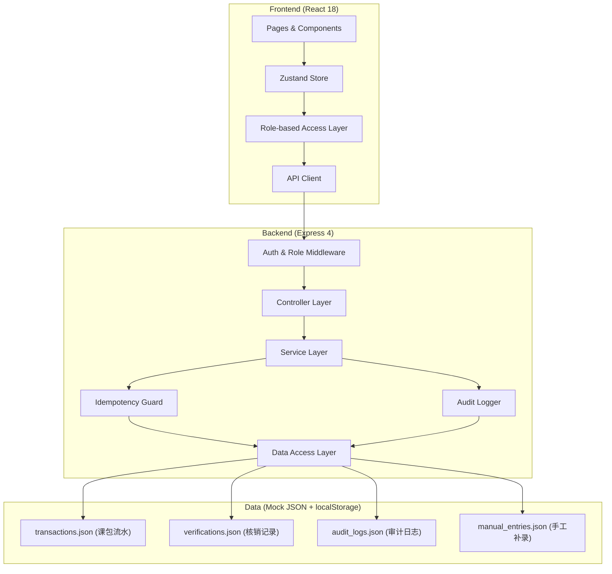
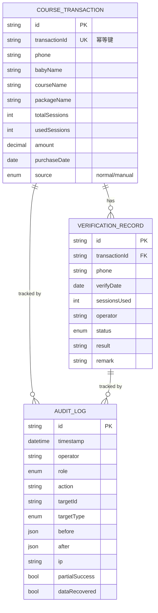

## 1. 架构设计



## 2. 技术描述

- 前端：React@18 + TypeScript + tailwindcss@3 + Vite + zustand + lucide-react + react-router-dom
- 后端：Express@4 + TypeScript + CORS
- 数据存储：前端 localStorage 持久化 + JSON 静态样例数据，模拟数据库
- 初始化工具：vite-init

## 3. 路由定义

| 路由 | 用途 | 权限 |
|------|------|------|
| / | 核销提醒墙首页（列表+筛选+导出） | 全部 |
| /detail/:id | 完整链路详情页 | 全部 |
| /audit | 审计视图（主管专属） | supervisor |
| /manual-entry | 手工补录页 | 全部（补录操作留痕） |
| /role-demo | 角色切换演示页 | 全部 |

## 4. API 定义

### TypeScript 类型

```typescript
type UserRole = 'staff' | 'supervisor';

interface CourseTransaction {
  id: string;
  transactionId: string;        // 幂等键
  phone: string;
  babyName: string;
  courseName: string;
  packageName: string;
  totalSessions: number;
  usedSessions: number;
  amount: number;
  purchaseDate: string;
  source: 'normal' | 'manual';
}

interface VerificationRecord {
  id: string;
  transactionId: string;
  phone: string;
  verifyDate: string;
  sessionsUsed: number;
  operator: string;
  status: 'pending' | 'verified' | 'exception' | 'partial_success';
  result: string;
  remark: string;
}

interface AuditLog {
  id: string;
  timestamp: string;
  operator: string;
  role: UserRole;
  action: string;
  targetId: string;
  targetType: 'transaction' | 'verification' | 'manual_entry' | 'import';
  before: Record<string, any> | null;
  after: Record<string, any> | null;
  ip: string;
  partialSuccess?: boolean;
  dataRecovered?: boolean;
}
```

### API 端点

| 方法 | 路径 | 描述 |
|------|------|------|
| GET | /api/transactions | 按手机号/状态筛选课包流水 |
| GET | /api/transactions/:id | 单条课包流水 + 完整核销链路 |
| GET | /api/audit | 审计日志（supervisor） |
| POST | /api/manual-entry | 手工补录核销记录 |
| POST | /api/import-sample | 重导样例数据（幂等） |
| GET | /api/export | 导出 CSV（count 二次校验） |

## 5. 数据模型

### 6.1 ER 图



### 6.2 索引与约束

- `course_transactions.transaction_id` UNIQUE 索引保证幂等导入
- `audit_logs.timestamp` + `audit_logs.target_id` 复合索引加速审计查询
- `verification_records.transaction_id` 外键关联课包流水
- 所有表带软删除字段 `deleted_at`，物理删除仅内部使用

## 6. 关键机制实现

### 6.1 幂等导入
导入时按 `transactionId` 查询，已存在则跳过并记录"重复导入"审计日志，不存在则插入。

### 6.2 数量口径一致性
列表 count 由同一 SQL/查询产生，前端同时展示于页面和作为导出参数传入后端，后端导出前二次 count 校验并写入响应头 `X-Total-Count`。

### 6.3 审计永不丢失
审计日志 append-only，写入使用独立事务，不受主业务回滚影响；localStorage 使用独立 key 前缀 `audit_` 存储。

### 6.4 部分成功标记
批量操作逐条 try/catch，成功/失败分别记录，失败条目在审计中标记 `partialSuccess: true`。
