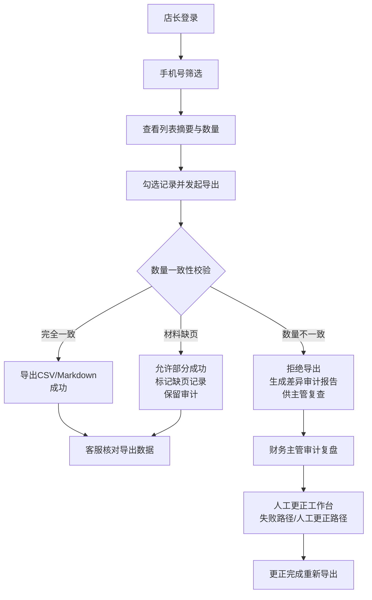

## 1. 产品概述

婴幼儿接送授权清洗链门店售后版——解决梧桐社区儿保室旧流程中"电话授权+临时阿姨"混同后变更记录丢失的问题。系统以门店为单位，管理婴幼儿接送人授权、变更、撤销全链路，确保导出报告与页面数据严格一致，并保留失败路径与人工更正路径供财务复盘。

目标用户：门店店长（按手机号筛选→导出→客服核对）、客服专员（核对数据）、财务主管（审计复查）。

## 2. 核心功能

### 2.1 用户角色

| 角色 | 登录方式 | 核心权限 |
|------|----------|----------|
| 门店店长 | 工号登录 | 按手机号筛选、查看全部授权记录、发起导出、标记人工更正 |
| 客服专员 | 工号登录 | 核对导出数据、查看详情、标注问题 |
| 财务主管 | 工号登录 | 审计追溯、查看失败路径、确认人工更正、导出审计报告 |

### 2.2 功能模块

1. **授权记录列表页**：摘要卡片、手机号筛选、状态筛选、分页、数量摘要
2. **授权详情页**：基础信息、接送人信息、授权变更历史（审计链）、材料附件、当前状态
3. **导出中心**：CSV 导出、Markdown 报告导出、数量一致性校验、部分成功处理、导出审计日志
4. **人工更正工作台**：失败记录查看、人工更正录入、更正审计
5. **审计追踪页**：变更历史对比、谁改过、什么时候改的、改了什么

### 2.3 页面详情

| 页面名称 | 模块名称 | 功能描述 |
|-----------|-------------|---------------------|
| 授权记录列表页 | 顶部筛选栏 | 手机号精确/模糊搜索、授权状态筛选（有效/已撤销/临时/电话授权）、日期范围、门店选择 |
| 授权记录列表页 | 数据摘要区 | 总记录数、有效授权数、临时授权数、电话授权数、异常数、待更正数、已导出数 |
| 授权记录列表页 | 记录列表区 | 每行展示婴幼儿姓名、家长手机号、接送人类型、授权状态、最后变更时间、操作按钮 |
| 授权记录列表页 | 导出操作区 | 全选/反选、导出 CSV、导出 Markdown 报告、导出预览（数量校验） |
| 授权详情页 | 基础信息卡片 | 婴幼儿信息、家长信息、所属门店 |
| 授权详情页 | 接送人信息 | 主接送人、临时接送人（阿姨）、电话授权记录、关系说明 |
| 授权详情页 | 变更审计链 | 时间线展示每次变更：操作人、操作时间、变更前后对比、变更原因 |
| 授权详情页 | 材料附件区 | 上传/预览授权书、身份证件，缺页标记（部分成功） |
| 授权详情页 | 操作区 | 发起变更、撤销授权、标记人工更正 |
| 导出中心页 | 导出记录列表 | 每次导出：导出人、导出时间、筛选条件、页面记录数、导出记录数、差异数、状态（成功/部分成功/失败） |
| 导出中心页 | 差异详情 | 当导出数量≠页面数量时：列出缺失记录ID、原因、审计标记 |
| 人工更正工作台 | 待更正列表 | 失败/异常记录、标记原因、当前处理人 |
| 人工更正工作台 | 更正表单 | 更正前后数据、更正说明、附件上传、更正人签名 |
| 审计追踪页 | 全局变更时间线 | 全门店变更记录，可按操作人、时间、变更类型筛选 |
| 审计追踪页 | 失败路径复盘 | 失败记录完整链路：原始数据→失败点→处理过程→最终结果 |

## 3. 核心流程

店长打开系统→按手机号筛选婴幼儿家长→查看列表摘要（总数/状态分布）→勾选需要导出的记录→点击导出 CSV/Markdown→系统执行数量一致性校验→若完全一致，直接导出；若存在材料缺页，允许部分成功并标记缺页记录；若导出数量与页面数量不一致，拒绝导出并生成审计差异报告（供主管复查）。

财务主管在审计追踪页查看失败路径与人工更正路径，复盘每一步操作。

## 4. 用户界面设计

### 4.1 设计风格
- 主色调：医疗蓝 `#1E6FDB`（专业信任），辅色：暖橙 `#F59E0B`（临时/电话授权高亮），警示红 `#DC2626`（异常/失败），成功绿 `#10B981`（正常/一致）
- 中性色：石板灰系列 `slate`，保证信息密度与可读性
- 按钮风格：4px 圆角，主按钮实色填充+微悬停抬升，次按钮描边，危险按钮红色
- 字体：标题用 Noto Serif SC（衬线稳重），正文用 Noto Sans SC（无衬线易读），数据表格用 JetBrains Mono（等宽对齐）
- 布局：左侧导航栏 + 顶部面包屑 + 主内容卡片式，信息密度偏紧凑（面向专业运营人员）
- 图标：lucide-react 线性图标，状态用彩色圆点 badge

### 4.2 页面设计概览

| 页面名称 | 模块名称 | UI 元素 |
|-----------|-------------|----------|
| 授权记录列表页 | 顶部筛选栏 | 左侧品牌logo，右侧筛选条件（手机号搜索框、状态下拉、日期范围、门店选择）、刷新按钮 |
| 授权记录列表页 | 数据摘要区 | 6 个 KPI 卡片横向排列，每张含图标、数字、环比变化、颜色区分，卡片间细线分隔 |
| 授权记录列表页 | 记录列表区 | 表格：斑马纹、hover 高亮、状态 badge、操作列（查看详情/导出单条） |
| 授权记录列表页 | 导出操作区 | 表格上方 toolbar：全选 checkbox、已选数量、导出按钮组（CSV/Markdown）、导出预览提示 |
| 授权详情页 | 基础信息卡片 | 双栏网格布局，婴幼儿头像占位、关键信息加粗展示 |
| 授权详情页 | 变更审计链 | 左侧垂直线+圆点时间线，右侧每条变更的操作人/时间/前后对比 diff 面板 |
| 导出中心页 | 差异详情 | 差异列表含告警图标，可展开查看具体缺失原因与关联审计ID |
| 人工更正工作台 | 更正表单 | 左右对比布局：左原始值、右更正值，中间箭头，底部更正说明多行文本 |

### 4.3 响应式
桌面优先（>=1280px），主操作区固定最小宽度 1024px；平板端（>=768px）摘要区换行堆叠；移动端（<768px）表格转为卡片列表，筛选条件折叠。

### 4.4 微交互
- 摘要数字加载时 count-up 动画
- 状态变更 badge 颜色过渡
- 导出进度条（含已导出/总数百分比）
- 时间线节点 hover 时放大 + 详细信息 tooltip
- 差异告警行 pulse 闪烁 2 次后稳定
