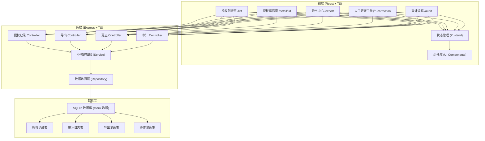
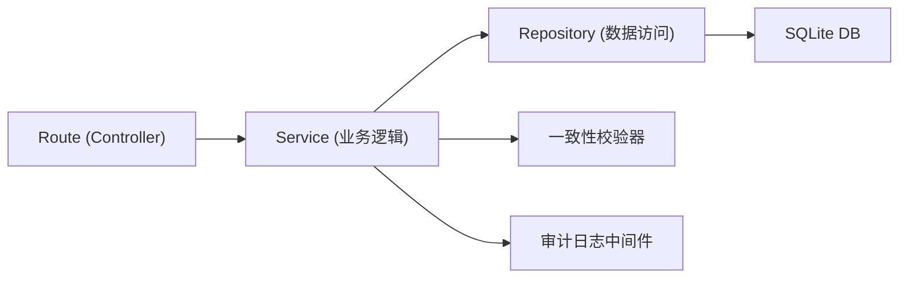
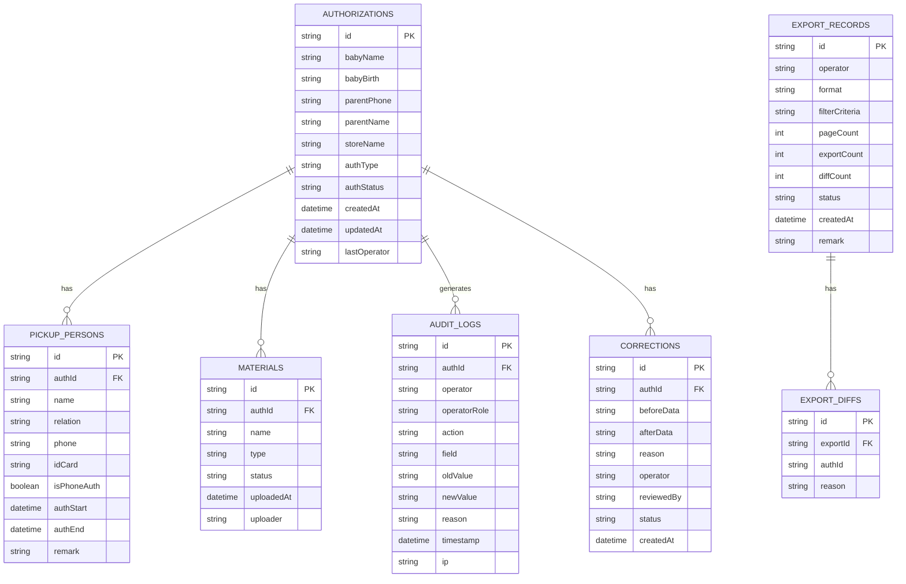

## 1. 架构设计



## 2. 技术描述

- 前端：React@18 + TypeScript + Vite + TailwindCSS@3 + Zustand + react-router-dom + lucide-react
- 初始化工具：vite-init
- 后端：Express@4 + TypeScript + better-sqlite3
- 数据库：SQLite（内嵌，开发演示用，mock 数据自动初始化）
- 导出：papaparse (CSV) + 原生 Markdown 生成器
- HTTP 客户端：axios

## 3. 路由定义

| 路由 | 用途 |
|-------|---------|
| /list | 授权记录列表页（首页，摘要+筛选+表格+导出） |
| /detail/:id | 授权详情页（基础信息+接送人+审计链+材料） |
| /export | 导出中心（导出历史+差异详情+一致性校验结果） |
| /correction | 人工更正工作台（失败记录+更正表单） |
| /audit | 审计追踪（全局变更时间线+失败路径复盘） |

后端 API 路由（前缀 `/api`）：

| 方法 | 路由 | 用途 |
|-------|-------|---------|
| GET | /authorizations | 分页查询授权记录（支持手机号、状态、门店筛选） |
| GET | /authorizations/:id | 单条授权详情（含变更历史） |
| POST | /authorizations/:id/correct | 提交人工更正 |
| GET | /authorizations/summary | 列表摘要统计（KPI 数字） |
| POST | /export/csv | 导出 CSV（含一致性校验，支持部分成功） |
| POST | /export/markdown | 导出 Markdown 报告（含一致性校验） |
| GET | /export/records | 导出历史列表 |
| GET | /export/:id/diff | 导出差异详情（当数量不一致时） |
| GET | /audit/timeline | 全局审计时间线 |
| GET | /audit/failure-paths | 失败路径复盘数据 |
| GET | /corrections/pending | 待更正列表 |

## 4. API 类型定义

```typescript
// 授权类型
export type AuthType = 'primary' | 'temporary' | 'phone';
// 授权状态
export type AuthStatus = 'active' | 'revoked' | 'expired' | 'pending' | 'failed' | 'corrected';
// 导出状态
export type ExportStatus = 'success' | 'partial' | 'failed' | 'rejected';

export interface Authorization {
  id: string;
  babyName: string;
  babyBirth: string;
  parentPhone: string;
  parentName: string;
  storeName: string;
  authType: AuthType;
  authStatus: AuthStatus;
  pickups: PickupPerson[];
  materials: MaterialAttachment[];
  createdAt: string;
  updatedAt: string;
  lastOperator: string;
}

export interface PickupPerson {
  id: string;
  name: string;
  relation: string; // '母亲' | '父亲' | '临时阿姨' | '其他'
  phone: string;
  idCard?: string;
  isPhoneAuth: boolean;
  authStart?: string;
  authEnd?: string;
  remark?: string;
}

export interface MaterialAttachment {
  id: string;
  name: string;
  type: 'auth_letter' | 'id_card' | 'other';
  status: 'ok' | 'missing' | 'damaged';
  uploadedAt: string;
  uploader: string;
}

export interface AuditLog {
  id: string;
  authId: string;
  operator: string;
  operatorRole: string;
  action: 'create' | 'update' | 'revoke' | 'correct' | 'export' | 'phone_auth';
  field?: string;
  oldValue?: string;
  newValue?: string;
  reason?: string;
  timestamp: string;
  ip?: string;
}

export interface ExportRecord {
  id: string;
  operator: string;
  format: 'csv' | 'markdown';
  filterCriteria: Record<string, any>;
  pageCount: number;      // 页面展示的记录数
  exportCount: number;    // 实际导出的记录数
  diffCount: number;      // 差异数
  status: ExportStatus;
  missingIds: string[];
  createdAt: string;
  remark?: string;
}

export interface CorrectionRecord {
  id: string;
  authId: string;
  beforeData: Partial<Authorization>;
  afterData: Partial<Authorization>;
  reason: string;
  operator: string;
  reviewedBy?: string;
  status: 'pending' | 'approved' | 'rejected';
  createdAt: string;
}
```

## 5. 服务端分层架构



## 6. 数据模型

### 6.1 ER 图



### 6.2 DDL（SQLite）

```sql
CREATE TABLE IF NOT EXISTS authorizations (
  id TEXT PRIMARY KEY,
  baby_name TEXT NOT NULL,
  baby_birth TEXT,
  parent_phone TEXT NOT NULL,
  parent_name TEXT NOT NULL,
  store_name TEXT NOT NULL,
  auth_type TEXT NOT NULL CHECK(auth_type IN ('primary','temporary','phone')),
  auth_status TEXT NOT NULL CHECK(auth_status IN ('active','revoked','expired','pending','failed','corrected')),
  created_at TEXT NOT NULL,
  updated_at TEXT NOT NULL,
  last_operator TEXT NOT NULL
);
CREATE INDEX idx_authorizations_parent_phone ON authorizations(parent_phone);
CREATE INDEX idx_authorizations_status ON authorizations(auth_status);
CREATE INDEX idx_authorizations_store ON authorizations(store_name);

CREATE TABLE IF NOT EXISTS pickup_persons (
  id TEXT PRIMARY KEY,
  auth_id TEXT NOT NULL REFERENCES authorizations(id),
  name TEXT NOT NULL,
  relation TEXT NOT NULL,
  phone TEXT NOT NULL,
  id_card TEXT,
  is_phone_auth INTEGER NOT NULL DEFAULT 0,
  auth_start TEXT,
  auth_end TEXT,
  remark TEXT
);
CREATE INDEX idx_pickup_auth ON pickup_persons(auth_id);

CREATE TABLE IF NOT EXISTS materials (
  id TEXT PRIMARY KEY,
  auth_id TEXT NOT NULL REFERENCES authorizations(id),
  name TEXT NOT NULL,
  type TEXT NOT NULL CHECK(type IN ('auth_letter','id_card','other')),
  status TEXT NOT NULL CHECK(status IN ('ok','missing','damaged')),
  uploaded_at TEXT NOT NULL,
  uploader TEXT NOT NULL
);
CREATE INDEX idx_materials_auth ON materials(auth_id);

CREATE TABLE IF NOT EXISTS audit_logs (
  id TEXT PRIMARY KEY,
  auth_id TEXT NOT NULL REFERENCES authorizations(id),
  operator TEXT NOT NULL,
  operator_role TEXT NOT NULL,
  action TEXT NOT NULL,
  field TEXT,
  old_value TEXT,
  new_value TEXT,
  reason TEXT,
  timestamp TEXT NOT NULL,
  ip TEXT
);
CREATE INDEX idx_audit_auth ON audit_logs(auth_id);
CREATE INDEX idx_audit_timestamp ON audit_logs(timestamp);
CREATE INDEX idx_audit_action ON audit_logs(action);

CREATE TABLE IF NOT EXISTS export_records (
  id TEXT PRIMARY KEY,
  operator TEXT NOT NULL,
  format TEXT NOT NULL CHECK(format IN ('csv','markdown')),
  filter_criteria TEXT,
  page_count INTEGER NOT NULL,
  export_count INTEGER NOT NULL,
  diff_count INTEGER NOT NULL,
  status TEXT NOT NULL CHECK(status IN ('success','partial','failed','rejected')),
  missing_ids TEXT,
  created_at TEXT NOT NULL,
  remark TEXT
);
CREATE INDEX idx_export_created ON export_records(created_at);

CREATE TABLE IF NOT EXISTS corrections (
  id TEXT PRIMARY KEY,
  auth_id TEXT NOT NULL REFERENCES authorizations(id),
  before_data TEXT NOT NULL,
  after_data TEXT NOT NULL,
  reason TEXT NOT NULL,
  operator TEXT NOT NULL,
  reviewed_by TEXT,
  status TEXT NOT NULL CHECK(status IN ('pending','approved','rejected')),
  created_at TEXT NOT NULL
);
CREATE INDEX idx_corrections_auth ON corrections(auth_id);
CREATE INDEX idx_corrections_status ON corrections(status);
```
