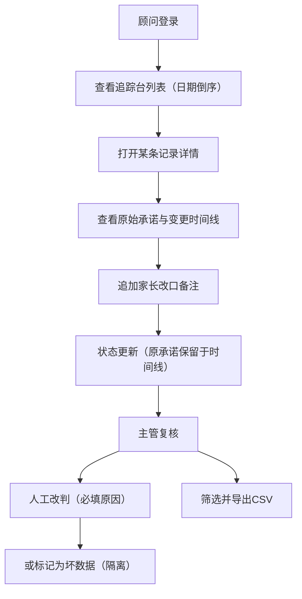

## 1. 产品概述

婴幼儿课程改期追踪台（试听顾问版）是面向课程主管与试听顾问的改期承诺复核系统，解决旧承诺无法翻查、状态变更无法溯源的问题。产品聚焦从录入到导出的完整闭环，保留每次人工改判的完整轨迹。

- 核心用户：课程主管、试听顾问
- 核心价值：承诺可溯源、改判可复核、数据可导出

## 2. 核心功能

### 2.1 用户角色
| 角色 | 说明 | 核心权限 |
|------|------|----------|
| 课程主管 | 复核改期记录、导出数据 | 查看全部记录、详情复核、导出、标记坏数据 |
| 试听顾问 | 录入改期、补充家长改口备注 | 查看本人记录、补录备注、提交新改期 |

### 2.2 功能模块
1. **追踪台首页（记录列表）**：按日期倒序的完整记录行、筛选过滤、状态标签
2. **记录详情页**：完整变更时间线、原始承诺、每次改判原因、来源文件、处理人
3. **手工补录**：新增改期记录、家长改口备注补充
4. **导出功能**：CSV/Excel 导出、导出范围筛选

### 2.3 页面详情
| 页面名称 | 模块名称 | 功能描述 |
|----------|----------|----------|
| 追踪台首页 | 顶部导航栏 | 产品名称、角色切换、导出按钮、补录按钮 |
| 追踪台首页 | 筛选区 | 状态筛选、处理人筛选、日期范围、关键词搜索 |
| 追踪台首页 | 记录列表 | 每行含：来源文件、儿童姓名、家长、原承诺日期、当前状态、处理人、最近人工说明、操作按钮；日期倒序 |
| 记录详情页 | 基本信息卡 | 儿童信息、家长、来源文件、创建时间 |
| 记录详情页 | 变更时间线 | 按时间倒序展示每次变更：状态、操作人、说明、时间戳；原始承诺永不删除 |
| 记录详情页 | 补录操作区 | 追加家长改口备注、人工改判状态并填写原因 |
| 记录详情页 | 坏数据标记 | 标记为坏数据并说明原因，隔离出正常列表 |
| 手工补录页 | 补录表单 | 儿童姓名、家长联系方式、原承诺、新改期日期、原因说明、来源（手工补录） |
| 导出功能 | 导出对话框 | 选择导出范围、格式（CSV）、包含/排除坏数据 |

## 3. 核心流程

### 主要用户流程
顾问查看列表 → 打开详情页查看完整变更历史 → 追加家长改口备注（保留原承诺）→ 主管复核并人工改判（写入原因）→ 筛选导出。

## 4. 用户界面设计

### 4.1 设计风格
- **主色**：深墨蓝 #1E3A5F（专业可信赖）
- **辅色**：暖琥珀 #D97706（强调警示与人工操作）、青绿 #0F766E（正常/已处理状态）
- **中性色**：石板灰系列（slate），背景分层：#F8FAFC / #F1F5F9 / #E2E8F0
- **字体**：标题使用 "Noto Serif SC"（宋体衬线，稳重）；正文使用 "Noto Sans SC"（黑体无衬线，可读）
- **按钮风格**：细边框 2px、圆角 sm、悬停时底色微变并上浮 1px
- **图标**：lucide-react，线性风格
- **布局**：顶部导航 + 左侧筛选（桌面端）+ 中间数据表格 + 右侧详情抽屉或独立详情页

### 4.2 页面设计概述
| 页面名称 | 模块名称 | UI 元素 |
|----------|----------|---------|
| 追踪台首页 | 顶部导航 | 深色底、品牌名、操作按钮组、阴影 |
| 追踪台首页 | 筛选区 | 浅灰卡片、内联表单控件、紧凑间距 |
| 追踪台首页 | 记录列表 | 斑马纹行、悬停高亮、状态彩色 Pill、每行显示最新人工说明（截断可展开）、坏数据行灰显删除线 |
| 记录详情页 | 信息卡 | 左侧垂直标签或顶部选项卡、时间线带连接竖线、每次变更为一个节点含时间/操作人/状态/说明 |
| 记录详情页 | 变更时间线 | 首条标记"原始承诺"标签（不可编辑）、后续变更依次排列、改判节点用琥珀色边框、坏数据节点用红色 |
| 手工补录页 | 补录表单 | 分组卡片、必填项星号、文本域支持多行、提交后返回列表并高亮新记录 |

### 4.3 响应式
- 桌面端（≥1280px）：左侧筛选常驻、表格多列显示
- 平板端（768-1279px）：筛选收起为下拉、表格隐藏次要列
- 移动端（<768px）：列表改为卡片堆叠、详情全屏
