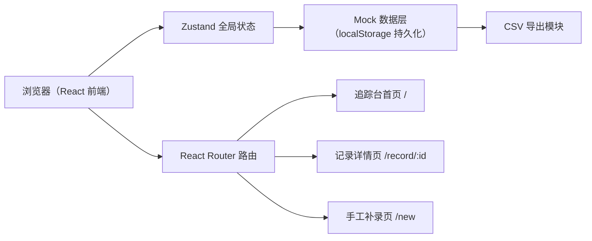
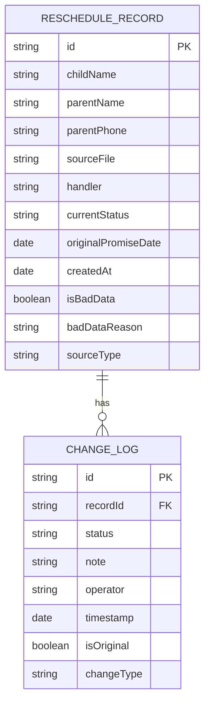

## 1. 架构设计



## 2. 技术说明
- 前端：React@18 + TypeScript + Vite + TailwindCSS@3 + zustand + react-router-dom + lucide-react
- 初始化工具：vite-init（react-ts 模板）
- 后端：无（纯前端 Mock，localStorage 持久化）
- 数据：内置 Mock 数据（含一条手工补录样例）

## 3. 路由定义
| 路由 | 用途 |
|------|------|
| / | 追踪台首页（记录列表 + 筛选） |
| /record/:id | 记录详情页（时间线 + 补录 + 改判） |
| /new | 手工补录页 |

## 4. 数据模型

### 4.1 数据模型定义



### 4.2 TypeScript 类型定义

```typescript
type RecordStatus = 
  | 'pending'      // 待处理
  | 'promised'     // 已承诺
  | 'rescheduled'  // 已改期
  | 'completed'    // 已完成
  | 'cancelled'    // 已取消
  | 'bad_data';    // 坏数据

type ChangeType = 
  | 'original'     // 原始承诺
  | 'note'         // 补充备注
  | 'reschedule'   // 改期
  | 'rejudge'      // 人工改判
  | 'bad_data';    // 标记坏数据

interface ChangeLog {
  id: string;
  recordId: string;
  status: RecordStatus;
  note: string;
  operator: string;
  timestamp: string;
  isOriginal: boolean;
  changeType: ChangeType;
  previousStatus?: RecordStatus;
}

interface RescheduleRecord {
  id: string;
  childName: string;
  parentName: string;
  parentPhone: string;
  sourceFile: string;
  handler: string;
  currentStatus: RecordStatus;
  originalPromiseDate: string;
  latestNote: string;
  createdAt: string;
  updatedAt: string;
  isBadData: boolean;
  badDataReason?: string;
  sourceType: 'import' | 'manual';
  changeLogs: ChangeLog[];
}
```

## 5. 目录结构
```
src/
├── components/
│   ├── Layout/           # 顶部导航、页面框架
│   ├── RecordTable/      # 记录列表与行组件
│   ├── FilterBar/        # 筛选区
│   ├── Timeline/         # 变更时间线
│   ├── StatusPill/       # 状态标签
│   └── Modal/            # 弹窗（改判、坏数据、导出）
├── pages/
│   ├── Dashboard.tsx     # 追踪台首页
│   ├── RecordDetail.tsx  # 记录详情
│   └── NewRecord.tsx     # 手工补录
├── store/
│   └── useRecordStore.ts # Zustand store
├── data/
│   └── mockData.ts       # Mock 数据（含补录样例）
├── types/
│   └── index.ts          # 类型定义
├── utils/
│   ├── export.ts         # CSV 导出
│   └── format.ts         # 日期/状态格式化
├── App.tsx
├── main.tsx
└── index.css
```
