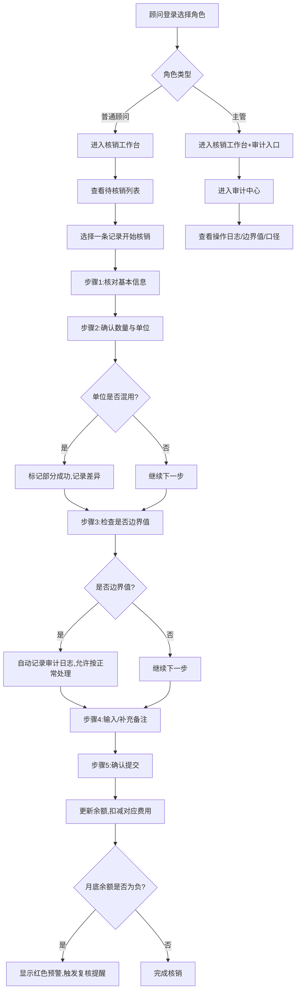

## 1. 产品概述

婴幼儿费用核销复核墙试听顾问版，是为早教课程顾问团队设计的费用核销与复核工具。目标是让新人顾问也能按标准化步骤完成核销工作，避免月底余额突然变负的问题，同时通过权限分离让主管可以独立审计，确保数据口径统一、历史可追溯。

- 解决问题：新人操作依赖老员工、月底余额异常、审计不透明、数据重复、备注变更丢失
- 目标用户：早教课程顾问（普通角色）、主管（审计角色）

## 2. 核心功能

### 2.1 用户角色

| 角色 | 进入方式 | 核心权限 |
|------|----------|----------|
| 试听顾问 | 角色切换选择"普通顾问" | 查看待核销记录、按步骤核销、添加补录备注、查看个人操作历史 |
| 主管 | 角色切换选择"主管" | 所有顾问权限 + 审计视图 + 边界值标记 + 导入记录去重管理 + 全量历史追溯 |

### 2.2 功能模块

1. **核销工作台**：步骤引导、待核销列表、余额实时监控
2. **核销流程**：五步标准化操作、单位混用处理、边界值识别
3. **审计中心**（主管可见）：操作审计日志、边界值复核、数据口径校验
4. **备注历史**：每次备注变更完整记录，原承诺不被抹掉
5. **导入管理**：样例数据导入去重、历史记录保留
6. **手工补录**：支持手动补录费用记录，前后对比

### 2.3 页面详情

| 页面名称 | 模块名称 | 功能描述 |
|----------|----------|----------|
| 核销工作台 | 顶部导航栏 | 角色切换、当前月份、余额预警卡片 |
| 核销工作台 | 步骤引导面板 | 5步操作流程、当前步骤高亮、已完成步骤标记 |
| 核销工作台 | 待核销列表 | 家长信息、课时/费用、状态、操作按钮 |
| 核销工作台 | 余额监控卡片 | 月初余额、已核销、剩余余额、负余额预警红线 |
| 核销详情页 | 基本信息区 | 家长、课程、数量、单位 |
| 核销详情页 | 核销操作区 | 数量输入、单位选择、部分成功标记、备注输入 |
| 核销详情页 | 历史备注区 | 时间线展示所有备注变更，含操作人和时间 |
| 审计中心（主管） | 审计日志面板 | 所有操作记录、筛选、搜索 |
| 审计中心（主管） | 边界值复核 | 被标记为正常的边界值记录，支持复查确认 |
| 审计中心（主管） | 口径校验 | 对比普通视图与主管视图的数据统计一致性 |
| 导入管理 | 样例导入 | 样例数据重新导入时自动去重，标记旧记录为失效 |
| 手工补录 | 补录表单 | 支持录入历史遗漏记录，展示补录前后数据差异对比 |

## 3. 核心流程

## 4. 用户界面设计

### 4.1 设计风格
- **主色调**：柔和的薄荷绿 (#10B981) 作为主色，温暖的珊瑚橙 (#F97316) 作为辅助色
- **预警色**：警戒红 (#EF4444) 用于余额负数值和边界值标记
- **中性色**：石板灰 (#1E293B) 文字，米白背景 (#FAFAF9)
- **按钮风格**：圆润大按钮 (rounded-xl)，主色填充，悬停微上浮阴影
- **字体**：标题用 DM Serif Display 衬线体，正文用 Inter 无衬线体
- **布局风格**：卡片式布局，分栏结构，步骤引导侧栏
- **图标风格**：Lucide 线性图标，统一 20px 尺寸

### 4.2 页面设计概览

| 页面名称 | 模块名称 | UI 元素 |
|----------|----------|---------|
| 核销工作台 | 顶部导航 | 固定高度、品牌Logo左侧、角色切换下拉右侧、余额胶囊标签 |
| 核销工作台 | 余额监控卡 | 渐变背景、大数字展示、负余额时红色闪烁边框动画 |
| 核销工作台 | 步骤侧栏 | 竖向步骤条、数字圆圈、连接线、当前步骤脉冲动画 |
| 核销工作台 | 记录列表 | 斑马纹、状态彩色标签、悬停高亮行 |
| 核销详情页 | 时间线备注 | 左侧竖线、圆点标记、时间戳、操作人、变更内容对比高亮 |
| 审计中心 | 审计日志 | 表格、可展开行、前后数值对比diff样式 |
| 审计中心 | 边界值面板 | 黄色边框警告卡、主管确认按钮、备注说明 |

### 4.3 响应式
- 桌面端优先（1280px+），左右分栏布局
- 平板端（768px）步骤引导改为顶部横向
- 移动端（<768px）列表单列展示，操作按钮底部固定

### 4.4 动效设计
- 页面进入：卡片依次淡入上浮 (stagger 80ms)
- 余额预警：负余额时卡片边框红色呼吸动画
- 步骤切换：当前步骤圆圈脉冲缩放
- 列表项：hover 时背景色微变 + 轻微右移
- 提交成功：绿色对勾弹出 + 轻微震动反馈
