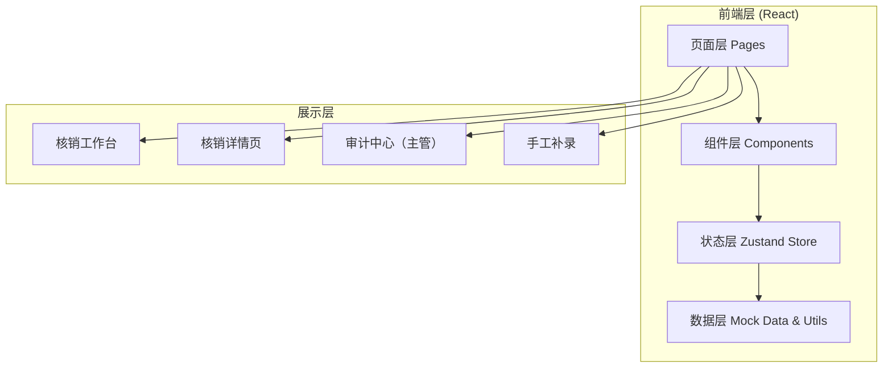
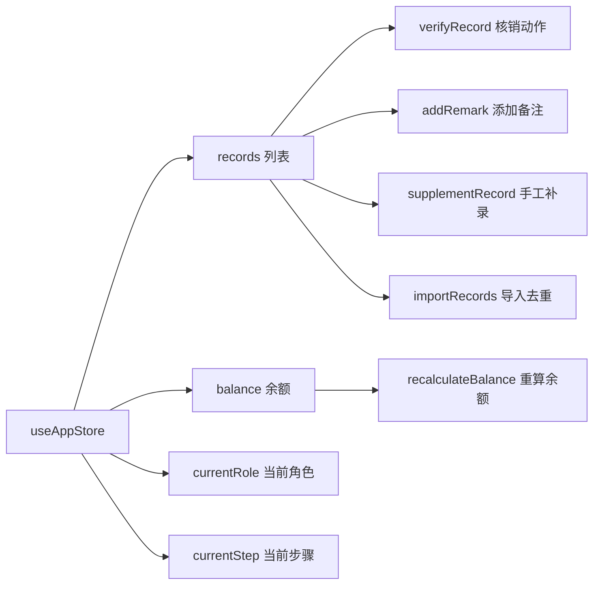

## 1. 架构设计



## 2. 技术描述

- **前端框架**：React 18 + TypeScript
- **构建工具**：Vite 5
- **样式方案**：Tailwind CSS 3
- **状态管理**：Zustand（轻量，适合中小型应用）
- **路由**：React Router DOM 6
- **图标库**：Lucide React
- **后端**：无后端，使用前端 Mock 数据模拟全部业务逻辑
- **数据持久化**：LocalStorage（模拟后端存储）

## 3. 路由定义

| 路由 | 页面 | 用途 |
|------|------|------|
| / | WorkbenchPage | 核销工作台首页 |
| /verify/:id | VerifyDetailPage | 单条记录核销详情页 |
| /audit | AuditCenterPage | 审计中心（主管权限） |
| /supplement | SupplementPage | 手工补录页面 |

## 4. 数据模型

### 4.1 TypeScript 类型定义

```typescript
// 用户角色
type UserRole = 'consultant' | 'supervisor';

// 费用单位
type FeeUnit = 'class_hour' | 'yuan' | 'section';

// 核销状态
type VerifyStatus = 'pending' | 'processing' | 'verified' | 'partially_verified' | 'rejected';

// 核销记录
interface VerifyRecord {
  id: string;
  parentName: string;
  childName: string;
  courseName: string;
  quantity: number;
  unit: FeeUnit;
  originalUnit?: FeeUnit;
  unitMixed: boolean;
  isBoundaryValue: boolean;
  boundaryAudited?: boolean;
  boundaryAuditedBy?: string;
  amount: number;
  status: VerifyStatus;
  createdAt: string;
  updatedAt: string;
  createdBy: string;
  verifiedBy?: string;
  verifiedAt?: string;
  isImported: boolean;
  importBatchId?: string;
  isInvalid: boolean;
  invalidReason?: string;
  remarkHistory: RemarkEntry[];
  auditLogs: AuditLogEntry[];
}

// 备注历史条目
interface RemarkEntry {
  id: string;
  content: string;
  operator: string;
  operatorRole: UserRole;
  timestamp: string;
  previousContent?: string;
}

// 审计日志条目
interface AuditLogEntry {
  id: string;
  action: 'create' | 'verify' | 'update_remark' | 'mark_boundary' | 'invalidate' | 'import' | 'supplement';
  field?: string;
  oldValue?: string;
  newValue?: string;
  operator: string;
  operatorRole: UserRole;
  timestamp: string;
  note?: string;
}

// 余额快照
interface BalanceSnapshot {
  month: string;
  initialBalance: number;
  verifiedAmount: number;
  remainingBalance: number;
  updatedAt: string;
}

// 全局状态
interface AppState {
  currentRole: UserRole;
  currentUser: string;
  records: VerifyRecord[];
  balance: BalanceSnapshot;
  activeRecordId: string | null;
  currentStep: number;
}
```

### 4.2 核心数据约束

1. **数量口径统一**：普通视图与主管视图使用同一数据源 `records`，通过 `isInvalid` 字段过滤，确保计数一致
2. **导入去重**：相同 `importBatchId` 重新导入时，旧记录标记 `isInvalid=true`，不产生重复有效记录
3. **边界值保留审计**：`isBoundaryValue=true` 的记录即使核销成功，也会在 `auditLogs` 中保留 `mark_boundary` 操作记录
4. **备注不可删除**：`remarkHistory` 数组只追加不覆盖，原承诺永久保留
5. **单位混用标记**：`unitMixed=true` 且状态为 `partially_verified` 表示部分成功

## 5. 状态管理设计



### 5.1 Store Actions

- `switchRole(role: UserRole)`：切换角色
- `setActiveRecord(id)`：选中核销记录
- `setCurrentStep(step)`：设置当前操作步骤
- `verifyRecord(id, data)`：执行核销，处理单位混用、边界值审计
- `addRemark(recordId, content)`：追加备注（不覆盖历史）
- `supplementRecord(data)`：手工补录新记录
- `importRecords(batchId, data)`：导入样例数据，自动去重失效旧记录
- `markBoundaryAudited(id, auditor)`：主管复核边界值记录
- `recalculateBalance()`：重新计算余额

## 6. 组件拆分

| 组件路径 | 职责 |
|----------|------|
| components/layout/Header.tsx | 顶部导航，角色切换 |
| components/layout/Sidebar.tsx | 步骤引导侧栏 |
| components/balance/BalanceCard.tsx | 余额监控卡片，含预警动画 |
| components/records/RecordList.tsx | 待核销记录列表 |
| components/records/RecordRow.tsx | 单条记录行 |
| components/verify/VerifyFlow.tsx | 五步核销流程容器 |
| components/verify/StepPanel.tsx | 单个步骤面板 |
| components/verify/UnitMixedAlert.tsx | 单位混用警告提示 |
| components/verify/BoundaryAlert.tsx | 边界值警告提示 |
| components/remark/RemarkTimeline.tsx | 备注历史时间线 |
| components/remark/RemarkInput.tsx | 备注输入框 |
| components/audit/AuditLogTable.tsx | 审计日志表格 |
| components/audit/BoundaryReviewPanel.tsx | 边界值复核面板 |
| components/audit/ConsistencyCheck.tsx | 数据口径一致性校验 |
| components/supplement/SupplementForm.tsx | 手工补录表单 |
| components/supplement/DiffPreview.tsx | 补录前后差异对比 |
| components/common/StatusBadge.tsx | 状态标签 |
| components/common/RoleGate.tsx | 权限门控组件 |
