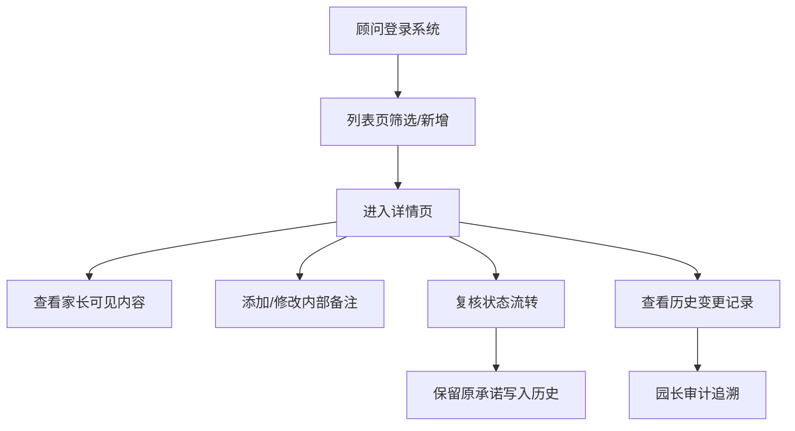

## 1. 产品概述

梧桐社区儿保室婴幼儿批次追溯授权库试听顾问版，为早教课程顾问提供高效的婴幼儿信息管理工具，解决高峰期顾问在多个文件间切换效率低下的问题。所有操作（新增、筛选、复核、修改、历史、导出）共用同一份 API 数据，确保数据一致性。

## 2. 核心功能

### 2.1 用户角色

| 角色 | 说明 | 核心权限 |
|------|------|----------|
| 早教课程顾问 | 日常主要使用者 | 新增记录、筛选查询、修改信息、追加备注、复核状态、导出数据 |
| 园长 | 管理者/审计者 | 查看审计日志、查看完整变更历史 |

### 2.2 功能模块

1. **列表页**：数据筛选、新增入口、列表展示、批量导出
2. **详情页**：基础信息展示、家长可见内容/内部备注分区、状态复核、修改记录、历史版本、追加材料
3. **审计日志**：变更历史追溯（谁在什么时候改了什么）

### 2.3 页面详情

| 页面名称 | 模块名称 | 功能描述 |
|-----------|-------------|---------------------|
| 列表页 | 筛选区 | 按婴幼儿姓名、批次号、状态、家长电话筛选 |
| 列表页 | 数据表格 | 展示核心字段：婴幼儿姓名、批次号、家长姓名、联系电话、当前状态、创建时间、操作 |
| 列表页 | 新增按钮 | 打开新增表单弹窗 |
| 列表页 | 导出按钮 | 导出当前筛选结果为 CSV |
| 详情页 | 基础信息 | 婴幼儿基本信息展示与编辑 |
| 详情页 | 家长可见区 | 家长可以看到的授权内容、试听安排 |
| 详情页 | 内部备注区 | 顾问内部沟通内容，不对家长可见 |
| 详情页 | 历史记录 | 所有变更的时间线：谁、何时、改了什么、前后值对比 |
| 详情页 | 状态流转 | 复核、关闭、追加材料 |
| 详情页 | 异常说明 | 坏数据标记、无处理人记录的原因说明 |
| 审计页 | 审计日志列表 | 全量变更记录，可按操作人、时间、操作类型筛选 |

## 3. 核心流程

顾问在儿保室高峰期通过单页应用快速完成工作：打开系统 → 筛选查找婴幼儿记录 → 查看/修改详情 → 追加家长临时改口的备注（保留原承诺）→ 复核状态 → 按需导出数据。园长可随时进入审计页面追溯所有操作。

## 4. 用户界面设计

### 4.1 设计风格
- **主色调**：医疗绿（#2F855A），传达专业信任感
- **辅助色**：琥珀橙（#DD6B20）用于状态提醒，浅灰蓝（#718096）用于次要信息
- **中性色**：以 slate 色系为基础，确保内容可读性
- **按钮风格**：直角微圆角（rounded-md），扁平化，清晰的状态区分
- **字体**：思源宋体 / Noto Sans SC，兼顾专业感与可读性
- **布局风格**：顶部导航 + 左侧筛选 + 主内容区，传统后台布局，高效实用
- **图标**：lucide-react 线性图标，简洁朴素

### 4.2 页面设计概述

| 页面名称 | 模块名称 | UI 元素 |
|-----------|-------------|-------------|
| 列表页 | 顶部导航 | Logo、系统名称、角色切换、审计入口 |
| 列表页 | 筛选区 | 下拉筛选框、搜索输入框、重置按钮 |
| 列表页 | 表格区 | 斑马纹行、状态标签、操作按钮列 |
| 详情页 | 分区卡片 | 白底卡片 + 浅灰分割线，家长可见区/内部备注区视觉隔离 |
| 详情页 | 历史时间线 | 左侧竖线 + 节点圆点 + 变更内容卡片 |
| 审计页 | 日志表格 | 操作人、时间、操作类型、变更摘要 |

### 4.3 响应式
桌面端优先，保证 1280px 宽度下体验最佳。筛选区在窄屏下自动换行。
