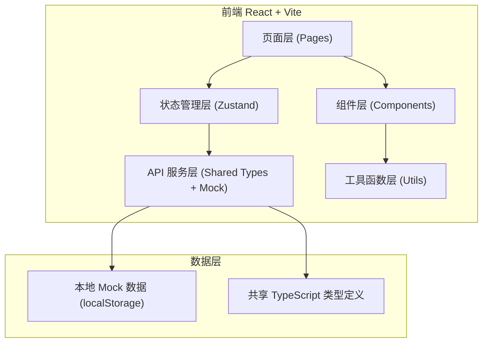
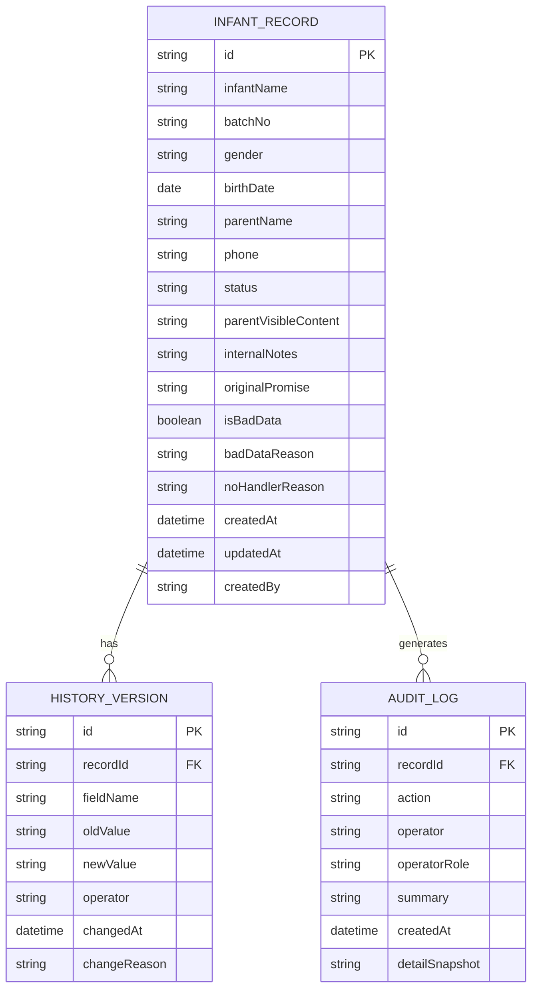

## 1. 架构设计



## 2. 技术描述

- **前端**：React@18 + TypeScript + tailwindcss@3 + vite
- **状态管理**：zustand（单一 store 管理所有列表/详情/审计数据，确保新增、筛选、复核、修改、历史、导出共用同一份数据源）
- **路由**：react-router-dom
- **图标**：lucide-react
- **数据持久化**：localStorage + Mock 初始数据（模拟后端 API）
- **导出**：前端生成 CSV

## 3. 路由定义

| Route | 用途 |
|-------|---------|
| / | 列表页（筛选、新增、导出入口） |
| /record/:id | 详情页（基础信息、家长可见/内部备注、历史记录、复核修改） |
| /audit | 审计日志页（园长视角） |

## 4. API / Store 定义

核心 Store 方法（所有页面共用同一份数据）：
- `getRecords(filters)` - 获取筛选后的记录列表
- `getRecordById(id)` - 获取单条详情（含完整历史）
- `createRecord(data)` - 新增记录
- `updateRecord(id, data, operator)` - 修改记录（自动写入审计日志和历史版本）
- `reviewRecord(id, status, operator, reason)` - 复核状态流转
- `appendMaterial(id, material, operator)` - 已关闭后追加材料
- `exportRecords(filters)` - 导出当前筛选数据 CSV
- `getAuditLogs(filters)` - 获取审计日志

## 5. 数据模型

### 5.1 ER 图



### 5.2 数据定义（TypeScript 类型）

```typescript
export type RecordStatus = 'pending' | 'reviewed' | 'closed' | 'invalid';

export interface InfantRecord {
  id: string;
  infantName: string;
  batchNo: string;
  gender: 'male' | 'female';
  birthDate: string;
  parentName: string;
  phone: string;
  status: RecordStatus;
  parentVisibleContent: string;
  internalNotes: string;
  originalPromise: string;
  isBadData: boolean;
  badDataReason?: string;
  noHandlerReason?: string;
  createdAt: string;
  updatedAt: string;
  createdBy: string;
}

export interface HistoryVersion {
  id: string;
  recordId: string;
  fieldName: string;
  fieldLabel: string;
  oldValue: string;
  newValue: string;
  operator: string;
  changedAt: string;
  changeReason?: string;
}

export interface AuditLog {
  id: string;
  recordId?: string;
  action: 'create' | 'update' | 'review' | 'append' | 'export';
  operator: string;
  operatorRole: 'consultant' | 'principal';
  summary: string;
  createdAt: string;
  detailSnapshot?: string;
}
```
