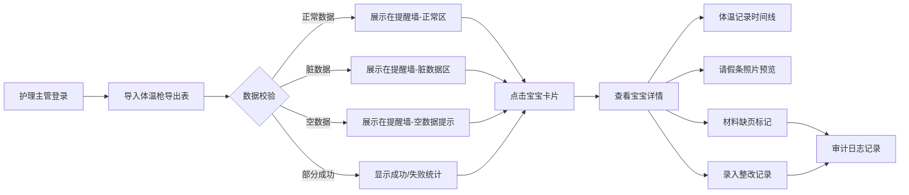

## 1. 产品概述

婴幼儿晨检复核提醒墙（月子护理版）是专为月子中心护理主管设计的晨检复核管理系统。解决早高峰体温枪记录碎片化、备注信息零散、材料缺页追溯难的问题，实现从导出表到宝宝详情、原始体温记录、请假条照片的完整链路追溯，并支持服务重启后数据持久化。

- 目标用户：月子中心护理主管
- 核心价值：晨检记录可追溯、材料缺页可审计、数据状态可视化、服务重启数据不丢失

## 2. 核心功能

### 2.1 用户角色
| 角色 | 核心权限 |
|------|----------|
| 护理主管 | 查看提醒墙、搜索宝宝、复核详情、录入整改记录、导入导出数据、查看审计日志 |

### 2.2 功能模块
1. **晨检提醒墙首页**：宝宝晨检卡片列表、状态筛选、搜索、数据导入
2. **宝宝详情页**：基础信息、体温记录时间线、请假条照片、状态标签、整改记录
3. **审计日志页**：导出数量与页面不一致记录、材料缺页记录、操作历史

### 2.3 页面详情
| 页面名称 | 模块名称 | 功能描述 |
|-----------|-------------|---------------------|
| 晨检提醒墙 | 顶部统计栏 | 显示正常/异常/待复核/缺材料宝宝数量统计 |
| 晨检提醒墙 | 状态筛选栏 | 按全部/正常/异常/待复核/缺材料/脏数据筛选 |
| 晨检提醒墙 | 宝宝卡片网格 | 展示宝宝头像、姓名、房号、今日体温、状态标签、备注摘要 |
| 晨检提醒墙 | 导入工具栏 | Excel导入、部分成功提示、空数据/脏数据反馈 |
| 宝宝详情 | 基础信息区 | 姓名、性别、月龄、房号、责任护士、入所日期 |
| 宝宝详情 | 体温记录时间线 | 展示原始体温枪记录，含时间、体温值、测量人、设备编号 |
| 宝宝详情 | 请假条照片区 | 照片预览、说明文字、上传时间、材料完整性标记 |
| 宝宝详情 | 整改记录区 | 问题描述、整改措施、整改人、整改时间、状态追踪 |
| 宝宝详情 | 备注回溯区 | 展示早高峰零散备注的完整时间线 |
| 审计日志 | 导入审计列表 | 每次导入的文件名、时间、成功数、失败数、差异记录 |
| 审计日志 | 材料缺页记录 | 缺页类型、涉及宝宝、发现时间、处理状态 |
| 审计日志 | 操作历史 | 所有修改操作的时间、操作人、变更前后对比 |

## 3. 核心流程

护理主管每日早高峰后登录系统 → 导入体温枪导出表 → 系统识别空数据/脏数据/正常数据 → 部分成功时提示成功/失败数量 → 点击异常宝宝卡片进入详情 → 查看原始体温记录与请假条照片 → 如发现材料缺页标记并记录 → 录入整改措施 → 服务重启后重新打开详情确认数据完整性。

## 4. 用户界面设计

### 4.1 设计风格
- 主色调：柔和的医疗蓝（#2563EB）搭配暖粉辅助色（#F472B6），体现专业与温馨
- 按钮风格：圆角胶囊按钮，hover时轻微上浮阴影
- 字体：标题使用思源宋体，正文使用思源黑体，数据数字使用等宽字体
- 布局风格：卡片式网格布局，顶部固定导航，左侧状态筛选栏
- 图标风格：使用线条型医疗主题图标（体温计、婴儿、文件、照片等）

### 4.2 页面设计概览
| 页面名称 | 模块名称 | UI元素 |
|-----------|-------------|-------------|
| 晨检提醒墙 | 顶部统计栏 | 渐变色统计卡片、数字动画、状态图标 |
| 晨检提醒墙 | 宝宝卡片网格 | 悬停上浮、状态角标、体温异常高亮闪烁 |
| 宝宝详情 | 体温时间线 | 竖线时间轴、体温异常红色标记、体温正常绿色标记 |
| 宝宝详情 | 照片预览 | 点击放大、材料缺页半透明红色遮罩提示 |
| 审计日志 | 记录列表 | 斑马纹背景、差异数据高亮、操作类型标签 |

### 4.3 响应式
- 桌面端优先设计（1280px起）
- 平板端：卡片网格从3列变2列
- 移动端：卡片网格从2列变1列，筛选栏折叠为下拉菜单
