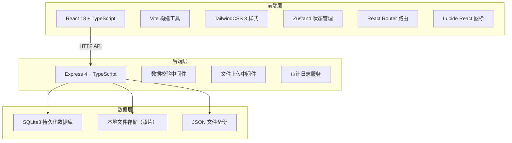
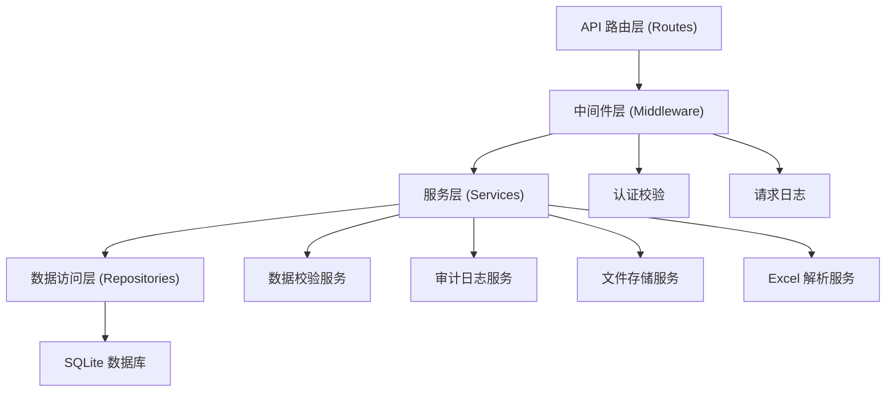
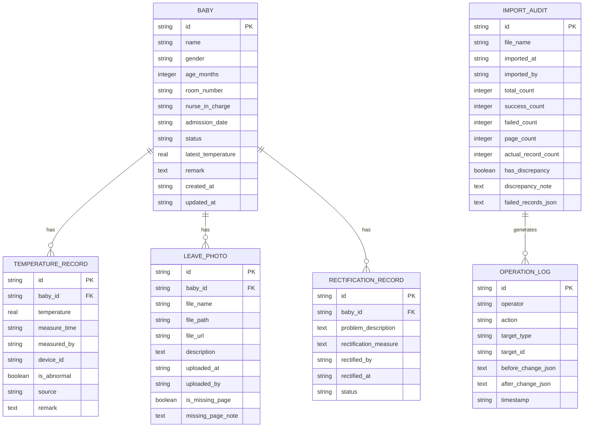

## 1. 架构设计



## 2. 技术描述
- 前端：React@18 + TypeScript + TailwindCSS@3 + Vite + Zustand + React Router + Lucide React
- 后端：Express@4 + TypeScript + Multer（文件上传）+ better-sqlite3（数据库）
- 数据库：SQLite3（本地持久化，服务重启数据不丢失）
- 文件存储：本地磁盘存储照片附件，URL路径映射访问
- 数据备份：每日自动导出JSON快照

## 3. 路由定义
| 路由 | 用途 |
|-------|---------|
| / | 晨检提醒墙首页 - 宝宝卡片列表与状态筛选 |
| /baby/:id | 宝宝详情页 - 体温记录、照片、整改记录 |
| /audit | 审计日志页 - 导入审计、材料缺页、操作历史 |

## 4. API 定义

### 4.1 类型定义
```typescript
// 数据状态枚举
type DataStatus = 'normal' | 'dirty' | 'empty' | 'missing_material' | 'pending_review';

// 宝宝信息
interface Baby {
  id: string;
  name: string;
  gender: 'male' | 'female';
  ageMonths: number;
  roomNumber: string;
  nurseInCharge: string;
  admissionDate: string;
  status: DataStatus;
  latestTemperature: number | null;
  remark: string;
  createdAt: string;
  updatedAt: string;
}

// 体温记录
interface TemperatureRecord {
  id: string;
  babyId: string;
  temperature: number;
  measureTime: string;
  measuredBy: string;
  deviceId: string;
  isAbnormal: boolean;
  source: 'gun' | 'manual';
  remark: string;
}

// 请假条照片
interface LeavePhoto {
  id: string;
  babyId: string;
  fileName: string;
  filePath: string;
  fileUrl: string;
  description: string;
  uploadedAt: string;
  uploadedBy: string;
  isMissingPage: boolean;
  missingPageNote: string;
}

// 整改记录
interface RectificationRecord {
  id: string;
  babyId: string;
  problemDescription: string;
  rectificationMeasure: string;
  rectifiedBy: string;
  rectifiedAt: string;
  status: 'pending' | 'in_progress' | 'completed';
}

// 导入审计
interface ImportAudit {
  id: string;
  fileName: string;
  importedAt: string;
  importedBy: string;
  totalCount: number;
  successCount: number;
  failedCount: number;
  pageCount: number;
  actualRecordCount: number;
  hasDiscrepancy: boolean;
  discrepancyNote: string;
  failedRecords: Array<{ row: number; reason: string; data: any }>;
}

// 操作日志
interface OperationLog {
  id: string;
  operator: string;
  action: string;
  targetType: string;
  targetId: string;
  beforeChange: any;
  afterChange: any;
  timestamp: string;
}
```

### 4.2 接口列表
| 方法 | 路径 | 描述 |
|------|------|------|
| GET | /api/babies | 获取宝宝列表（支持筛选、搜索、分页） |
| GET | /api/babies/:id | 获取宝宝详情（含体温记录、照片、整改记录） |
| POST | /api/babies | 新增宝宝 |
| PUT | /api/babies/:id | 更新宝宝信息 |
| GET | /api/babies/:id/temperatures | 获取宝宝体温记录 |
| POST | /api/babies/:id/temperatures | 新增体温记录 |
| GET | /api/babies/:id/photos | 获取宝宝请假条照片 |
| POST | /api/babies/:id/photos | 上传请假条照片 |
| PUT | /api/babies/:id/photos/:photoId | 更新照片信息（标记缺页等） |
| GET | /api/babies/:id/rectifications | 获取整改记录 |
| POST | /api/babies/:id/rectifications | 新增整改记录 |
| PUT | /api/babies/:id/rectifications/:recordId | 更新整改记录 |
| POST | /api/import/excel | 导入Excel体温表（支持部分成功） |
| GET | /api/audit/imports | 获取导入审计记录 |
| GET | /api/audit/operations | 获取操作日志 |

## 5. 服务端架构



## 6. 数据模型

### 6.1 ER 图


### 6.2 DDL 语句
```sql
-- 宝宝表
CREATE TABLE IF NOT EXISTS babies (
    id TEXT PRIMARY KEY,
    name TEXT NOT NULL,
    gender TEXT CHECK(gender IN ('male', 'female')) NOT NULL,
    age_months INTEGER NOT NULL,
    room_number TEXT NOT NULL,
    nurse_in_charge TEXT NOT NULL,
    admission_date TEXT NOT NULL,
    status TEXT CHECK(status IN ('normal', 'dirty', 'empty', 'missing_material', 'pending_review')) NOT NULL DEFAULT 'pending_review',
    latest_temperature REAL,
    remark TEXT,
    created_at TEXT NOT NULL,
    updated_at TEXT NOT NULL
);

CREATE INDEX IF NOT EXISTS idx_babies_status ON babies(status);
CREATE INDEX IF NOT EXISTS idx_babies_room ON babies(room_number);

-- 体温记录表
CREATE TABLE IF NOT EXISTS temperature_records (
    id TEXT PRIMARY KEY,
    baby_id TEXT NOT NULL REFERENCES babies(id) ON DELETE CASCADE,
    temperature REAL NOT NULL,
    measure_time TEXT NOT NULL,
    measured_by TEXT,
    device_id TEXT,
    is_abnormal INTEGER NOT NULL DEFAULT 0,
    source TEXT NOT NULL DEFAULT 'gun',
    remark TEXT,
    created_at TEXT NOT NULL
);

CREATE INDEX IF NOT EXISTS idx_temp_baby ON temperature_records(baby_id);
CREATE INDEX IF NOT EXISTS idx_temp_time ON temperature_records(measure_time);

-- 请假条照片表
CREATE TABLE IF NOT EXISTS leave_photos (
    id TEXT PRIMARY KEY,
    baby_id TEXT NOT NULL REFERENCES babies(id) ON DELETE CASCADE,
    file_name TEXT NOT NULL,
    file_path TEXT NOT NULL,
    file_url TEXT NOT NULL,
    description TEXT,
    uploaded_at TEXT NOT NULL,
    uploaded_by TEXT NOT NULL,
    is_missing_page INTEGER NOT NULL DEFAULT 0,
    missing_page_note TEXT
);

CREATE INDEX IF NOT EXISTS idx_photo_baby ON leave_photos(baby_id);

-- 整改记录表
CREATE TABLE IF NOT EXISTS rectification_records (
    id TEXT PRIMARY KEY,
    baby_id TEXT NOT NULL REFERENCES babies(id) ON DELETE CASCADE,
    problem_description TEXT NOT NULL,
    rectification_measure TEXT NOT NULL,
    rectified_by TEXT NOT NULL,
    rectified_at TEXT NOT NULL,
    status TEXT CHECK(status IN ('pending', 'in_progress', 'completed')) NOT NULL DEFAULT 'pending'
);

CREATE INDEX IF NOT EXISTS idx_rect_baby ON rectification_records(baby_id);

-- 导入审计表
CREATE TABLE IF NOT EXISTS import_audits (
    id TEXT PRIMARY KEY,
    file_name TEXT NOT NULL,
    imported_at TEXT NOT NULL,
    imported_by TEXT NOT NULL,
    total_count INTEGER NOT NULL,
    success_count INTEGER NOT NULL,
    failed_count INTEGER NOT NULL,
    page_count INTEGER,
    actual_record_count INTEGER,
    has_discrepancy INTEGER NOT NULL DEFAULT 0,
    discrepancy_note TEXT,
    failed_records_json TEXT
);

-- 操作日志表
CREATE TABLE IF NOT EXISTS operation_logs (
    id TEXT PRIMARY KEY,
    operator TEXT NOT NULL,
    action TEXT NOT NULL,
    target_type TEXT NOT NULL,
    target_id TEXT NOT NULL,
    before_change_json TEXT,
    after_change_json TEXT,
    timestamp TEXT NOT NULL
);

CREATE INDEX IF NOT EXISTS idx_log_target ON operation_logs(target_type, target_id);
CREATE INDEX IF NOT EXISTS idx_log_time ON operation_logs(timestamp);
```
